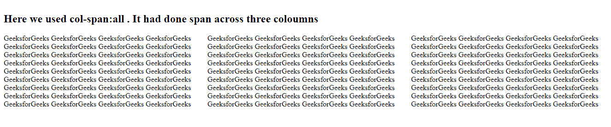
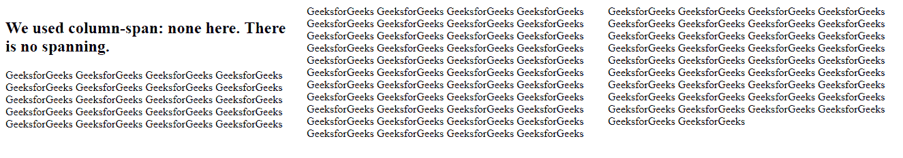
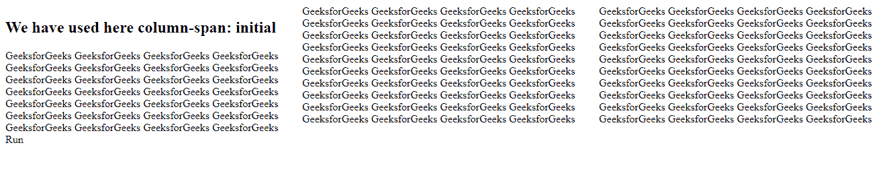
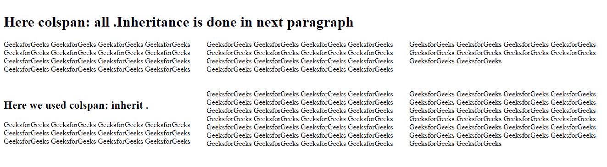

# CSS |柱跨属性

> 原文:[https://www.geeksforgeeks.org/css-column-span-property/](https://www.geeksforgeeks.org/css-column-span-property/)

CSS 的**列跨度属性**设置一个元素可以跨越的列数。其值可以是 none | all | initial | inherit
**语法:**

```css
column-span: none|all|initial|inherit;
```

**默认值:无**

**房产价值:**

*   **全部**:允许在所有列中均等跨越。
    **语法:**

```css
 column-span: all;
```

*   **例:**

## 超文本标记语言

```css
<!DOCTYPE html>
<html>

<head>
    <title>
        CSS | column-span Property
    </title>
    <style>
        .paragraph {
            column-count: 3;
        }

        h2 {
            column-span: all;
        }
    </style>
</head>

<body>
    <div class="paragraph ">
        <h2> Here we used col-span:all; 
          It had done span across three columns
        </h2>
      GeeksforGeeks GeeksforGeeks GeeksforGeeks
      GeeksforGeeks GeeksforGeeks GeeksforGeeks
      GeeksforGeeks GeeksforGeeks GeeksforGeeks
      GeeksforGeeks GeeksforGeeks GeeksforGeeks
      GeeksforGeeks GeeksforGeeks GeeksforGeeks
      GeeksforGeeks GeeksforGeeks GeeksforGeeks
      GeeksforGeeks GeeksforGeeks GeeksforGeeks
      GeeksforGeeks GeeksforGeeks GeeksforGeeks
      GeeksforGeeks GeeksforGeeks GeeksforGeeks 
      GeeksforGeeks GeeksforGeeks GeeksforGeeks 
      GeeksforGeeks GeeksforGeeks GeeksforGeeks 
      GeeksforGeeks GeeksforGeeks GeeksforGeeks 
      GeeksforGeeks GeeksforGeeks GeeksforGeeks 
      GeeksforGeeks GeeksforGeeks GeeksforGeeks 
      GeeksforGeeks GeeksforGeeks GeeksforGeeks 
      GeeksforGeeks GeeksforGeeks GeeksforGeeks 
      GeeksforGeeks GeeksforGeeks GeeksforGeeks 
      GeeksforGeeks GeeksforGeeks GeeksforGeeks 
      GeeksforGeeks GeeksforGeeks GeeksforGeeks 
      GeeksforGeeks GeeksforGeeks GeeksforGeeks 
      GeeksforGeeks GeeksforGeeks GeeksforGeeks 
      GeeksforGeeks GeeksforGeeks GeeksforGeeks 
      GeeksforGeeks GeeksforGeeks GeeksforGeeks 
      GeeksforGeeks GeeksforGeeks GeeksforGeeks 
      GeeksforGeeks GeeksforGeeks GeeksforGeeks 
      GeeksforGeeks GeeksforGeeks GeeksforGeeks 
      GeeksforGeeks GeeksforGeeks GeeksforGeeks 
      GeeksforGeeks GeeksforGeeks GeeksforGeeks 
      GeeksforGeeks GeeksforGeeks GeeksforGeeks 
      GeeksforGeeks GeeksforGeeks GeeksforGeeks 
      GeeksforGeeks GeeksforGeeks GeeksforGeeks 
      GeeksforGeeks GeeksforGeeks GeeksforGeeks 
      GeeksforGeeks GeeksforGeeks GeeksforGeeks 
      GeeksforGeeks GeeksforGeeks GeeksforGeeks 
      GeeksforGeeks GeeksforGeeks GeeksforGeeks 
      GeeksforGeeks GeeksforGeeks GeeksforGeeks
  </div>
</body>
</html>
```

*   **输出:**



*   **无:**该值杀死跨越元素并将其设置为无。
    **语法:**

```css
 column-span: none;
```

*   **例:**

## 超文本标记语言

```css
<!DOCTYPE html>
<html>

<head>
    <title>
        CSS | column-span Property
    </title>
    <style>
        .paragraph {
            column-count: 3;
        }

        h2 {
            column-span: none;
        }
    </style>
</head>

<body>
    <div class="paragraph ">
        <h2> Here we used col-span:none;
          It had done span across three columns
        </h2>
      GeeksforGeeks GeeksforGeeks GeeksforGeeks
      GeeksforGeeks GeeksforGeeks GeeksforGeeks
      GeeksforGeeks GeeksforGeeks GeeksforGeeks
      GeeksforGeeks GeeksforGeeks GeeksforGeeks
      GeeksforGeeks GeeksforGeeks GeeksforGeeks
      GeeksforGeeks GeeksforGeeks GeeksforGeeks
      GeeksforGeeks GeeksforGeeks GeeksforGeeks
      GeeksforGeeks GeeksforGeeks GeeksforGeeks
      GeeksforGeeks GeeksforGeeks GeeksforGeeks 
      GeeksforGeeks GeeksforGeeks GeeksforGeeks 
      GeeksforGeeks GeeksforGeeks GeeksforGeeks 
      GeeksforGeeks GeeksforGeeks GeeksforGeeks 
      GeeksforGeeks GeeksforGeeks GeeksforGeeks 
      GeeksforGeeks GeeksforGeeks GeeksforGeeks 
      GeeksforGeeks GeeksforGeeks GeeksforGeeks 
      GeeksforGeeks GeeksforGeeks GeeksforGeeks 
      GeeksforGeeks GeeksforGeeks GeeksforGeeks 
      GeeksforGeeks GeeksforGeeks GeeksforGeeks 
      GeeksforGeeks GeeksforGeeks GeeksforGeeks 
      GeeksforGeeks GeeksforGeeks GeeksforGeeks 
      GeeksforGeeks GeeksforGeeks GeeksforGeeks 
      GeeksforGeeks GeeksforGeeks GeeksforGeeks 
      GeeksforGeeks GeeksforGeeks GeeksforGeeks 
      GeeksforGeeks GeeksforGeeks GeeksforGeeks 
      GeeksforGeeks GeeksforGeeks GeeksforGeeks 
      GeeksforGeeks GeeksforGeeks GeeksforGeeks 
      GeeksforGeeks GeeksforGeeks GeeksforGeeks 
      GeeksforGeeks GeeksforGeeks GeeksforGeeks 
      GeeksforGeeks GeeksforGeeks GeeksforGeeks 
      GeeksforGeeks GeeksforGeeks GeeksforGeeks 
      GeeksforGeeks GeeksforGeeks GeeksforGeeks 
      GeeksforGeeks GeeksforGeeks GeeksforGeeks 
      GeeksforGeeks GeeksforGeeks GeeksforGeeks 
      GeeksforGeeks GeeksforGeeks GeeksforGeeks 
      GeeksforGeeks GeeksforGeeks GeeksforGeeks 
      GeeksforGeeks GeeksforGeeks GeeksforGeeks
  </div>
</body>
</html>
```

*   **输出:**



*   **初始值:**该值使该属性设置为默认值。
    **语法:**

```css
 column-span: initial;
```

*   **例:**

## 超文本标记语言

```css
<!DOCTYPE html>
<html>

<head>
    <title>
        CSS | column-span Property
    </title>
    <style>
        .paragraph {
            column-count: 3;
        }

        h2 {
            column-span: initial;
        }
    </style>
</head>

    <div class="paragraph ">
        <h2> Here we used col-span:initial;
          It had done span across three columns
        </h2>
      GeeksforGeeks GeeksforGeeks GeeksforGeeks
      GeeksforGeeks GeeksforGeeks GeeksforGeeks
      GeeksforGeeks GeeksforGeeks GeeksforGeeks
      GeeksforGeeks GeeksforGeeks GeeksforGeeks
      GeeksforGeeks GeeksforGeeks GeeksforGeeks
      GeeksforGeeks GeeksforGeeks GeeksforGeeks
      GeeksforGeeks GeeksforGeeks GeeksforGeeks
      GeeksforGeeks GeeksforGeeks GeeksforGeeks
      GeeksforGeeks GeeksforGeeks GeeksforGeeks 
      GeeksforGeeks GeeksforGeeks GeeksforGeeks 
      GeeksforGeeks GeeksforGeeks GeeksforGeeks 
      GeeksforGeeks GeeksforGeeks GeeksforGeeks 
      GeeksforGeeks GeeksforGeeks GeeksforGeeks 
      GeeksforGeeks GeeksforGeeks GeeksforGeeks 
      GeeksforGeeks GeeksforGeeks GeeksforGeeks 
      GeeksforGeeks GeeksforGeeks GeeksforGeeks 
      GeeksforGeeks GeeksforGeeks GeeksforGeeks 
      GeeksforGeeks GeeksforGeeks GeeksforGeeks 
      GeeksforGeeks GeeksforGeeks GeeksforGeeks 
      GeeksforGeeks GeeksforGeeks GeeksforGeeks 
      GeeksforGeeks GeeksforGeeks GeeksforGeeks 
      GeeksforGeeks GeeksforGeeks GeeksforGeeks 
      GeeksforGeeks GeeksforGeeks GeeksforGeeks 
      GeeksforGeeks GeeksforGeeks GeeksforGeeks 
      GeeksforGeeks GeeksforGeeks GeeksforGeeks 
      GeeksforGeeks GeeksforGeeks GeeksforGeeks 
      GeeksforGeeks GeeksforGeeks GeeksforGeeks 
      GeeksforGeeks GeeksforGeeks GeeksforGeeks 
      GeeksforGeeks GeeksforGeeks GeeksforGeeks 
      GeeksforGeeks GeeksforGeeks GeeksforGeeks 
      GeeksforGeeks GeeksforGeeks GeeksforGeeks 
      GeeksforGeeks GeeksforGeeks GeeksforGeeks 
      GeeksforGeeks GeeksforGeeks GeeksforGeeks 
      GeeksforGeeks GeeksforGeeks GeeksforGeeks 
      GeeksforGeeks GeeksforGeeks GeeksforGeeks 
      GeeksforGeeks GeeksforGeeks GeeksforGeeks
  </div>
</body>
</html>
```

*   **输出:**



*   **inherit:** 关联元素采用其父元素的指定列跨度属性的评估值，即它将采用父元素的继承属性。CSS 的列跨度属性不支持这种情况。
    **语法:**

```css
 column-span: inherit;
```

*   **例:**

## 超文本标记语言

```css
<!DOCTYPE html>
<html>

<head>
    <title>
        CSS | column-span Property
    </title>
    <style>
        .paragraph {
            column-count: 3;
        }

        h2 {
            column-span: all;
        }
    </style>
</head>

<body>
    <div class="paragraph ">
        <h1>Here colspan: all;
          Inheritance is done in next paragraph 
        </h1> 
      GeeksforGeeks GeeksforGeeks GeeksforGeeks
      GeeksforGeeks GeeksforGeeks GeeksforGeeks
      GeeksforGeeks GeeksforGeeks GeeksforGeeks
      GeeksforGeeks GeeksforGeeks GeeksforGeeks
      GeeksforGeeks GeeksforGeeks GeeksforGeeks
      GeeksforGeeks GeeksforGeeks GeeksforGeeks
      GeeksforGeeks GeeksforGeeks GeeksforGeeks
      GeeksforGeeks GeeksforGeeks GeeksforGeeks 
      GeeksforGeeks GeeksforGeeks GeeksforGeeks 
      GeeksforGeeks GeeksforGeeks GeeksforGeeks
      GeeksforGeeks GeeksforGeeks GeeksforGeeks
      GeeksforGeeks GeeksforGeeks GeeksforGeeks
      GeeksforGeeks GeeksforGeeks GeeksforGeeks
      GeeksforGeeks GeeksforGeeks GeeksforGeeks
    </div>
    <br>
    <br>

    <div class="paragraph ">
        <h2>Here  we used colspan: inherit.;</h2> 
      GeeksforGeeks GeeksforGeeks GeeksforGeeks
      GeeksforGeeks GeeksforGeeks GeeksforGeeks 
      GeeksforGeeks GeeksforGeeks GeeksforGeeks
      GeeksforGeeks GeeksforGeeks GeeksforGeeks 
      GeeksforGeeks GeeksforGeeks GeeksforGeeks 
      GeeksforGeeks GeeksforGeeks GeeksforGeeks 
      GeeksforGeeks GeeksforGeeks GeeksforGeeks 
      GeeksforGeeks GeeksforGeeks GeeksforGeeks 
      GeeksforGeeks GeeksforGeeks GeeksforGeeks 
      GeeksforGeeks GeeksforGeeks GeeksforGeeks 
      GeeksforGeeks GeeksforGeeks GeeksforGeeks 
      GeeksforGeeks GeeksforGeeks GeeksforGeeks 
      GeeksforGeeks GeeksforGeeks GeeksforGeeks 
      GeeksforGeeks GeeksforGeeks GeeksforGeeks 
      GeeksforGeeks GeeksforGeeks GeeksforGeeks 
      GeeksforGeeks GeeksforGeeks GeeksforGeeks 
      GeeksforGeeks GeeksforGeeks GeeksforGeeks 
      GeeksforGeeks GeeksforGeeks GeeksforGeeks 
      GeeksforGeeks GeeksforGeeks GeeksforGeeks 
      GeeksforGeeks GeeksforGeeks GeeksforGeeks 
      GeeksforGeeks GeeksforGeeks GeeksforGeeks
      GeeksforGeeks GeeksforGeeks GeeksforGeeks
    </div>

</body>

</html>
```

*   **输出:**



*   **支持的浏览器:**支持的浏览器 **CSS |栏跨属性**如下:
    *   谷歌 Chrome 50.0，4.0 -webkit-
    *   Internet Explorer 10.0
    *   Opera 37.0，15.0 -webkit-
    *   Safari 9.0，3.1 -webkit-