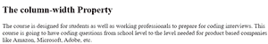

# CSS |列宽属性

> 原文:[https://www.geeksforgeeks.org/css-column-width-property/](https://www.geeksforgeeks.org/css-column-width-property/)

CSS 中的列宽属性用于定义列的宽度。显示元素内容所需的最小列数。这是一种灵活的特性。如果浏览器在给定的列宽下不能容纳至少两列，那么这两列将放入一列中。
**语法:**

```
column-width: auto|length|initial|inherit; 
```

**房产价值:**

*   **自动:**为默认值。浏览器决定列的宽度。
    **语法:**

```
column-width: auto;
```

*   **例:**

## 超文本标记语言

```
<!DOCTYPE html>
<html>
    <head>
        <title>
            CSS column-width Property
        </title>

        <style>
            .gfg {

                /* For Chrome, Safari, Opera browsers */
                -webkit-column-width: auto;

                /* For Firefox browser */
                -moz-column-width: auto;

                column-width: auto;
            }
        </style>
    </head>

    <body>
        <h2 >
            The column-width Property
        </h2>

        <div class = "gfg">
            The course is designed for students as well
            as working professionals to prepare for
            coding interviews. This course is going
            to have coding questions from school level
            to the level needed for product based
            companies like Amazon, Microsoft, Adobe, etc.
        </div>
    </body>
</html>                                   
```

*   **输出:**


*   **长度:**用于以长度表示列的宽度。长度可以设置为 px、cm 等形式。
    **语法:**

```
column-width: length;
```

*   **例:**

## 超文本标记语言

```
<!DOCTYPE html>
<html>
    <head>
        <title>
            CSS column-width Property
        </title>

        <style>
            .gfg {

                /* For Chrome, Safari, Opera browsers */
                -webkit-column-width: 100px;

                /* For Firefox browser */
                -moz-column-width: 100px;

                column-width: 100px;
            }
        </style>
    </head>

    <body>
        <h2 >
            The column-width Property
        </h2>

        <div class = "gfg">
            The course is designed for students as well
            as working professionals to prepare for
            coding interviews. This course is going
            to have coding questions from school level
            to the level needed for product based
            companies like Amazon, Microsoft, Adobe, etc.
        </div>
    </body>
</html>                                    
```

*   **输出:**


*   **初始值:**用于将列宽属性设置为默认值。
    **语法:**

```
column-width: initial;
```

*   **例:**

## 超文本标记语言

```
<!DOCTYPE html>
<html>
    <head>
        <title>
            CSS column-width Property
        </title>

        <style>
            .gfg {

                /* For Chrome, Safari, Opera browsers */
                -webkit-column-width: initial;

                /* For Firefox browser */
                -moz-column-width: initial;

                column-width: initial;
            }
        </style>
    </head>

    <body>
        <h2 >
            The column-width Property
        </h2>

        <div class = "gfg">
            The course is designed for students as well
            as working professionals to prepare for
            coding interviews. This course is going
            to have coding questions from school level
            to the level needed for product based
            companies like Amazon, Microsoft, Adobe, etc.
        </div>
    </body>
</html>                                 
```

*   **输出:**



*   **继承:**用于从父级设置列宽属性。

**支持的浏览器:**列宽属性支持的浏览器如下:

*   谷歌 Chrome 50.0，4.0-网络工具包
*   Internet Explorer 10.0
*   火狐 52.0， 2.0-moz-
*   Opera 37.0，15.0-webkit-，11.1
*   Safari 9.0、3.1-webkit