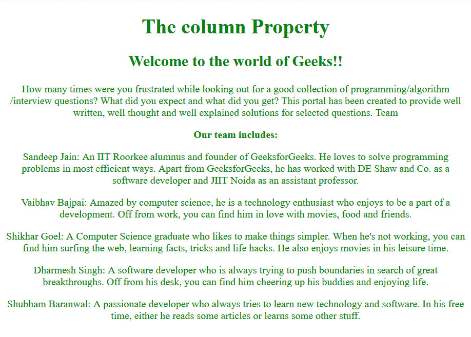
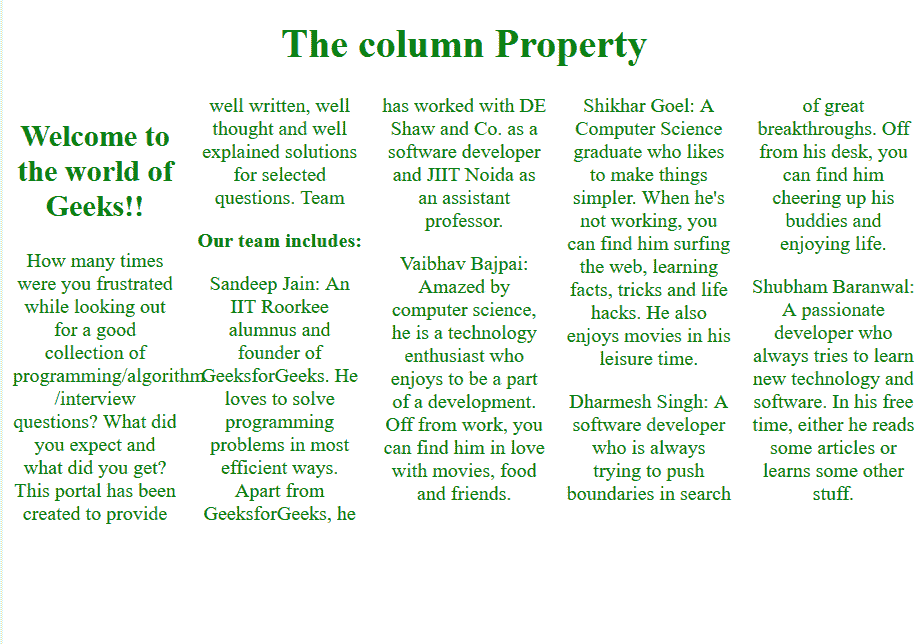

# CSS |列属性

> 原文:[https://www.geeksforgeeks.org/css-columns-property/](https://www.geeksforgeeks.org/css-columns-property/)

在 CSS 中*列*属性用于设置列的数量和列的宽度。这是一个简写属性，一次可以取多个值。

**语法:**

```
columns: column-width columns-count | auto | initial | inherit;

```

**属性值:**

*   **auto:** This sets the column-width and column-count values to their browser default values.

    **语法:**

    ```
    columns: auto auto;

    ```

    **示例 1:** 使用*自动*作为值。

    ```
    <!DOCTYPE html>
    <html>

    <head>
        <title>
            CSS | columns Property
        </title>
        <style>
            body {
                text-align: center;
                color: green;
            }

            .GFG {
                -webkit-columns: auto auto;
                /* Chrome, Safari, Opera */
                -moz-columns: auto auto;
                /* Firefox */
                columns: auto auto;
            }
        </style>
    </head>

    <body>

        <h1>The column Property</h1>

        <div class="GFG">
            <h2>Welcome to the world of Geeks!!</h2> 
              How many times were you frustrated while 
              looking out for a good collection of
              programming/algorithm/interview questions? 
              What did you expect and what did you get? 
              This portal has been created to provide well 
              written, well thought and well-explained 
              solutions for selected questions.

            <p>
                <strong>Our team includes:</strong>
                <p>
                    Sandeep Jain: An IIT Roorkee alumnus 
                  and founder of GeeksforGeeks. He loves 
                  to solve programming problems in most 
                  efficient ways. Apart from GeeksforGeeks,
                  he has worked with DE Shaw and Co. as a 
                  software developer and JIIT Noida as an
                  assistant professor.
                </p>

                <p>
                    Vaibhav Bajpai: Amazed by computer 
                  science,he is a technology enthusiast who 
                  enjoys being a part of a development. Off
                  from work, you canfind him in love with 
                  movies, food, and friends.
                </p>

                <p>
                    Shikhar Goel: A Computer Science graduate
                  who likes to make things simpler. When he's
                  not working, you can find him surfing the web,
                  learning facts, tricks and life hacks. 
                  He also enjoys movies in his leisure time.
                </p>

                <p>
                    Dharmesh Singh: A software developer who 
                  is always trying to push boundaries in search
                  of great breakthroughs. Off from his desk,
                  you can find him cheering up his buddies 
                  and enjoying life.
                </p>

                <p>
                    Shubham Baranwal: A passionate developer 
                  who always tries to learn new technology and
                  software. In his free time, either he reads 
                  some articles or learns some other stuff.
                </p>
            </p>
        </div>
    </body>

    </html>
    ```

    **输出:**
    

    **注意:**如果未指定列宽和列数中的任何值，则浏览器默认将其值设为自动。

*   **integer:** This is used to specify the column-width and the column-count using integer values.

    **语法:**

    ```
    columns: column-width column-count;

    ```

    **例 2:**

    ```
    <!DOCTYPE html>
    <html>

    <head>
        <title>
            CSS | columns Property
        </title>
        <style>
            body {
                text-align: center;
                color: green;
            }

            .GFG {
                -webkit-columns: 60px 5;
                /* Chrome, Safari, Opera */
                -moz-columns: 60px 5;
                /* Firefox */
                columns: 60px 5;
            }
        </style>
    </head>

    <body>

        <h1>The column Property</h1>

        <div class="GFG">
            <h2>Welcome to the world of Geeks!!</h2> 
              How many times were you frustrated while 
              looking out for a good collection of
              programming/algorithm/interview questions? 
              What did you expect and what did you get? 
              This portal has been created to provide well 
              written, well thought and well-explained 
              solutions for selected questions.

            <p>
                <strong>Our team includes:</strong>
                <p>
                    Sandeep Jain: An IIT Roorkee alumnus 
                  and founder of GeeksforGeeks. He loves 
                  to solve programming problems in most 
                  efficient ways. Apart from GeeksforGeeks,
                  he has worked with DE Shaw and Co. as a 
                  software developer and JIIT Noida as an
                  assistant professor.
                </p>

                <p>
                    Vaibhav Bajpai: Amazed by computer 
                  science,he is a technology enthusiast who 
                  enjoys being a part of a development. Off
                  from work, you canfind him in love with 
                  movies, food, and friends.
                </p>

                <p>
                    Shikhar Goel: A Computer Science graduate
                  who likes to make things simpler. When he's
                  not working, you can find him surfing the web,
                  learning facts, tricks and life hacks. 
                  He also enjoys movies in his leisure time.
                </p>

                <p>
                    Dharmesh Singh: A software developer who 
                  is always trying to push boundaries in search
                  of great breakthroughs. Off from his desk,
                  you can find him cheering up his buddies 
                  and enjoying life.
                </p>

                <p>
                    Shubham Baranwal: A passionate developer 
                  who always tries to learn new technology and
                  software. In his free time, either he reads 
                  some articles or learns some other stuff.
                </p>
            </p>
        </div>
    </body>

    </html>
    ```

    **输出:**
    

*   **initial:** Initializes the values to their initial default values.

    **语法:**

    ```
    columns: initial initial;

    ```

    **例 3:**

    ```
    <!DOCTYPE html>
    <html>

    <head>
        <title>
            CSS | columns Property
        </title>
        <style>
            body {
                text-align: center;
                color: green;
            }

            .GFG {
                -webkit-columns: initial initial;
                /* Chrome, Safari, Opera */
                -moz-columns: initial initial;
                /* Firefox */
                columns: initial initial;
            }
        </style>
    </head>

    <body>

        <h1>The column Property</h1>

        <div class="GFG">
            <h2>Welcome to the world of Geeks!!</h2> 
              How many times were you frustrated while 
              looking out for a good collection of
              programming/algorithm/interview questions? 
              What did you expect and what did you get? 
              This portal has been created to provide well 
              written, well thought and well-explained 
              solutions for selected questions.

            <p>
                <strong>Our team includes:</strong>
                <p>
                    Sandeep Jain: An IIT Roorkee alumnus 
                  and founder of GeeksforGeeks. He loves 
                  to solve programming problems in most 
                  efficient ways. Apart from GeeksforGeeks,
                  he has worked with DE Shaw and Co. as a 
                  software developer and JIIT Noida as an
                  assistant professor.
                </p>

                <p>
                    Vaibhav Bajpai: Amazed by computer 
                  science,he is a technology enthusiast who 
                  enjoys being a part of a development. Off
                  from work, you canfind him in love with 
                  movies, food, and friends.
                </p>

                <p>
                    Shikhar Goel: A Computer Science graduate
                  who likes to make things simpler. When he's
                  not working, you can find him surfing the web,
                  learning facts, tricks and life hacks. 
                  He also enjoys movies in his leisure time.
                </p>

                <p>
                    Dharmesh Singh: A software developer who 
                  is always trying to push boundaries in search
                  of great breakthroughs. Off from his desk,
                  you can find him cheering up his buddies 
                  and enjoying life.
                </p>

                <p>
                    Shubham Baranwal: A passionate developer 
                  who always tries to learn new technology and
                  software. In his free time, either he reads 
                  some articles or learns some other stuff.
                </p>
            </p>
        </div>
    </body>

    </html>
    ```

    **输出:**
    

*   **inherit:** Inherits the value from its parent element.

    **语法:**

    ```
    columns: inherit inherit;

    ```

    **例 4:**

    ```
    <!DOCTYPE html>
    <html>

    <head>
        <title>
            CSS | columns Property
        </title>
        <style>
            body {
                text-align: center;
                color: green;
            }

            .GFG {
                -webkit-columns: inherit inherit;
                /* Chrome, Safari, Opera */
                -moz-columns: inherit inherit;
                /* Firefox */
                columns: inherit inherit;
            }
        </style>
    </head>

    <body>

        <h1>The column Property</h1>

        <div class="GFG">
            <h2>Welcome to the world of Geeks!!</h2> 
              How many times were you frustrated while 
              looking out for a good collection of
              programming/algorithm/interview questions? 
              What did you expect and what did you get? 
              This portal has been created to provide well 
              written, well thought and well-explained 
              solutions for selected questions.

            <p>
                <strong>Our team includes:</strong>
                <p>
                    Sandeep Jain: An IIT Roorkee alumnus 
                  and founder of GeeksforGeeks. He loves 
                  to solve programming problems in most 
                  efficient ways. Apart from GeeksforGeeks,
                  he has worked with DE Shaw and Co. as a 
                  software developer and JIIT Noida as an
                  assistant professor.
                </p>

                <p>
                    Vaibhav Bajpai: Amazed by computer 
                  science,he is a technology enthusiast who 
                  enjoys being a part of a development. Off
                  from work, you canfind him in love with 
                  movies, food, and friends.
                </p>

                <p>
                    Shikhar Goel: A Computer Science graduate
                  who likes to make things simpler. When he's
                  not working, you can find him surfing the web,
                  learning facts, tricks and life hacks. 
                  He also enjoys movies in his leisure time.
                </p>

                <p>
                    Dharmesh Singh: A software developer who 
                  is always trying to push boundaries in search
                  of great breakthroughs. Off from his desk,
                  you can find him cheering up his buddies 
                  and enjoying life.
                </p>

                <p>
                    Shubham Baranwal: A passionate developer 
                  who always tries to learn new technology and
                  software. In his free time, either he reads 
                  some articles or learns some other stuff.
                </p>
            </p>
        </div>
    </body>

    </html>

    </html>
    ```

    **输出:**
    

**支持的浏览器:****栏目属性**支持的浏览器如下:

*   Chrome 50.0，4.0 -webkit-
*   Edge 10.0
*   火狐 52.0， 9.0 -moz-
*   Opera 37.0，15.0 -webkit- 11.1
*   Safari 9.0，3.1 -webkit-