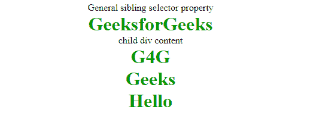
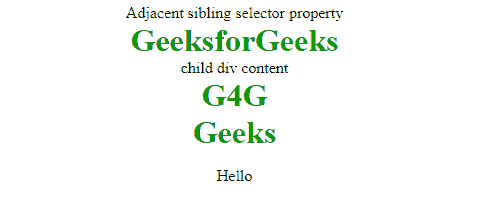
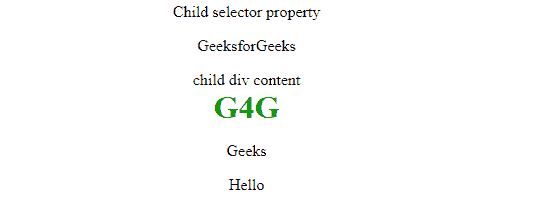
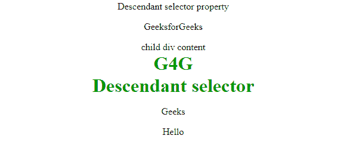

# CSS | combinator

> 原文:[https://www.geeksforgeeks.org/css-combinators/](https://www.geeksforgeeks.org/css-combinators/)

CSS 组合器正在解释两个选择器之间的关系。CSS 选择器是用于选择样式元素的模式。CSS 选择器可以是一个简单的选择器，也可以是一个复杂的选择器，由多个使用组合子连接的选择器组成。
CSS 中有四种组合子，下面讨论:

*   常规同级选择器(~)
*   Adjecant 同级选择器(+)
*   子选择器(>)
*   后代选择器(空间)

**通用同级选择器:**通用同级选择器用于选择跟随第一个选择器元素的元素，并且与第一个选择器元素共享同一个父元素。这可用于选择共享同一父元素的一组元素。

## 超文本标记语言

```html
<!DOCTYPE html>
<html>
<head>
    <title>Combinator Property</title>
    <style>
        div ~ p{
            color: #009900;
            font-size:32px;
            font-weight:bold;
            margin:0px;
            text-align:center;
        }
        div {
            text-align:center;
        }
    </style>
</head>

<body>
    <div>General sibling selector property</div>

<p>GeeksforGeeks</p>

    <div>
        <div>child div content</div>

<p>G4G</p>

    </div>

<p>Geeks</p>

<p>Hello</p>

</body>
</html>                   
```

**输出:**



**相邻同级选择器:**相邻同级选择器用于选择与指定选择器标签相邻的元素或下一个元素。这个组合器只选择紧挨着指定标签的一个标签。

## 超文本标记语言

```html
<!DOCTYPE html>
<html>
<head>
    <title>Combinator Property</title>
    <style>
        div + p{
            color: #009900;
            font-size:32px;
            font-weight:bold;
            margin:0px;
            text-align:center;
        }
        div {
            text-align:center;
        }
        p {
            text-align:center;
        }
    </style>
</head>

<body>
    <div>Adjacent sibling selector property</div>

<p>GeeksforGeeks</p>

    <div>
        <div>child div content</div>

<p>G4G</p>

    </div>

<p>Geeks</p>

<p>Hello</p>

</body>
</html>                   
```

**输出:**



**子选择器:**该选择器用于选择指定标签的直接子元素。这个组合子比后代选择器更严格，因为如果第一个选择器元素是它的父元素，它只选择第二个选择器。

## 超文本标记语言

```html
<!DOCTYPE html>
<html>
<head>
    <title>Combinator Property</title>
    <style>
        div > p{
            color: #009900;
            font-size:32px;
            font-weight:bold;
            margin:0px;
            text-align:center;
        }
        div {
            text-align:center;
        }
        p {
            text-align:center;
        }
    </style>
</head>

<body>
    <div>Child selector property</div>

<p>GeeksforGeeks</p>

    <div>
        <div>child div content</div>

<p>G4G</p>

    </div>

<p>Geeks</p>

<p>Hello</p>

</body>
</html>                   
```

**输出:**



**后代选择器:**该选择器用于选择指定标签的所有子元素。标签可以是指定标签的直接子标签，也可以位于指定标签的很深处。这个组合器组合了两个选择器，使得所选元素具有与第一个选择器元素相同的祖先。

## 超文本标记语言

```html
<!DOCTYPE html>
<html>
<head>
    <title>Combinator Property</title>
    <style>
        div p{
            color: #009900;
            font-size:32px;
            font-weight:bold;
            margin:0px;
            text-align:center;
        }
        div {
            text-align:center;
        }
        p {
            text-align:center;
        }
    </style>
</head>

<body>
    <div>Descendant selector property</div>

<p>GeeksforGeeks</p>

    <div>
        <div>child div content</div>

<p>G4G</p>

<p>Descendant selector</p>

    </div>

<p>Geeks</p>

<p>Hello</p>

</body>
</html>                   
```

**输出:**



**支持的浏览器:**

*   谷歌 Chrome
*   internet Explorer(IE 7.0 之后)
*   火狐浏览器
*   歌剧
*   旅行队