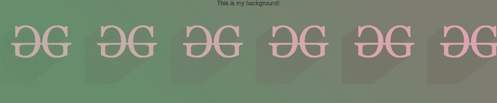

# CSS |结合背景图像与渐变叠加

> 原文:[https://www . geesforgeks . org/CSS-combine-background-image-with-gradient-overlay/](https://www.geeksforgeeks.org/css-combine-background-image-with-gradient-overlay/)

CSS 渐变允许我们显示两种或多种颜色之间的平滑过渡。它们可以通过简单地组合背景图像 [url](https://www.geeksforgeeks.org/css-background-image-property/) 和[渐变](https://www.geeksforgeeks.org/css-gradients/)属性添加到背景图像的顶部。
**语法:**

*   对于背景图像顶部的线性渐变:

    ```css
    element {
        background-image: linear-gradient(direction, 
         color-stop1, color-stop2, ...), url('url');
    }
    ```

*   背景图像顶部的径向渐变:

    ```css
    element {
        background-image: radial-gradient(direction, 
        color-stop1, color-stop2, ...), url('url');
    }
    ```

以下示例说明了上述方法:
**示例 1:** 具有线性渐变的背景图像。

```css
<!DOCTYPE html>
<html lang="en">

<head>
    <title>Background Image with Gradient</title>
    <meta charset="utf-8">
    <meta name="viewport"
          content="width=device-width, initial-scale=1">
    <link rel="stylesheet"
          href=
"https://maxcdn.bootstrapcdn.com/bootstrap/4.3.1/css/bootstrap.min.css">
    <style>
        .my_bg {
            background-image: 
              linear-gradient(45deg, rgba(
                145, 146, 122, 0.62), rgba(
                  217, 91, 132, 0.58)), url(
'https://media.geeksforgeeks.org/wp-content/cdn-uploads/20190710102234/download3.png');
            width: 100%;
            height: 280px;
            text-align: center;
        }
    </style>
</head>

<body>
    <div class="my_bg">
        This is my background!
    </div>
</body>

</html>
```

**输出:**


**示例 2:** 具有径向梯度的背景图像。

```css
<!DOCTYPE html>
<html lang="en">

<head>
    <title>Background Image with Gradient</title>
    <meta charset="utf-8">
    <meta name="viewport" 
          content="width=device-width, initial-scale=1">
    <link rel="stylesheet" 
          href=
"https://maxcdn.bootstrapcdn.com/bootstrap/4.3.1/css/bootstrap.min.css">
    <style>
        .my_bg {
            background-image: radial-gradient(rgba(
              145, 146, 122, 0.62), rgba(217, 91, 132, 0.58)), url(
'https://media.geeksforgeeks.org/wp-content/uploads/20200120152724/gfg_icon.png');
            width: 100%;
            height: 200px;
            text-align: center;
        }
    </style>
</head>

<body>
    <div class="my_bg">
        This is my background!
    </div>
</body>

</html>
```

**输出:**
