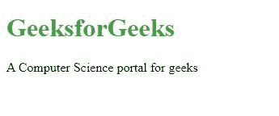

# CSS 注释

> 原文:[https://www.geeksforgeeks.org/css-comments/](https://www.geeksforgeeks.org/css-comments/)

CSS 中的**注释**是代码中被编译器忽略而不执行的语句。注释用于解释代码。它们使程序更加易读易懂。

**语法:**

```css
/* content */
```

注释可以是单行或多行。/* */注释语法可以用于单个和多行注释。对于较旧的浏览器，我们可能会在 CSS 中使用语法进行隐藏，但不再推荐使用。在代码中添加注释是一种很好的做法，如果有人阅读了代码或者稍后查看了代码，这有助于理解代码。

**注意:**输出是一样的，因为注释被浏览器忽略，不被解释。

**例 1:** 本例描述单行注释。

## 超文本标记语言

```css
<!DOCTYPE html>
<html>
<head>
    <style>
    h1 {
        color: green;
    }

    /* Single line comment */
    </style>
</head>

<body>
    <h1>GeeksforGeeks</h1>

<p> A Computer Science portal for geeks </p>

</body>
</html>
```

**输出:**



**例 2:** 本例描述多行注释。

## 超文本标记语言

```css
<!DOCTYPE html>
<html>
<head>
    <style>
    h1 {
        color: green;
    }

    /* This is a multiline
           comment */
    </style>
</head>

<body>
    <h1>GeeksforGeeks</h1>

<p> A Computer Science portal for geeks </p>

</body>
</html>
```

**输出:**


**支持的浏览器:**

*   谷歌 Chrome
*   微软公司出品的 web 浏览器
*   微软边缘
*   火狐浏览器
*   旅行队
*   歌剧