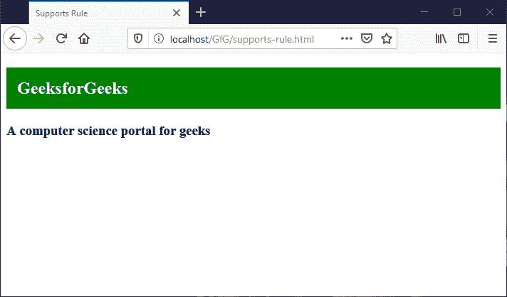
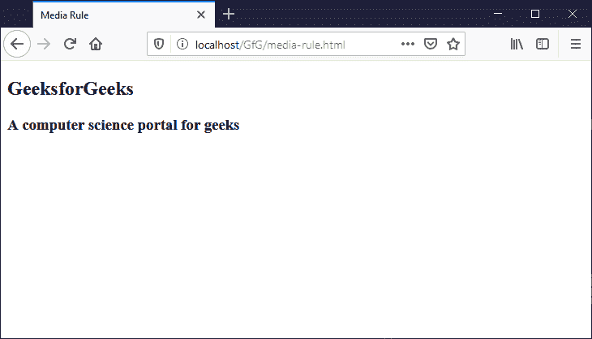
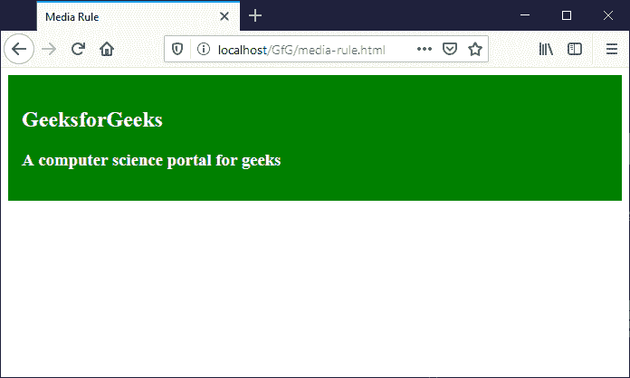
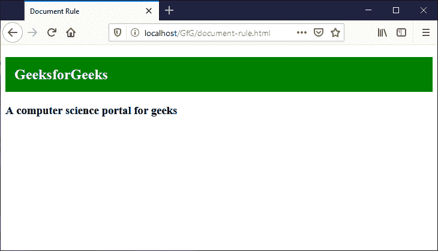

# CSS |条件规则

> 原文:[https://www.geeksforgeeks.org/css-conditional-rules/](https://www.geeksforgeeks.org/css-conditional-rules/)

**CSS 条件规则**只不过是 CSS 的一个特性，其中 CSS 样式是基于特定条件应用的。因此，这里的条件可以是真也可以是假，并且基于语句/样式将被执行。
这些规则最终归入 **CSS at-rule** 之下，因为它们以 **@** 开始。
条件规则为:

*   **@支持**
*   **@媒体**
*   **@文档**

**@ supports:**[@ supports 条件式规则](https://www.geeksforgeeks.org/css-supports-rule/)是检查浏览器对特定 CSS 属性的支持，并基于此应用样式。
**语法:**

```html
@supports ("*condition*") {
   /*  Style to apply  */
}
```

**例:**

## 超文本标记语言

```html
<!DOCTYPE html>
<html>
<head>
    <title>Supports Rule</title>
    <style>       
        @supports (display: grid) {
            section h1 {
                background-color: green;
                color: white;
                padding: 15px;
            }
        }
    </style>
</head>
<body>
    <section>
        <h1>GeeksforGeeks</h1>
        <h3>A computer science portal for geeks</h3>
    </section>
</body>
</html>
```

**输出:**



在上面的示例中，浏览器由作为网格的 display 属性支持。
**@媒体:**[@媒体条件规则](https://www.geeksforgeeks.org/css-media-rule/)是用于基于媒体查询应用样式的规则。它可用于检查设备宽度和/或高度，并应用基于此指定的样式。
**语法:**

```html
@media screen and ("*condition*") {
   /*  Style to apply  */
}
```

**例:**

## 超文本标记语言

```html
<!DOCTYPE html>
<html>
<head>
    <title>Media Rule</title>
    <style>
        @media screen and (max-width: 700px) {
            section {
                background-color: green;
                color: white;
                padding: 15px;
            }
        }
    </style>
</head>
<body>
    <section>
        <h1>GeeksforGeeks</h1>
        <h3>A computer science portal for geeks</h3>
    </section>
</body>
</html>
```

**输出:**
**屏幕宽度超过 700 像素:**



**屏幕宽度小于或等于 700 像素:**



在上面的例子中，当浏览器的宽度超过 700px 时，不应用样式，但是当浏览器窗口小于 700px 时，应用样式。
**@文档:**[@文档条件规则](https://www.geeksforgeeks.org/css-document-rule/)用于对指定的网址应用样式，即样式仅应用于指定的网址。
**语法:**

```html
@document url(“*YOUR-URL*”) {
   /*  Style to apply  */
}
```

它是实验性的，只在带有 **-moz-** 前缀即 [**@-moz-document**](https://developer.mozilla.org/en-US/docs/Web/CSS/@document) 的 Firefox 上工作。
**例:**

## 超文本标记语言

```html
<!DOCTYPE html>
<html>
<head>
    <title>Document Rule</title>
    <style>
        @-moz-document url("http://localhost/GfG/document-rule.html") {
            section h1 {
                background-color: green;
                color: #fff;
                padding: 15px;
            }
        }
    </style>
</head>
<body>
    <section>
        <h1>GeeksforGeeks</h1>
        <h3>A computer science portal for geeks</h3>
    </section>
</body>
</html>
```

**输出:**



在上面的示例中，当指定的 URL 是被访问的 URL 时，应用该样式。

**支持的浏览器:**

*   谷歌 Chrome
*   微软公司出品的 web 浏览器
*   火狐浏览器
*   歌剧
*   狩猎