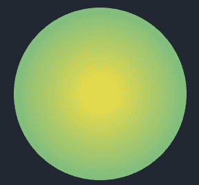
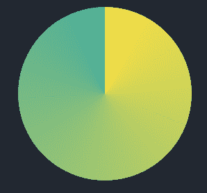
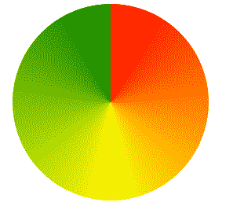
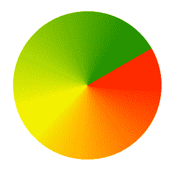
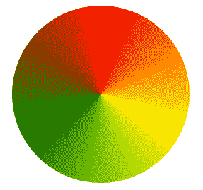
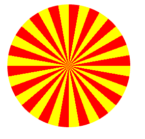
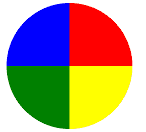

# CSS |二次曲线-渐变()函数

> 原文:[https://www.geeksforgeeks.org/css-conic-gradient-function/](https://www.geeksforgeeks.org/css-conic-gradient-function/)

圆锥梯度()函数是 CSS 中的一个内置函数，用于设置圆锥梯度作为背景图像。圆锥梯度角从 0 度–360 度开始。圆锥曲线是圆形的，使用元素的中心作为颜色停止的源点。
圆锥渐变包括饼图和色轮。圆锥梯度()函数的结果是一个数据类型的对象，这是一种特殊的图像。

**语法:**

```css
 Background image: conic-gradient(color degree, color degree, ...)  
```

圆锥渐变类似于径向渐变，只是颜色停止点位于创建的圆的外边缘。

**示例:**

径向梯度:



圆锥梯度:



下面的例子说明了 CSS 中的圆锥梯度()函数:

**程序 1:**

```css
<!DOCTYPE html>
<html>
<head>
    <title>conic gradient</title>
    <style>
    .box
    {    
        background-color: yellow;
        height: 200px;
        width: 200px;
        float: left;
        margin: 20px;
        border-radius: 50%;
    }
    .a
    {
        background-image: 
          conic-gradient(red, yellow, green);
    }
    </style>
</head>
<body>
    <div class="box a"></div>
</body>
</html>
```

**输出:**



**程序 2:**

```css
<!DOCTYPE html>
<html>
<head>
    <title>conic gradient</title>
    <style>
    .box
    {    
        background-color: yellow;
        height: 200px;
        width: 200px;
        float: left;
        margin: 20px;
        border-radius: 50%;
    }
    .b
    {
        background-image: conic-gradient(
              from 60deg, red, yellow, green);
    }
    </style>
</head>
<body>
    <div class="box b"></div>
</body>
</html>
```

**输出:**



**程序 3:**

```css
<!DOCTYPE html>
<html>
<head>
    <title>conic gradient</title>
    <style>
    .box
    {    
        background-color: yellow;
        height: 200px;
        width: 200px;
        float: left;
        margin: 20px;
        border-radius: 50%;
    }
    .c
    {
        background-image: 
            conic-gradient(red, yellow, green, red);
    }
    </style>
</head>
<body>
    <div class="box c"></div>
</body>
</html
```

**输出:**



**程序 4:**

```css
<!DOCTYPE html>
<html>
<head>
    <title>conic gradient</title>
    <style>
    .box
    {    
        background-color: yellow;
        height: 200px;
        width: 200px;
        float: left;
        margin: 20px;
        border-radius: 50%;
    }
    .d
    {
        background-image:
 repeating-conic-gradient(
      red 0deg, red 10deg, yellow 10deg, yellow 20deg);    
    }     
    </style>
</head>
<body>
    <div class="box d"></div>
</body>
</html>
```

**输出:**



**程序 5:**

```css
<!DOCTYPE html>
<html>
<head>
    <title>conic gradient</title>
    <style>
    .box
    {    
        background-color: yellow;
        height: 200px;
        width: 200px;
        float: left;
        margin: 20px;
        border-radius: 50%;
    }
    .e
    {
        background-image: 
          conic-gradient(
                        red 0deg, red 90deg,
                        yellow 90deg, yellow 180deg,
                        green 180deg, green 270deg,
                        blue 270deg, blue 360deg);
    }
    </style>
</head>
<body>
    <div class="box e"></div>
</body>
</html>
```

**输出:**

