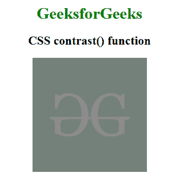

# CSS |对比度()功能

> 原文:[https://www.geeksforgeeks.org/css-contrast-function/](https://www.geeksforgeeks.org/css-contrast-function/)

对比度()函数是一个内置函数，用于应用滤镜来设置图像的对比度。此功能调整图像的对比度。

**语法:**

```html
contrast( amount )
```

**参数:**该功能接受保存对比度量的单参数**量**。对比度的值是根据值和百分比设置的。值 0%代表完全灰色的图像，100%代表原始图像。

下面的例子说明了 CSS 中的 contrast()函数:

**示例:**

```html
<!DOCTYPE html> 
<html> 

<head> 
    <title>CSS contrast() Function</title> 

    <style>
        h1 {
            color:green;
        }
        body {
            text-align:center;
        }
        .contrast_effect {
            filter: contrast(10%);
        }
    </style>
</head> 

<body> 
    <h1>GeeksforGeeks</h1> 

    <h2>CSS contrast() function</h2>

     
</body> 

</html>    
```

**输出:**


**支持的浏览器:**对比()功能支持的浏览器如下:

*   谷歌 Chrome
*   微软公司出品的 web 浏览器
*   火狐浏览器
*   旅行队
*   歌剧