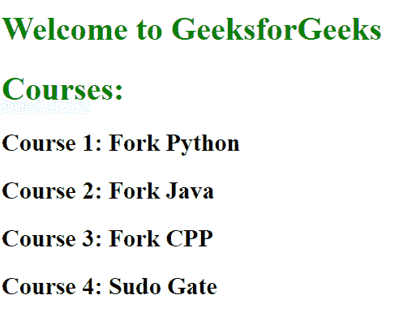
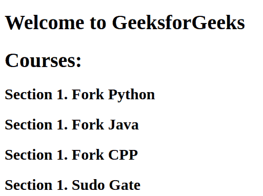

# CSS |反增量属性

> 原文:[https://www . geesforgeks . org/CSS-counter-increment-property/](https://www.geeksforgeeks.org/css-counter-increment-property/)

**CSS 计数器递增属性**用于递增/递减计数器的值。CSS 计数器是一个变量，用于跟踪一个变量被使用的次数。

**语法:**

```css
counter-increment: none | identifier | initial | inherit;
```

**默认值:无**

**属性值:**

**无:**这是默认值，此时不会增加计数器。
**语法:**

```css
counter-increment: none;
```

**例:**

## 超文本标记语言

```css
<!DOCTYPE html>
<html>

<head>
    <title>CSS counter-increment Property</title>
    <style>

        h1 {
            color: green;
        }

        body {
        }

        <!-- The h2::before selector inserts something
        before the content of each selected element -->
        h2::before {

            counter-increment: none;
        }
    </style>
</head>

<body>

    <h1>Welcome to GeeksforGeeks</h1>
    <h1>Courses: </h1>
    <h2>Fork Python</h2>
    <h2>Fork Java</h2>
    <h2>Fork CPP</h2>
    <h2>Sudo Gate</h2>

</body>

</html>                   
```

**输出:**



**标识符:**标识符值用于定义要递增的计数器。该值还采用一个数字，该数字定义了增量的大小。该增量值的默认值为 1(如果选择器尚未复位，则默认值为 0)。该值也采用负值。
**语法:**

```css
counter-increment: identifier;
```

**例:**

## 超文本标记语言

```css
<!DOCTYPE html>
<html>

<head>
    <title>CSS counter-increment Property</title>
    <style>

        h1 {
            color: green;
        }

        body {

            <!-- Set "geek-counter" identifier to 0 -->
              counter-reset: geek-counter;
        }

        <!-- The h2::before selector inserts something
          before the content of each selected element -->
          h2::before {

            <!-- Increment "geek-counter" by 1 -->
            counter-increment: geek-counter;
            content: "Course " counter(geek-counter) ": ";
        }
    </style>
</head>

<body>

    <h1>Welcome to GeeksforGeeks</h1>
    <h1>Courses: </h1>
    <h2>Fork Python</h2>
    <h2>Fork Java</h2>
    <h2>Fork CPP</h2>
    <h2>Sudo Gate</h2>

</body>

</html>
```

**输出:**


**初始值:**该值将属性设置为默认值。
**语法:**

```css
counter-increment: initial;
```

**例:**

## 超文本标记语言

```css
<!DOCTYPE html>
<html>

<head>
    <style>
    body {
            /* Set "my-geek-counter" to 1*/
            counter-reset: my-geek-counter 1;
        }

        h2::before {
            /* Sets the initial value
              which is 1 here for the counter */
            counter-increment: initial;
            content: "Section " counter(my-geek-counter) ". ";
        }
    }
    </style>
</head>

<body>

    <h1>Welcome to GeeksforGeeks</h1>
    <h1>Courses: </h1>
    <h2>Fork Python</h2>
    <h2>Fork Java</h2>
    <h2>Fork CPP</h2>
    <h2>Sudo Gate</h2>
</body>

</html>
```

**输出:**



**inherit:** 该值从其父元素继承该属性。
**语法:**

```css
counter-increment: inherit;
```

**例:**

## 超文本标记语言

```css
<!DOCTYPE html>
<html>

<head>
    <style>
    body {
            /* Set "my-geek-counter" to 1*/
            counter-reset: my-geek-counter 1;
        }

        h2::before {
            /* Sets the initial value
            which is 1 here for the counter */
            counter-increment: inherit;
            content: "Section " counter(my-geek-counter) ". ";
        }
    }
    </style>
</head>

<body>

    <h1>Welcome to GeeksforGeeks</h1>
    <h1>Courses: </h1>
    <h2>Fork Python</h2>
    <h2>Fork Java</h2>
    <h2>Fork CPP</h2>
    <h2>Sudo Gate</h2>
</body>

</html>
```

**输出:**


**支持的浏览器***反增量*属性支持的浏览器如下:

*   谷歌 Chrome 2.0
*   互联网探索 8.0
*   Firefox 1.0
*   歌剧 9.2
*   苹果 Safari 3.0