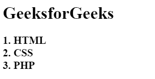
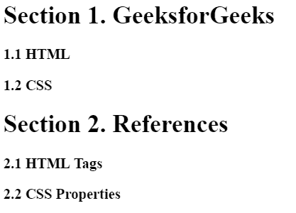

# CSS |计数器复位属性

> 原文:[https://www.geeksforgeeks.org/css-counter-reset-property/](https://www.geeksforgeeks.org/css-counter-reset-property/)

CSS 中的计数器重置属性用于为元素创建或重置 CSS 计数器。此属性与反增量属性和内容属性一起工作。

**语法:**

```html
counter-reset = none|name number|initial|inherit;
```

**默认值:**

*   **无**

**房产价值:**

*   **无:**为默认值。该值不会重置计数器。
*   **名称编号:**元素每次出现时重置计数器的值。如果未指定，默认值为 0。
*   **初始值:**将计数器复位属性设置为默认值。
*   **继承:**元素从其父元素继承属性。

**示例 1:** 本示例使用计数器重置属性创建部分。

## 超文本标记语言

```html
<!DOCTYPE html>
<html>

<head>

    <!-- CSS property to set counter-reset property -->
    <style>

        /* set chapter counter to 0*/
        body {
            counter-reset: chapter;    
        }
        .chapter:before {
            content: counter(chapter) ". ";
            display: inline;
        }
        .chapter {

            /* Increment the chapter counter by 1,
            same as counter-increment: chapter 1; */
            counter-increment: chapter;

            /* set section counter to 0 */
            counter-reset: section;    
            font-size: 20px;
            font-weight: bold;
        }
    </style>
</head>

<body>
    <h1>GeeksforGeeks</h1>

    <div class = "chapter">HTML</div>
    <div class = "chapter">CSS</div>
    <div class = "chapter">PHP</div>
</body>                   

</html>
```

**输出:**



**示例 2:** 本示例使用计数器重置属性创建节和子节。

## 超文本标记语言

```html
<!DOCTYPE html>
<html>

<head>

    <!-- CSS style to create counter-reset property -->
    <style>
        body {
            counter-reset: section;
        }
        h1 {
            counter-reset: category;
        }
        h1:before {
            counter-increment: section;
            content: "Section " counter(section) ". ";
        }
        h3:before {
            counter-increment: category;
            content: counter(section) "." counter(category) " ";
        }
    </style>
</head>

<body>
    <h1>GeeksforGeeks</h1>

    <h3>HTML</h3>
    <h3>CSS </h3>

    <h1>References</h1>

    <h3>HTML Tags</h3>
    <h3>CSS Properties</h3>
</body>

</html>                   
```

**输出:**



**支持的浏览器:***反重置属性*支持的浏览器如下:

*   谷歌 Chrome 4.0
*   Internet Explorer 8.0
*   Firefox 2.0
*   Safari 3.1
*   歌剧 9.6