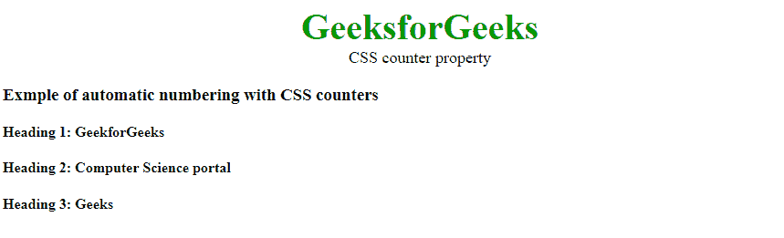
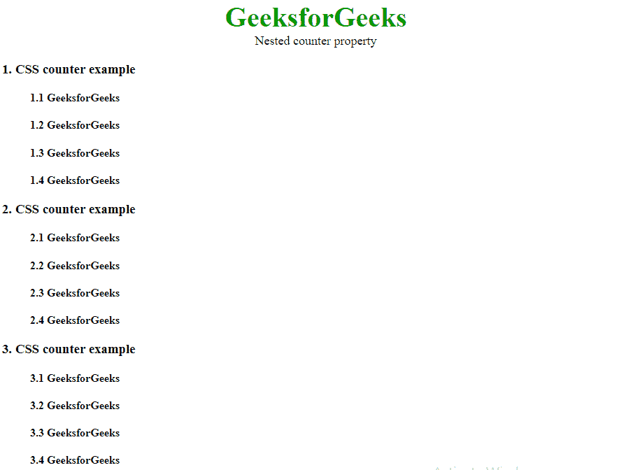

# CSS |计数器

> 原文:[https://www.geeksforgeeks.org/css-counters/](https://www.geeksforgeeks.org/css-counters/)

CSS 中的计数器基本上是可以用于编号的变量，CSS 计数器的值可以通过 CSS 规则来递增。例如，CSS 计数器可以用来自动增加标题的编号。在 HTML 中，

**CSS 计数器属性:** CSS 计数器包含以下属性:

*   **计数器复位:**用于复位一个计数器。
*   **计数器递增:**它基本上递增一个计数器值。
*   **内容:**用于生成内容。
*   **counter()或 counters()函数:**可以使用内容属性中的 counter()或 counters()函数显示计数器的值。这两个函数基本上用于将计数器的值添加到元素中。

**初始化 CSS 计数器:**要使用 CSS 计数器属性，首先必须使用计数器重置属性创建它，第一步是重置计数器。默认情况下，myCounter 使用计数器重置属性初始化为值 0(零)。
**语法:**

```html
counter-reset: myCounter;

```

**递增和使用 CSS 计数器:**要递增计数器，请使用 CSS 计数器递增属性。
**语法:**

```html
counter-increment: myCounter;

```

内容中的 counter()或 counters()函数用于以特定顺序显示内容。
**语法:**

```html
content: counter(myCounter);

```

**示例:**

```html
<!DOCTYPE html>
<html>
    <head>
        <title>CSS counter property</title>
        <style>
            body {
                counter-reset: myCounter;
            }

            h4::before {
                counter-increment: myCounter;
                content: "Heading " counter(myCounter) ": ";
            }
            .geeks {
                color:#090;
                font-size:40px;
                font-weight:bold;
                text-align:center;
            }
            .gfg {
                text-align:center;
                font-size:18px;
            }
        </style>
    </head>
    <body>
        <div class = "geeks">GeeksforGeeks</div>
        <div class = "gfg">CSS counter property</div>
        <h3>Example of automatic numbering with CSS counters</h3>
        <h4>GeekforGeeks</h4>
        <h4>Computer Science portal</h4>
        <h4>Geeks</h4>
    </body>
</html>                                 
```

**输出:**


**嵌套 CSS 计数器:**计数器内的计数器称为嵌套计数器。嵌套计数器用于创建标题和副标题。这个例子展示了带有嵌套标签的 CSS 计数器的使用。不同计数器用于不同类型的标签。

**示例:**

```html
<!DOCTYPE html>
<html>
    <head>
        <title>Nested css counter</title>
        <style>
            body {
                counter-reset: counter1;
            }
            h3 {
                counter-reset: counter2;
            }
            h3::before {
                counter-increment: counter1;
                content: counter(counter1) ". ";
            }
            h4::before {
                margin-left:40px;
                counter-increment: counter2;
                content: counter(counter1) "." counter(counter2) " ";
            }
            .geeks {
                color:#090;
                font-size:40px;
                font-weight:bold;
                text-align:center;
            }
            .gfg {
                text-align:center;
                font-size:18px;
            }
        </style>
    </head>
    <body>
        <div class = "geeks">GeeksforGeeks</div>
        <div class = "gfg">Nested counter property</div>
        <h3>CSS counter example</h3>
        <h4>GeeksforGeeks</h4>
        <h4>GeeksforGeeks</h4>
        <h4>GeeksforGeeks</h4>
        <h4>GeeksforGeeks</h4>

        <h3>CSS counter example</h3>
        <h4>GeeksforGeeks</h4>
        <h4>GeeksforGeeks</h4>
        <h4>GeeksforGeeks</h4>
        <h4>GeeksforGeeks</h4>

        <h3>CSS counter example</h3>
        <h4>GeeksforGeeks</h4>
        <h4>GeeksforGeeks</h4>
        <h4>GeeksforGeeks</h4>
        <h4>GeeksforGeeks</h4>
    </body>
</html>                    
```

**输出:**
