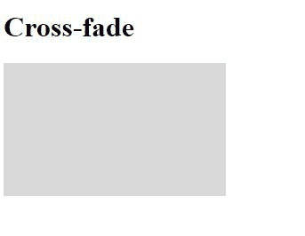
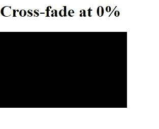

# CSS 交叉淡入属性

> 原文:[https://www.geeksforgeeks.org/css-cross-fade-property/](https://www.geeksforgeeks.org/css-cross-fade-property/)

**交叉淡入度属性**用于在两个给定图像之间形成一种混合。简单来说，它是用来将图像按百分比混合在一起的。

**语法:**

```css
cross-fade( <image, <image>, <percentage> )
```

**属性值:**

*   它没有属性值，取而代之的是两个图像和一个指示所需混合量的数字。

**例 1:**

在第一幅图像是白色而第二幅图像是黑色的情况下，交叉淡入度为 0%,然后以 85 份白色图像和 15 份黑色图像的方式进行混合。

```css
<!DOCTYPE html>
<html lang="en">
<head>
  <meta charset="UTF-8">
  <meta name="viewport" 
        content="width=device-width,
                 initial-scale=1.0">
  <title>Document</title>
</head>
<style>
#box{
    width: 250px;
    height: 150px;
    /* 15 parts of black and 85 parts of white */
    background-image: -webkit-cross-fade(
      url(
"https://media.geeksforgeeks.org/wp-content/uploads/20200714125439/w-200x141.JPG")
      ,url(
"https://media.geeksforgeeks.org/wp-content/uploads/20200714125445/b-300x173.JPG")
      ,15%);
}
</style>
<body>
  <h1>Cross-fade</h1>
  <div id="box">
  </div>
</body>
</html>
```

**输出:**



**例 2:**

在第一幅图像是黑色而第二幅图像是白色的情况下，交叉淡入度为 0%,然后以白色图像的 0 部分和黑色图像的 100 部分的方式进行混合。

```css
<!DOCTYPE html>
<html lang="en">
<head>
  <meta charset="UTF-8">
  <meta name="viewport" 
        content="width=device-width, 
                 initial-scale=1.0">
  <title>Document</title>
</head>
<style>
#box{
    width: 250px;
    height: 150px;
    /* 15 parts of black and 85 parts of white */
    background-image:
    -webkit-cross-fade(
    url(
"https://media.geeksforgeeks.org/wp-content/uploads/20200714125445/b-300x173.JPG"),
    url(
"https://media.geeksforgeeks.org/wp-content/uploads/20200714130459/01.JPG"),
    0%);
}
</style>
<body>
  <h1>Cross-fade at 0%</h1>
  <div id="box">
  </div>
</body>
</html>
```

**输出:**



**支持的浏览器:**

*   Firefox 3.0
*   边缘
*   铬
*   旅行队