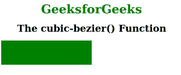

# CSS |三次贝塞尔()函数

> 原文:[https://www.geeksforgeeks.org/css-cubic-bezier-function/](https://www.geeksforgeeks.org/css-cubic-bezier-function/)

三次贝塞尔()函数是 CSS 中的一个内置函数，用于定义三次贝塞尔曲线。
贝塞尔曲线是一种数学定义的曲线，用于二维图形应用，如家居插画、水墨等。曲线由四个点定义:初始位置和终止位置，即 P0 和 P3(分别称为“锚”)，以及两个独立的中间点，即 P1 和 P2(在我们的示例中称为“手柄”)。贝塞尔曲线常用于计算机图形学、动画、建模等。
**语法:**

```css
cubic-bezier( x1, y1, x2, y2 )
```

**参数:**该功能接受四个参数，这是强制性的。它包含一个数值，x1 和 x2 的值介于 0 到 1 之间。
下面的程序说明了 CSS 中的三次 bezier()函数:
**程序:**

## 超文本标记语言

```css
<!DOCTYPE html>
<html>
    <head>
        <title>cubic-bezier function</title>
        <style>
            .geeks {
                width: 150px;
                height: 80px;
                background: green;
                transition: width 5s;
                transition-timing-function: cubic-bezier(0.3, 0.7, 1.0, 0.1);
            }

            div:hover {
                width:300px;
            }
            .gfg {
                font-size:40px;
                font-weight:bold;
                color:green;
                text-align:center;
            }
            h1 {
                text-align:center;
            }
        </style>
    </head>
    <body>
        <div class = "gfg">GeeksforGeeks</div>
        <h1>The cubic-bezier() Function</h1>
        <div class = "geeks"></div>
    </body>
</html>
```

**输出:**



**支持的浏览器:**

*   谷歌 Chrome
*   微软公司出品的 web 浏览器
*   火狐浏览器
*   歌剧
*   旅行队