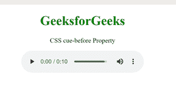
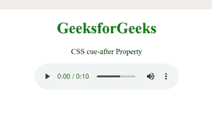

# CSS 提示属性

> 原文:[https://www.geeksforgeeks.org/css-cue-property/](https://www.geeksforgeeks.org/css-cue-property/)

它是提示前和提示后属性的简写版本。它指定在元素之前或之后播放听觉图标，以区分和设置元素。

**语法:**

```css
cue: <cue-before> <cue-after>?
```

**属性值:**

*   **CSS cue-before:** It is used to define an auditory icon played before the element to distinguish and set the element.

    **语法:**

    ```css
    cue-before: url|none;
    ```

    **示例:**

    ```css
    <!DOCTYPE html> 
    <html> 

    <head> 
        <style> 
            .gfg { 
                cue-before: url("bell.wav"); 
            } 
        </style> 
    </head> 

    <body style="text-align: center;"> 
        <h1 style="color: green;">GeeksforGeeks</h1> 
        <p class="gfg">CSS cue-before Property</p>

        <audio controls> 
            <source src= 
    "https://media.geeksforgeeks.org/wp-content/uploads/20190625153922/frog.mp3"
            type="audio/mp3"> 
        </audio> 
    </body> 

    </html> 
    ```

    **输出:**

    

*   **CSS cue-after:** It is used to define an auditory icon played after the element to distinguish and set the element.

    **语法:**

    ```css
    cue-after: url | none ;
    ```

    **示例:**

    ```css
    <!DOCTYPE html> 
    <html> 

    <head> 
        <style> 
            .gfg { 
                cue-after: url("bell.wav"); 
            } 
        </style> 
    </head> 

    <body style="text-align: center;"> 
        <h1 style="color: green;">GeeksforGeeks</h1> 
        <p class="gfg">CSS cue-after Property</p>

        <audio controls> 
            <source src= 
    "https://media.geeksforgeeks.org/wp-content/uploads/20190625153922/frog.mp3"
            type="audio/mp3"> 
        </audio> 
    </body> 

    </html> 
    ```

    **输出:**

    