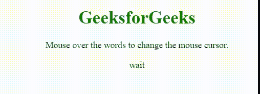

# CSS 光标属性

> 原文:[https://www.geeksforgeeks.org/css-cursor-property/](https://www.geeksforgeeks.org/css-cursor-property/)

**光标属性**用于指定当*指向一个元素*时要显示的鼠标光标。该属性由零个或多个< url >值定义，这些值由逗号分隔，后跟 1 个关键字值作为强制的&每个< url >将指向图像文件。

**语法:**

```css
cursor: value;
```

**属性值:**

*   **自动:**这是浏览器设置光标的默认属性。
*   **别名:**该属性用于显示光标指示要创建的内容。
*   **全滚动:**在该属性中，光标表示滚动。
*   **单元格:**在该属性中，光标表示选择了一个单元格或一组单元格。
*   **上下文菜单:**在该属性中，光标表示上下文菜单可用。
*   **col-resize:** 在该属性中，光标表示可以水平调整列的大小。
*   **复制:**在该属性中，光标表示要复制的内容。
*   **十字准线:**在该属性中，光标呈现为十字准线。
*   **默认:**默认光标。
*   **e-resize:** 在此属性中，光标指示框的边缘将向右移动。
*   **ew-resize:** 在该属性中，光标表示双向调整光标大小。
*   **帮助:**在该属性中，光标表示帮助可用。
*   **移动:**在该属性中，光标表示要移动的东西
*   **n-调整大小:**在该属性中，光标指示要上移的框的边缘。
*   **ne-resize:** 在该属性中，光标指示框的一条边要向上和向右移动。
*   **nesw-resize:** 该属性表示双向调整光标大小。
*   **ns-resize:** 该属性表示双向调整光标大小。
*   **NW-调整大小:**在该属性中，光标指示框的边缘将上下移动。
*   **nwse-resize:** 该属性表示双向调整光标大小。
*   **不拖放:**在该属性中，光标表示被拖动的项目不能放在这里。
*   **无:**该属性表示没有为元素渲染光标。
*   **不允许:**在该属性中，光标表示不会执行请求的动作。
*   **指针:**在该属性中，光标是指针，表示链接
*   **进度:**在该属性中，光标表示程序正忙。
*   **行-调整大小:**在该属性中，光标表示行可以垂直调整大小。
*   **s-调整大小:**在该属性中，光标指示要向下移动的框的边缘。
*   **se-resize:** 在该属性中，光标指示要向下和向右移动的框的边缘。
*   **sw-resize:** 在该属性中，光标指示框的边缘将被向下和向左移动。
*   **文本:**在该属性中，光标表示可以选择的文本。
*   **URL:** 在该属性中，自定义游标的 URL 列表以逗号分隔，列表末尾有一个通用游标。
*   **竖排文字:**在该属性中，光标表示可以选择的竖排文字。
*   **w-调整大小:**在此属性中，光标指示框的边缘将向左移动。
*   **等待:**在该属性中，光标表示程序正忙。
*   **放大:**在该属性中，光标表示有东西可以放大。
*   **缩小:**在该属性中，光标表示有东西可以缩小。
*   **初始值:**该属性用于设置为默认值。
*   **继承:**从其父元素继承。

**示例:**该示例说明了光标属性&的使用，其值被设置为*等待*，这表明程序正忙。

## 超文本标记语言

```css
<!DOCTYPE html>
<html>
<head>
    <title> CSS | cursor property </title>
    <style>
    .wait {
        cursor: wait;
    }

    h1 {
        color: green;
    }
    </style>
</head>

<body>
    <center>
        <h1>GeeksforGeeks</h1>
        <p>Mouse over the words to change the mouse cursor.</p>

        <p class="wait">wait</p>

    </center>
</body>
</html>
```

**输出:**



**支持的浏览器:**

*   谷歌 Chrome 1.0
*   微软边缘 12.0
*   Mozilla Firefox 1.0
*   ie4.0
*   Opera 7.0
*   Safari1.2