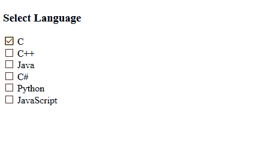

# CSS |:默认选择器

> 原文:[https://www.geeksforgeeks.org/css-default-selector/](https://www.geeksforgeeks.org/css-default-selector/)

**默认选择器**用于设置表单中一组相同类型元素的默认元素。该选择器用于按钮、选项、单选按钮和复选框。

**语法:**

```css
:default {
  //property
}

```

**示例:**

```css
<!DOCTYPE html>
<html>

<head>
    <style>
        input[type="checkbox"]:default {
            box-shadow: 0 0 1px 1px gray;
        }
    </style>
</head>

<body>

    <h3>Select Language</h3>

    <form action="">
        <input type="checkbox" name="lan" value="c" checked> C
        <br>
        <input type="checkbox" name="lan" value="c++"> C++
        <br>
        <input type="checkbox" name="lan" value="java"> Java
        <br>
        <input type="checkbox" name="lan" value="c#"> C#
        <br>
        <input type="checkbox" name="lan" value="python"> Python
        <br>
        <input type="checkbox" name="lan" value="javascript"> JavaScript
        <br>
    </form>

</body>

</html>
```

**输出:**


**支持的浏览器**

*   谷歌 Chrome 10.0*   Edge 12.0*   Firefox 4.0*   Safari 5.0*   Opera 10.0