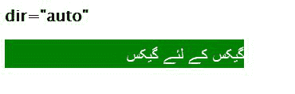

# CSS :d ir 选择器

> 原文:[https://www.geeksforgeeks.org/css-dir-selector/](https://www.geeksforgeeks.org/css-dir-selector/)

**:dir** 用于选择和改变方向从左到右或从右到左的文本元素的属性。

**语法:**

```
:dir(ltr|rtl)
```

**参数:**接受以下两个参数。

*   **ltr:** 这个关键字基本上是寻找方向从左到右的元素。
*   **rtl:** 这个关键词基本上是寻找从右向左有方向的元素。

**注意:**请在火狐浏览器中运行代码。

**示例:**

```
<!DOCTYPE html>
<html lang="en">
<head>
  <meta charset="UTF-8">
  <meta name="viewport" 
        content="width=device-width, 
                 initial-scale=1.0">
  <title>Document</title>
</head>
<style>
  *{
    color:#fff;
    width: 300px;
    font-family: 'Lucida Sans', 'Lucida Sans Regular',
 'Lucida Grande', 'Lucida Sans Unicode', Geneva,
 Verdana, sans-serif;
    font-size: 20px;
    padding-top: 5px;
  }

  :dir(rtl) {
    background-color: black;
  }
  :dir(ltr) {
  background-color: green;
  }
</style>
<body>
  <div dir="rtl">
    Geeks for geeks
  </div>
  <div dir="ltr">
    Geeks for geeks
    <div dir="rtl">???? ?? ??? ????</div>
  </div>
</body>
</html>
```

**输出:**


**例 2:**

```
<!DOCTYPE html>
<html lang="en">
<head>
  <meta charset="UTF-8">
  <meta name="viewport" 
        content="width=device-width,
                 initial-scale=1.0">
  <title>Document</title>
</head>
<style>
  *{
    color:#fff;
    width: 300px;
    font-family: 'Lucida Sans', 'Lucida Sans Regular',
 'Lucida Grande', 'Lucida Sans Unicode', Geneva, 
Verdana, sans-serif;
    font-size: 20px;
    padding-top: 5px;
  }
  h1{
    color: #000;
  }

  :dir(rtl) {
    background-color: green;
  }
</style>
<body>
  <h1>dir="auto"</h1>
  <div dir="auto">???? ?? ??? ????</div>
</body>
</html>
```

**输出:**



**支持的浏览器:**

*   火狐浏览器