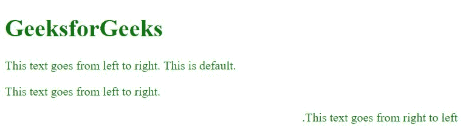

# CSS |方向属性

> 原文:[https://www.geeksforgeeks.org/css-direction-property/](https://www.geeksforgeeks.org/css-direction-property/)

**方向属性**指定任何块元素内的文本/书写方向。它可以有两个值 rtl(从右向左)或 ltr(从左向右)

**语法:**

```
element_selector {
    direction: rtl|ltr|initial|inherit;
} 
```

**默认值:**

*   **ltr**

**房产价值:**

*   **rtl:** 指定从右向左的方向。
*   **ltr(默认):**将方向指定为从左到右，这也是默认方向。
*   **初始值:**将属性设置为默认值。
*   **继承:**从父元素继承属性。

**例:**

## 超文本标记语言

```
<!DOCTYPE html>
<html>

<head>
    <title>
        CSS | direction Property
    </title>
    <style>
        html {
            color: green;
        }

        .rtl {
            direction: rtl;
        }

        .ltr {
            direction: ltr;
        }
    </style>
</head>

<body>

    <h1>GeeksforGeeks</h1>

<p>This text goes from left to right. This is default.</p>

    <p class="ltr">This text goes from left to right.</p>

    <p class="rtl">This text goes from right to left.</p>

</body>

</html>
```

**输出:**



**支持的浏览器:**T2 方向属性支持的浏览器如下:

*   谷歌 Chrome 2.0
*   Internet Explorer 5.5
*   Firefox 1.0
*   歌剧 9.2
*   苹果 Safari 1.3