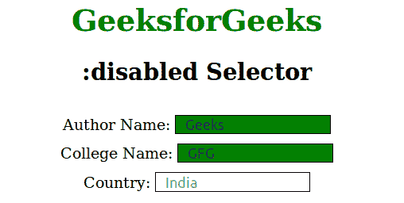
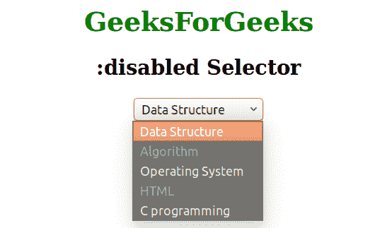

# CSS |:禁用选择器

> 原文:[https://www.geeksforgeeks.org/css-disabled-selector/](https://www.geeksforgeeks.org/css-disabled-selector/)

:disabled 选择器用于选择禁用的元素。该属性主要用于表单元素。

**语法:**

```html
:disabled {
    // CSS property
} 
```

您还可以为所有类型为“文本”的禁用输入元素设置背景颜色:

```html
input[type=text]:disabled {
    background: #dddddd;
}
```

**例 1:**

```html
<!DOCTYPE html>
<html>
    <head>
        <title>disable property</title>
        <style> 
            h1 {
            color:green;
            }
            input[type=text]:enabled {
                background: green;
            }

            input[type=text]:disabled {
                background: white;
            }
            input {
                width:150px;
                padding-left:10px;
                margin-top:10px;
                border:1px solid black;
            }
            body {
                text-align:center;
            }
        </style>
    </head>
    <body>
        <h1>GeeksforGeeks</h1>
        <h2>:disabled Selector</h2>
        <form action="">
            Author Name: <input type="text" value="Geeks"><br>
            College Name: <input type="text" value="GFG"><br>
            Country: <input type="text" disabled="disabled" 
            value="India">
        </form>
    </body>
</html>                    
```

**输出:**


**例 2:**

```html
<!DOCTYPE html>
<html>
    <head>
        <title>disable selector</title>
        <style> 
            h1 {
                color:green;
            }
            body {
                text-align:center;
            }
        </style>
    </head>
    <body>
        <h1>GeeksForGeeks</h1>
        <h2>:disabled Selector</h2>
        <select>
            <option value="s1">Data Structure</option>
            <option value="s2" disabled>Algorithm</option>
            <option value="s3">Operating System</option>
            <option value="s4" disabled>HTML</option>
            <option value="s5">C programming</option>
        </select>
    </body>
</html>                    
```

**输出**


**支持的浏览器:***支持的浏览器:*选择器禁用如下:

*   苹果 Safari 3.2
*   谷歌 Chrome 4.0
*   Firefox 3.5
*   歌剧 9.6
*   Internet Explorer 9.0

**更多选择器:**

*   [高级选择器](https://www.geeksforgeeks.org/advanced-selectors-in-css/)
*   [选中的选择器](https://www.geeksforgeeks.org/css-checked-selector/)
*   [属性选择器](https://www.geeksforgeeks.org/css-attribute-selector/)