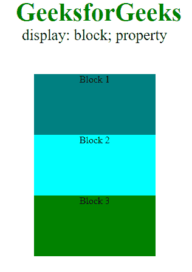
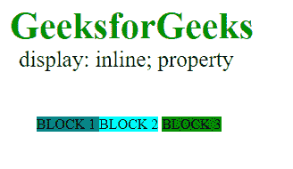
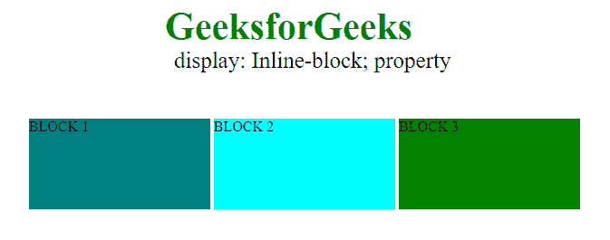
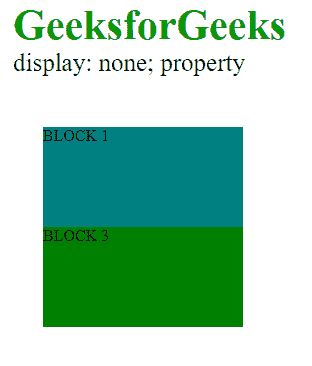

# CSS |显示属性

> 原文:[https://www.geeksforgeeks.org/css-display-property/](https://www.geeksforgeeks.org/css-display-property/)

CSS 中的**显示属性**定义了组件(div、超链接、标题等)将如何放置在网页上。顾名思义，该属性用于定义网页不同部分的显示。
**语法:**

```css
display: value;
```

**属性值**

<figure class="table">

| value | describe |
| internal links and collaboration between enterprises in coastal areas and those in the hinterland | Used to display elements as inline elements. |
| piece | Used to display an element as a block element. |
| content | Used to disappear the container. |
| 弯曲 | Used to display elements as block-level flex containers. |
| grid | Used to display an element as a block-level grid container. |
| [Inline block] | Used to display elements as inline level block containers. |
| Inline -flex | Used to display elements as inline flex containers. |
| Intranet grid | Used to display elements as inline grid containers. |
| Inline table | Used to display inline level table. |
| List item | Used to display all elements in the < li > element. |
| break-in | Depending on the context, it is used for inline or block-level display elements. |
| table | Used to set the behavior of all elements to . |
| Table-caption | Used to set the behavior of all elements to . |
| Table-column-group | Used to set the behavior of all elements to . |
| Table-Header-Group | Used to set the behavior of all elements to . |
| Table-Footer-Group | Used to set the behavior of all elements to . |
| Table-Row-Group | Used to set the behavior of all elements to . |
| Table-cell | Used to set the behavior of all elements to < td >. |
| Table-column | Used to set the behavior of all elements to . |
| Table-row | Used to set the behavior of all elements to < tr >. |
| without | Used to remove elements. |
| initial | Used to set default values. |
| inherit | Used to inherit property from their parents' elements. |

</figure>

下面用例子描述几个重要的值。
**Block:** 该属性作为 div 的默认属性。该属性将 div 一个接一个地垂直放置。可以使用 block 属性更改 div 的高度和宽度。如果没有提到宽度，那么 block 属性下的 div 将占用容器的宽度。
**例:**

## 超文本标记语言

```css
<!DOCTYPE html>
<html>
    <head>
        <title>CSS | Display property</title>
        <style>
            #geeks1{
                height: 100px;
                width: 200px;
                background: teal;
                display: block;
            }
            #geeks2{
                height: 100px;
                width: 200px;
                background: cyan;
                display: block;
            }
            #geeks3{
                height: 100px;
                width: 200px;
                background: green;
                display: block;
            }
            .gfg {
                margin-left:20px;
                font-size:42px;
                font-weight:bold;
                color:#009900;
            }
            .geeks {
                font-size:25px;
                margin-left:30px;
            }
            .main {
                margin:50px;
                text-align:center;
            }
        </style>
    </head>

    <body>
        <div class = "gfg">GeeksforGeeks</div>
        <div class = "geeks">display: block; property</div>
        <div class = "main">
            <div id="geeks1">Block 1 </div>
            <div id="geeks2">Block 2</div>
            <div id="geeks3">Block 3</div>
        </div>
    </body>                
</html>                   
```

**输出:**



**内联:**该属性是锚点标签的默认属性。这用于将 div 以水平方式内联放置。内联显示属性忽略用户设置的高度和宽度。
**例:**

## 超文本标记语言

```css
<!DOCTYPE html>
<html>
    <head>
        <title>CSS | Display property</title>
        <style>
            #main{
                height: 200px;
                width: 200px;
                background: teal;
                display: inline;

            }
            #main1{
                height: 200px;
                width: 200px;
                background: cyan;
                display: inline;

            }
            #main2{
                height: 200px;
                width: 200px;
                background: green;
                display: inline;
            }
            .gfg {
                margin-left:20px;
                font-size:42px;
                font-weight:bold;
                color:#009900;
            }
            .geeks {
                font-size:25px;
                margin-left:30px;
            }
            .main {
                margin:50px;
            }
        </style>
    </head>
    <body>
        <div class = "gfg">GeeksforGeeks</div>
        <div class = "geeks">display: inline; property</div>
        <div class = "main">
            <div id="main"> BLOCK 1 </div>
            <div id="main1"> BLOCK 2</div>
            <div id="main2">BLOCK 3 </div>
        </div>
    </body>
</html>                   
```

**输出:**



**内嵌-块:**这个特性使用了上面提到的两个属性，块和内嵌。因此，这个属性将 div 内联对齐，但不同的是它可以编辑块的高度和宽度。基本上，这会以块和内嵌的方式对齐 div。
**例:**

## 超文本标记语言

```css
<!DOCTYPE html>
<html>
    <head>
        <title>CSS | Display property</title>
        <style>
        #main{
                height: 100px;
                width: 200px;
                background: teal;
                display: inline-block;

            }
            #main1{
                height: 100px;
                width: 200px;
                background: cyan;
                display: inline-block;

            }
            #main2{
                height: 100px;
                width: 200px;
                background: green;
                display: inline-block;
            }
            .gfg {
                margin-left:200px;
                font-size:42px;
                font-weight:bold;
                color:#009900;
            }
            .geeks {
                font-size:25px;
                margin-left:210px;
            }
            .main {
                margin:50px;
            }
        </style>
    </head>
    <body>
        <div class = "gfg">GeeksforGeeks</div>
        <div class = "geeks">display: Inline-block; property</div>
        <div class = "main">
            <div id="main"> BLOCK 1 </div>
            <div id="main1"> BLOCK 2</div>
            <div id="main2">BLOCK 3 </div>
        </div>
    </body>
</html>                   
```

**输出:**



**无:**该属性隐藏使用该属性的 div 或容器。在其中一个 div 上使用它会使工作变得清晰。
**例:**

## 超文本标记语言

```css
<!DOCTYPE html>
<html>
    <head>
        <title>CSS | Display property</title>
        <style>
        #main{
                height: 100px;
                width: 200px;
                background: teal;
                display: block;

            }
            #main1{
                height: 100px;
                width: 200px;
                background: cyan;
                display: none;

            }
            #main2{
                height: 100px;
                width: 200px;
                background: green;
                display: block;
            }
            .gfg {
                margin-left:20px;
                font-size:42px;
                font-weight:bold;
                color:#009900;
            }
            .geeks {
                font-size:25px;
                margin-left:20px;
            }
            .main {
                margin:50px;
            }
        </style>
    </head>
    <body>
        <div class = "gfg">GeeksforGeeks</div>
        <div class = "geeks">display: none; property</div>
        <div class = "main">
            <div id="main"> BLOCK 1 </div>
            <div id="main1"> BLOCK 2</div>
            <div id="main2">BLOCK 3 </div>
        </div>
    </body>
</html>                   
```

**输出:**



**支持的浏览器:**显示属性支持的浏览器如下:

*   谷歌 Chrome 4.0
*   Internet Explorer 8.0
*   Firefox 3.0
*   Opera 7.0
*   Safari 3.1