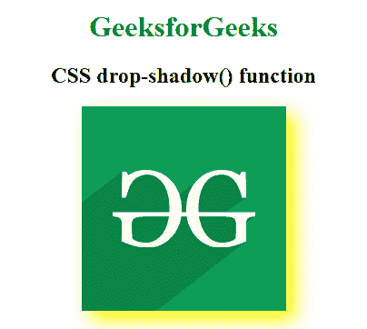
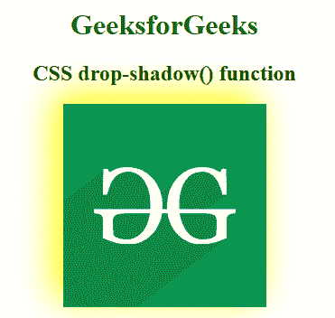

# CSS |投影()功能

> 原文:[https://www.geeksforgeeks.org/css-drop-shadow-function/](https://www.geeksforgeeks.org/css-drop-shadow-function/)

drop-shadow()函数是一个内置函数，用于对图像应用滤镜来设置图像的阴影。函数的作用是:在给定的偏移量和颜色下，创建一个模糊的阴影。

**语法:**

```
drop-shadow( offset-x offset-y blur-radius spread-radius color )
```

**参数:**该功能接受五个参数，如上所述，描述如下:

*   **偏移量-x:** 此参数设置图像的水平偏移量。正值创建右侧偏移，负值创建左侧偏移。
*   **offset-y:** 此参数设置图像的垂直偏移。正值创建到底部的偏移，负值创建到顶部的偏移。
*   **模糊半径:**设置模糊半径的值。这是一个可选参数。
*   **扩散半径:**设置扩散半径的值。这是一个可选参数。
*   **颜色:**设置投影的颜色。它的可选参数。

下面的例子说明了 CSS 中的投影()函数:

**例 1:**

```
<!DOCTYPE html> 
<html> 

<head> 
    <title>CSS drop-shadow() Function</title> 

    <style>
        h1 {
            color:green;
        }
        body {
            text-align:center;
        }
        .drop_shadow_effect {
            filter: drop-shadow(10px 10px 10px yellow)
        }
    </style>
</head> 

<body> 
    <h1>GeeksforGeeks</h1> 

    <h2>CSS drop-shadow() function</h2>

     
</body> 

</html>    
```

**输出:**


**例 2:**

```
<!DOCTYPE html> 
<html> 

<head> 
    <title>CSS drop-shadow() Function</title> 

    <style>
        h1 {
            color:green;
        }
        body {
            text-align:center;
        }
        .drop_shadow_effect {
            filter: drop-shadow(-10px -10px 20px yellow)
        }
    </style>
</head> 

<body> 
    <h1>GeeksforGeeks</h1> 

    <h2>CSS drop-shadow() function</h2>

     
</body> 

</html>
```

**输出:**


**支持的浏览器:**下拉阴影()功能支持的浏览器如下:

*   谷歌 Chrome
*   微软公司出品的 web 浏览器
*   火狐浏览器
*   旅行队
*   歌剧