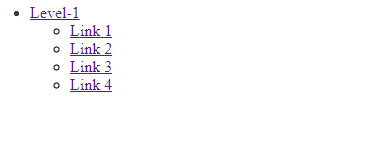
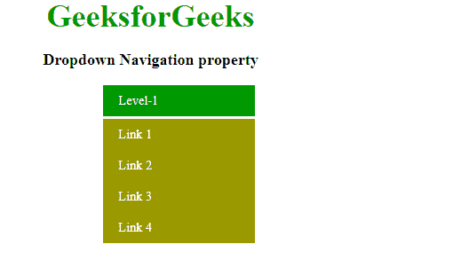
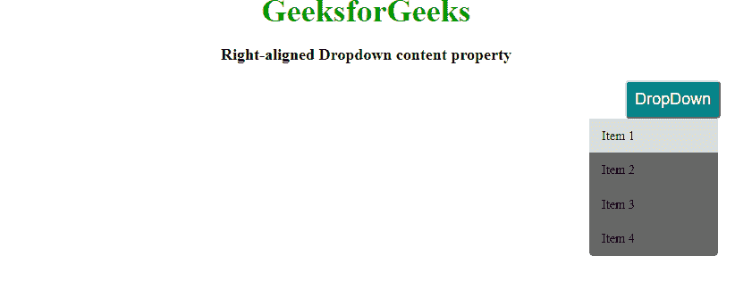
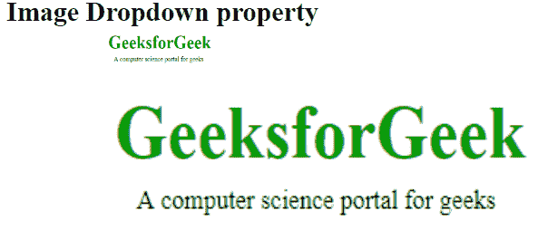
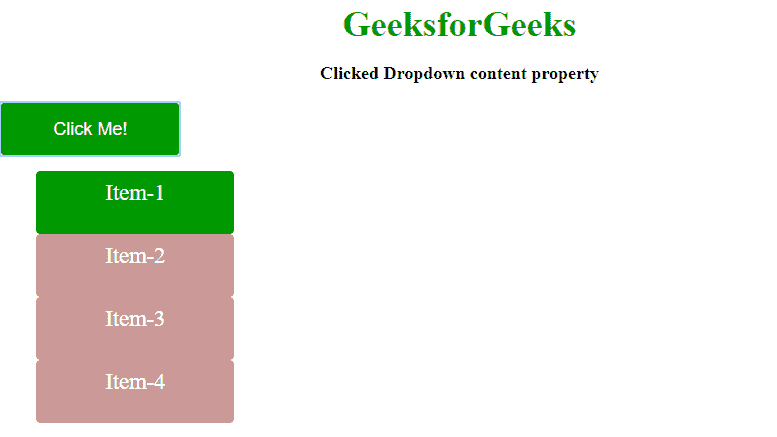

# CSS | DropDowns

> 原文:[https://www.geeksforgeeks.org/css-dropdowns/](https://www.geeksforgeeks.org/css-dropdowns/)

下拉菜单是交互式网站最重要的部分之一。CSS 用于设计下拉菜单。下拉列表是无序列表下的一堆列表，也就是 HTML 世界中广为人知的

*   ) label. To show the effect, use CSS for the components in the structure. CSS is a very simple attribute for creating drop-down menus.

```html
<!DOCTYPE html>
<html>
    <head>
        <title>Dropdown property</title>
    </head>
    <body>
        <nav>
            <ul>
                <li class="Lev-1">
                <a href="">Level-1</a>
                <ul>
                    <li><a href="">Link 1</a></li>
                    <li><a href="">Link 2</a></li>
                    <li><a href="">Link 3</a></li>
                    <li><a href="">Link 4</a></li>
                </ul>
                </li>
            </ul>
        </nav>
    </body>
</html>
```

**输出:**


**示例:**在 HTML 结构中添加 CSS 属性，创建交互式下拉结构。

```html
<!DOCTYPE html>
<html>
    <head>
        <title>Navigation property</title>
        <style>
            a {
                color: white;
                background-color:#990;
                text-decoration: none;
            }
            nav{
                background: #333;
            }
            nav >ul{ margin: 0 auto; width: 80px; }
            nav ul li{
                display: block;
                float: left;
                margin-left:-40px;
                position: relative;
            }
            nav ul a{
                display: block;
                float: left;
                width: 150px;
                padding: 10px 20px;
            }
            nav ul a:hover{
                background: #090;
            }
            nav ul li ul li{
                float: none;
            }
            nav ul li ul{
                display: none;
                position: absolute;
                background: #333;
                top: 42px;
            }
            nav ul li:hover>ul{
                display: block;
            }
            nav ul li a{
                display: block;
            }
            .gfg {
                font-size:40px;
                font-weight:bold;
                color:#009900;
                Text-align:center;
            }
            p {
                font-size:20px;
                font-weight:bold;
                text-align:center;
            }
        </style>
    </head>
    <body>
        <div class="gfg">GeeksforGeeks</div>
        <p>Dropdown Navigation property</p>
        <nav>
            <ul>
                <li class="Lev-1">
                <a href="">Level-1</a>
                <ul>
                    <li><a href="">Link 1</a></li>
                    <li><a href="">Link 2</a></li>
                    <li><a href="">Link 3</a></li>
                    <li><a href="">Link 4</a></li>
                </ul>
                </li>
            </ul>
        </nav>
    </body>
</html>                    
```

**输出:**


上面写的代码在下拉结构的基础上产生适当的输出。下面讨论了 HTML 代码的重要部分:

*   nav 是最外层的容器
*   nav ul Li ul Li–float 设置为 none，这样当我们悬停在它上面时，它会保持完整。
*   使用相对位置，使 li 相对于其组件移动或改变其位置。
*   悬停后使用“>”查看悬停对 li 的下一个 ul 的影响。

**右对齐下拉菜单:**右对齐下拉菜单是一个浮动值向右的下拉菜单，用于在右侧屏幕上显示下拉内容。将浮动右添加到包含内容的 div。

```html
<!DOCTYPE html>
<html>
    <head>
        <title>right-aligned dropdown content property</title>
        <style>
            #drop {
                background-color: teal;
                color: white;
                padding: 10px;
                font-size: 16px;
                width: : 200px;
                height: : 60px;
                border-radius: 5px;
                font-size: 20px;
            }
            #drop-down {
                position: relative;
                display: inline-block;
            }
            #dropdown-menu {
                display: none;
                position: absolute;
                background-color: #666;
                width: 160px;
                margin-left:-45px;
                border-radius: 5px;
                z-index: 1;
            }
            #dropdown-menu a {
                color: black;
                padding: 12px 16px;
                text-decoration: none;
                display: block;
            }
            .gfg {
                font-size:40px;
                font-weight:bold;
                color:#009900;
                Text-align:center;
            }
            p {
                font-size:20px;
                font-weight:bold;
                text-align:center;
            }
            #dropdown-menu a:hover {background-color: #ddd;}
            #drop-down:hover #dropdown-menu {display: block;}
        </style>
    </head>
    <body>
        <div class="gfg">GeeksforGeeks</div>
        <p>Right-aligned Dropdown content property</p>
        <div id="drop-down" style=" float: right; margin-right: 70px;">
            <button id="drop">DropDown</button>
            <div id="dropdown-menu">
                <a href="">Item 1</a>
                <a href="">Item 2</a>
                <a href="">Item 3</a>
                <a href="">Item 4</a>
            </div>
        </div>
    </body>
</html>                    
```

**输出:**


**图像下拉菜单:**不是下拉菜单，而是放大你悬停的图像。需要基本的 CSS 和一个图像来使它工作。

**示例:**

```html
<!DOCTYPE html>
<html>
    <head>
        <title>Image Dropdown</title>
        <style>
            .dropmenu {
                position: relative;
                display: inline-block;
                margin-left:150px;
            }
            .sub-dropmenu {
                display: none;
                position: absolute;
            }
            .dropmenu:hover .sub-dropmenu {
                display: block;
            }
            .enlarge {
                padding: 15px;
                text-align: center;
            }
            .gfg {
                margin-left:40px;
                font-size:30px;
                font-weight:bold;
            }
        </style>
    </head>
    <body>
        <div class = "gfg">Image Dropdown property</div>
        <div class="dropmenu">
                 
            <div class="sub-dropmenu">
                 
            </div>
        </div>
    </body>
</html>                    
```

**输出:**


**点击下拉:**这需要对 JavaScript 有基本的了解，因为它是用来运行一些函数来使点击的下拉工作的。
T3】例:

```html
<!DOCTYPE html>
<html>
    <head>
        <title>clicked dropdown</title>
        <style type="text/css">
            button {
                background: #009900;
                width: 200px;
                height: 60px;
                color: white;
                border: 1px solid #fff;
                font-size: 20px;
                border-radius: 5px;

            }
            ul li {
                list-style: none;
            }
            ul li a {
                display: block;
                background: #c99;
                width: 200px;
                height: 50px;
                text-decoration: none;
                text-align: center;
                padding: 10px;
                border-radius: 5px;
                text-align: center;
                color: white; 
                font-size: 25px;
            }
            ul li a {
                text-decoration: none;
            }
            ul li a:hover {
                background: #009900; 
            }
            .open {display: none;}
            .gfg {
                font-size:40px;
                font-weight:bold;
                color:#009900;
                Text-align:center;
            }
            p {
                font-size:20px;
                font-weight:bold;
                text-align:center;
            }
        </style>
        <script type="text/javascript">
            function open_menu(){
                var clicked= document.getElementById('drop-menu');
                if(clicked.style.display=='block')
                {
                    clicked.style.display='none';
                }
                else{
                    clicked.style.display='block';
                }
            }
        </script>
    </head>
    <body>
        <div class="gfg">GeeksforGeeks</div>
        <p>Clicked Dropdown content property</p>
        <div id="dropdown">
            <button onclick="open_menu()">Click Me!</button>
            <div class="open" id="drop-menu">
            <ul>
                <li><a href="">Item-1</a></li>
                <li><a href="">Item-2</a></li>
                <li><a href="">Item-3</a></li>
                <li><a href="">Item-4</a></li>
            </ul>
            </div>
        </div> 
    </body> 
</html>                    
```

**输出:**


**注:**代码的一些重要亮点:

*   当点击“点击我”按钮时，javascript 函数将展开和折叠菜单。
*   我们使用 onclick 来调用按钮标签中的 javascript 函数。