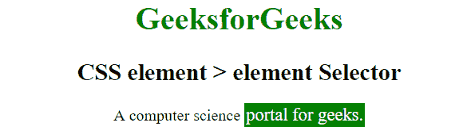

# CSS |元素>元素选择器

> 原文:[https://www . geesforgeks . org/CSS-element-element-selector-2/](https://www.geeksforgeeks.org/css-element-element-selector-2/)

CSS 中的**元素>元素**选择器仅用于为特定父元素的子元素设置样式。

**>** 左边的操作数是父元素，右边的操作数是子元素。

**注意:**不是指定父代的直接子代的元素不会被选中。

**语法:**

```css
element1 > element2 {
    //CSS Property
}

```

**例 1:**

```css
<!DOCTYPE html>
<html>
    <head>
        <title>
        CSS element>element Selector
        </title>
        <style>
            div > p {
                color:white;
                background: green;
                padding:2px;
            }
        </style>
    </head>
    <body style = "text-align: center;">
        <div>
            <h2 style = "color:green;">
                CSS element > element Selector
            </h2>

            <p>
                A computer science portal for geeks.
            </p>
        </div>

        <p>Geeks Classes is a quick course to cover 
        algorithms questions.</p>

        <p>This paragraph will not be styled.</p>
    </body>
</html>
```

**输出:**

**例 2:**

```css
<!DOCTYPE html>
<html>
    <head>
        <title>
            CSS element > element Selector
        </title>
        <style>
            p > span {
                color:white;
                background: green;
            }
        </style>
    </head>
    <body style = "text-align: center;">
        <h1 style = "color:green;">
            GeeksforGeeks
        </h1>
        <h2>
            CSS element > element Selector

        </h2>

        <p>A computer science <span>portal for geeks.</span></p>
</body>
</html>
```

**输出:**


**支持的浏览器:**元素>元素选择器支持的浏览器如下:

*   苹果 Safari
*   谷歌 Chrome
*   火狐浏览器
*   歌剧
*   Internet Explorer 7.0