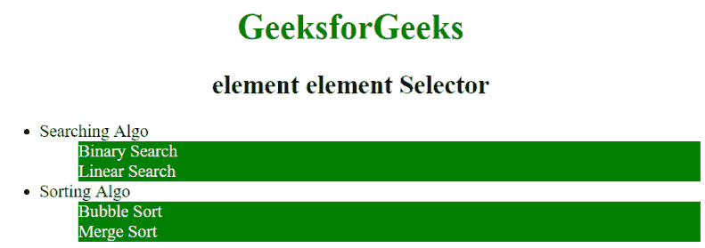

# CSS |元素元素选择器

> 原文:[https://www.geeksforgeeks.org/css-element-element-selector/](https://www.geeksforgeeks.org/css-element-element-selector/)

CSS 中的元素元素选择器用于选择元素内部的元素，也就是说，它组合了两个选择器，这样，如果第二个选择器匹配的元素的祖先元素与第一个选择器匹配，那么它们就会被选中。

**语法:**

```html
element element {
    // CSS Property
}

```

**例 1:**

```html
<!-- HTML code to illustrates space selector -->
<!DOCTYPE html>
<html>
    <head>
        <title>
            element element Selector
        </title>

        <style>
            div p {
                background-color: green;
                color: white;
            }
        </style>
    </head>

    <body style="text-align: center;">

        <h1 style = "color: green;">
            GeeksforGeeks
        </h1>

        <div>
            <h2>element element Selector</h2>

            <!-- CSS property is used here -->
            <p>A computer science portal for geeks.</p>
        </div>

        <p>This paragraph will not be selected.</p>
    </body>
</html>                    
```

**输出:**


**例 2:**

```html
<!DOCTYPE html>
<html>
    <head>
        <title>
            element element Selector
        </title>

        <style>
            li {
                color: black;
            }         
            li li {
                color: white;
                background: green;
            }
        </style>
    </head>

    <body style="text-align: center;">

        <h1 style = "color: green;">
            GeeksforGeeks
        </h1>

        <h2>element element Selector</h2>
        <ul>
            <li>
                <div>Searching Algo</div>
                <ul>
                    <li>Binary Search</li>
                    <li>Linear Search</li>
                </ul>
            </li>
            <li>
                <div>Sorting Algo</div>
                <ul>
                    <li>Bubble Sort</li>
                    <li>Merge Sort</li>
                </ul>
            </li>
        </ul>
    </body>
</html>                    
```

**输出:**


**支持的浏览器:**元素元素选择器支持的浏览器如下:

*   苹果 Safari
*   谷歌 Chrome
*   火狐浏览器
*   歌剧
*   微软公司出品的 web 浏览器