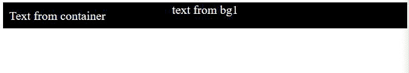

# CSS 元素()函数

> 原文:[https://www.geeksforgeeks.org/css-element-function/](https://www.geeksforgeeks.org/css-element-function/)

CSS 的**元素()**功能用于将页面中另一个元素的图像放入一个标签中。该图像显示了在另一个 HTML 元素中所做的更改。

**语法:**

```
element(id)
```

**参数:**这个函数取 HTML 元素的 id。

**注意:**此函数不适用于类标签，请在 Firefox 中运行代码。

**示例:**

```
<!DOCTYPE html>
<html lang="en">
<head>
  <meta charset="UTF-8">
  <meta name="viewport" 
        content="width=device-width, 
                 initial-scale=1.0">
  <title>Document</title>
</head>
<style>
  *{
    color: #fff;
    font-size: 20px;
  }
  .container{
    padding:10px;
    width:fit-content; 
    height:auto; 
    background:-moz-element(#bg1);
  }
  #bg1{
    text-align: center;
    width:fit-content; 
    height:300px; 
    background-image:url(
"https://media.geeksforgeeks.org/wp-content/uploads/20200714125445/b-300x173.JPG");
  }
</style>
<body>
  <div class="container">
    Text from container
  </div>

  <div style="overflow:hidden; height:0;
              width:fit-content;">
    <div id="bg1">Text from bg1</div>
  </div>
</body>
</html>
```

**输出:**



**支持的浏览器:**

*   Mozilla firefox
*   安卓版火狐