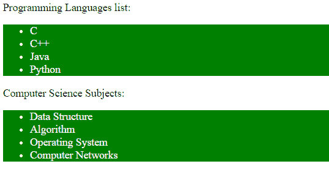
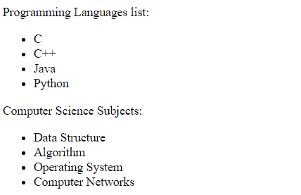

# CSS |元素 1 ~元素 2 选择器

> 原文:[https://www . geesforgeks . org/CSS-element 1 elements 2-selector/](https://www.geeksforgeeks.org/css-element1element2-selector/)

CSS 中的 element1~element2 选择器用于匹配 element2 后跟 element1 的出现。元素 1 后面紧跟元素 2 并不重要。如果两个元素都有公共的父元素，则此属性有效。

**语法:**

```
element1 ~ element2 {
    // CSS Property
}
```

**示例 1:** 在此示例中，两个元素具有相同的父元素(主体)。

```
<!DOCTYPE html>
<html>
    <head>
        <title>
            CSS element1~element2 Selector
        </title>

        <style>
            p ~ ul {
                background: green;
                color:white;
            }
        </style>
    </head>

    <body>
        <div>
            <p>Programming Languages list:</p>
            <ul>
                <li>C</li>
                <li>C++</li>
                <li>Java</li>
                <li>Python</li>
            </ul>

            <div>Computer Science Subjects:</div>
            <ul>
                <li>Data Structure</li>
                <li>Algorithm</li>
                <li>Operating System</li>
                <li>Computer Networks</li>
            </ul>
        </div>
    </body>
</html>                    
```

**输出:**


**示例 2:** 在此示例中，两个元素没有相同的父元素。所以 CSS 属性不适用。

```
<!DOCTYPE html>
<html>
    <head>
        <title>
            CSS element1~element2 Selector
        </title>

        <style>
            p ~ ul {
                background: lightgrey;
                border: 2px solid green;
            }
        </style>
    </head>

    <body>
        <p>Programming Languages list:</p>
        <div>
            <ul>
                <li>C</li>
                <li>C++</li>
                <li>Java</li>
                <li>Python</li>
            </ul>

            <div>Computer Science Subjects:</div>
            <ul>
                <li>Data Structure</li>
                <li>Algorithm</li>
                <li>Operating System</li>
                <li>Computer Networks</li>
            </ul>
        </div>
    </body>
</html>                    
```

**输出:**


**支持的浏览器:***元素 1 ~元素 2 选择器*支持的浏览器如下:

*   谷歌 Chrome 4.0
*   Internet Explorer 7.0
*   Firefox 3.5
*   Safari 3.2
*   歌剧 9.6