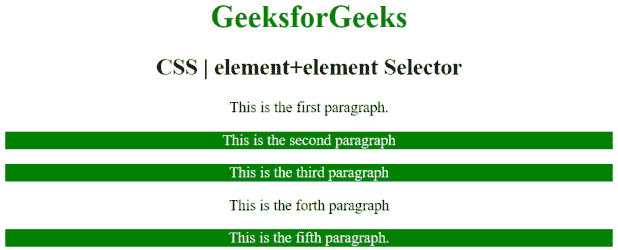

# CSS |元素+元素选择器

> 原文:[https://www . geesforgeks . org/CSS-element element-selector-2/](https://www.geeksforgeeks.org/css-elementelement-selector-2/)

CSS 中的元素+元素选择器用于设置紧接在第一个指定元素之后(而不是内部)的每个元素的样式。

**语法:**

```html
element + element {
    //CSS Property

```

**示例 1:** 在下面的程序中，“p + p”选择器选择每对连续的段落元素并设置其样式。如果连续有 2 个以上的 **p** 元素，那么它会对最后两个元素进行样式化。

```html
<!DOCTYPE html>
<html>
    <head>
        <title>
            CSS | element+element Selector
        </title>
        <style>
            p + p {
                color:white;
                background: green;
            }
        </style>
    </head>
    <body style = "text-align: center;">
        <h1 style = "color:green;">
            GeeksforGeeks
        </h1>
        <h2>
            CSS | element+element Selector

        </h2>

        <p>This is the first paragraph.</p>
        <p>This is the second paragraph</p>
        <p>This is the third paragraph</p>

        <div>
          <p>This is the forth paragraph</p>
          <p>This is the fifth paragraph.</p>
        </div>
</body>
</html>
```

**输出:**


**例 2:**

```html
<!DOCTYPE html>
<html>
    <head>
        <title>
        CSS | element+element Selector
        </title>
        <style>
            div + p {
                color:white;
                background: green;
                padding:2px;
            }
        </style>
    </head>
    <body style = "text-align: center;">
        <div>
            <h2 style = "color:green;">
                CSS | element+element Selector
            </h2>

            <p>
                A computer science portal for geeks.
            </p>
        </div>

        <p>Geeks Classes is a quick course to cover 
        algorithms questions.</p>

        <p>This paragraph will not be styled.</p>
    </body>
</html>
```

**输出:**


**支持的浏览器:**元素+元素选择器支持的浏览器如下:

*   苹果 Safari
*   谷歌 Chrome
*   火狐浏览器
*   歌剧
*   Internet Explorer 7.0