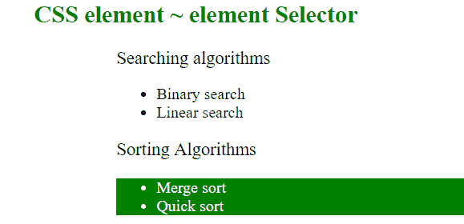
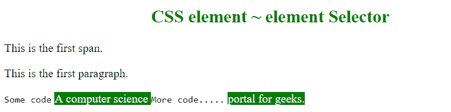

# CSS |元素~元素选择器

> 原文:[https://www . geesforgeks . org/CSS-element element-selector-3/](https://www.geeksforgeeks.org/css-elementelement-selector-3/)

CSS 中的 element ~ element selector 用于匹配第二个元素，如果它跟在第一个元素之后(不需要立即)。它们都应该有相同的父元素。

**语法:**

```html
element ~ element {
    //CSS Property
}

```

**示例 1:** 在下面的程序中，可以看到“p ~ ul”将只选择和样式化第二个无序列表，它位于段落之后，而不是第一个单独的列表。

```html
<!DOCTYPE html>
<html>
    <head>
        <title>
            CSS element ~ element Selector
        </title>
        <style>
            p ~ ul {
                color:white;
                background: green;
            }
        </style>
    </head>
    <body style = "">
        <h2 style = "color:green; text-align: center;">
            CSS element ~ element Selector

        </h2>

        <div>Searching algorithms</div>
        <ul>
          <li>Binary search</li>
          <li>Linear search</li>
        </ul>

        <p>Sorting Algorithms</p>
        <ul>
          <li>Merge sort</li>
          <li>Quick sort</li>
        </ul>
    </body>
</html>
```

**输出:**


**例 2:**

```html
<!DOCTYPE html>
<html>
    <head>
        <title>
            CSS element ~ element Selector
        </title>
        <style>
            p ~ span {
                color:white;
                background: green;
            }
        </style>
    </head>
    <body style = "">
        <!--<h1 style = "color:green;text-align: center;">-->
        <!--    GeeksforGeeks-->
        <!--</h1>-->
        <h2 style = "color:green; text-align: center;">
            CSS element ~ element Selector

        </h2>
        <span>This is the first span.</span>
        <p>This is the first paragraph.</p>
        <code>Some code</code>
        <span>A computer science  </span>
        <code>More code.....</code>
        <span> portal for geeks.</span>
    </body>
</html>
```

**输出:**


**支持的浏览器:**元素~元素选择器支持的浏览器如下:

*   苹果 Safari 3.2
*   谷歌 Chrome 4.0
*   Firefox 3.5
*   歌剧 9.6
*   Internet Explorer 7.0