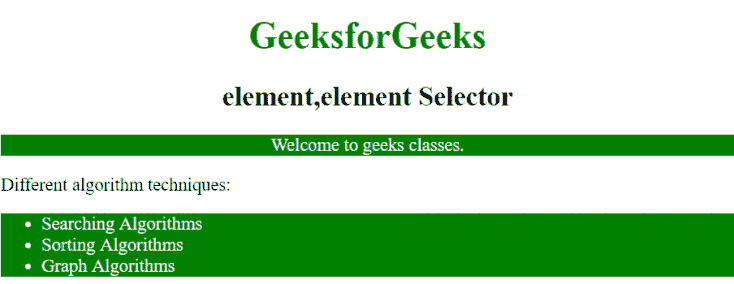

# CSS |元素，元素选择器

> 原文:[https://www.geeksforgeeks.org/css-elementelement-selector/](https://www.geeksforgeeks.org/css-elementelement-selector/)

CSS 中的元素，元素选择器用于为所有逗号分隔的元素设置相同的样式。

**语法:**

```
element, element {
    // CSS Property
}

```

**例 1:**

```
<!DOCTYPE html>
<html>
    <head>
        <title>
            element, element Selector
        </title>

        <style>

            /* Add same CSS property to all comma 
            separated elements */
            h1, h2, div, p {
                text-align: center;
            }

            div, p {
                background-color: green;
                color: white;
            }
        </style>
    </head>

    <body>
        <h1 style = "color: green;">
            GeeksforGeeks
        </h1>

        <h2>element, element Selector</h2>

        <div>
            A computer science portal for geeks.
        </div>
        <p>Welcome to geeks classes.</p>
    </body>
</html>                    
```

**输出:**


**例 2:**

```
<!DOCTYPE html>
<html>
    <head>
        <title>
            element, element Selector
        </title>

        <style>

            /* Add same CSS property to all comma 
            separated elements */
            h1, h2, p {
                text-align: center;
            }
            ul, p {
                background-color: green;
                color: white;
            }
        </style>
    </head>

    <body>
        <h1 style = "color: green;">
            GeeksforGeeks
        </h1>
        <h2>element, element Selector</h2>
        <p>Welcome to geeks classes.</p>

        <div>Different algorithm techniques:</div>
        <ul>
            <li>Searching Algorithms</li>
            <li>Sorting Algorithms</li>
            <li>Graph Algorithms</li>
        </ul>
    </body>
</html>                    
```

**输出:**


**支持的浏览器:**元素、元素选择器支持的浏览器如下:

*   苹果 Safari
*   谷歌 Chrome
*   火狐浏览器
*   歌剧
*   微软公司出品的 web 浏览器