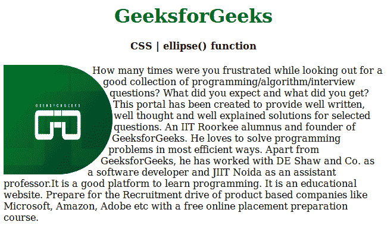
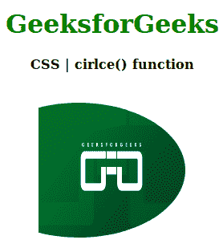

# CSS |椭圆()函数

> 原文:[https://www.geeksforgeeks.org/css-ellipse-function/](https://www.geeksforgeeks.org/css-ellipse-function/)

椭圆()函数是 CSS 中的一个内置函数，用于在椭圆形状图片或其他任何东西周围创建浮动文本。
**语法:**

```
circle(100px 10 px at 10px 150px);
```

或者

```
ellipse( percentage percentage );
```

**参数:**该函数接受用于保存半径值的单个参数长度或百分比。它是强制参数。
**返回值:**让文字椭圆成为用户想要的样子。
**例 1:** 我们将进行百分比程序。

## 超文本标记语言

```
<!DOCTYPE html>
<html>

<head>
    <title>
        CSS | ellipse() function
    </title>

    <style>
        div {
            float: left;
            width: 185px;
            height: 185px;
            shape-outside: ellipse();
        }

        img {
            border-radius: 0px 175px 175px 0px;
        }

        h1,
        h4 {
            text-align: center;
        }

        h1 {
            color: green;
        }
    </style>
</head>

<body>
    <h1>GeeksforGeeks</h1>
    <h4>CSS | ellipse() function</h4>
    <div>
        
    </div>

<p>How many times were you frustrated while looking out for a good
      collection of programming/algorithm/interview questions? What did
      you expect and what did you get? This portal has been created to
      provide well written, well thought and well explained solutions for
      selected questions. An IIT Roorkee alumnus and founder of
      GeeksforGeeks. He loves to solve programming problems in most
      efficient ways. Apart from GeeksforGeeks, he has worked  with DE Shaw
      and Co. as a software developer and JIIT Noida as an assistant
      professor.It is a good platform to learn programming. It is an
      educational website. Prepare for the Recruitment drive of product
      based companies like Microsoft, Amazon, Adobe etc with a free
      online placement preparation course.
  </p>

</body>

</html>
```

**输出:**



**例 2:**

## 超文本标记语言

```
<!DOCTYPE html>
<html>

<head>
    <title>
        CSS | ellipse() function
    </title>

    <style>
        h1 {
            color: green;
        }

        img {
            -webkit-clip-path: ellipse(
              farthest-side closest-side at 50px 100px);

            clip-path: ellipse(
              farthest-side closest-side at 50px 100px);
        }
    </style>
</head>

<body>
    <center>
        <h1>GeeksforGeeks</h1>
        <h4>CSS | ellipse() function</h4>
        
    </center>
</body>

</html>
```

**输出:**



**支持的浏览器:**以下是 **CSS |椭圆()函数**支持的浏览器:

*   谷歌 Chrome
*   微软边缘
*   火狐浏览器
*   旅行队
*   歌剧