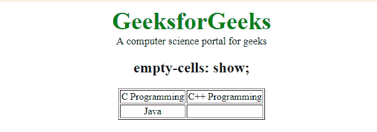
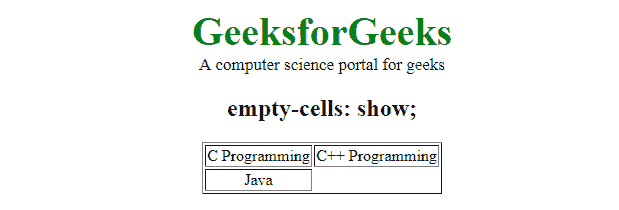

# CSS |空单元格属性

> 原文:[https://www.geeksforgeeks.org/css-empty-cells-property/](https://www.geeksforgeeks.org/css-empty-cells-property/)

此属性用于指定是否在表格的空单元格中显示边框。

**语法:**

```html
empty-cells: show|hide|initial|inherit;
```

**默认值:**

*   **显示**

**属性值:**

**显示属性:**该属性用于显示空单元格的边框。

*   **语法:**

    ```html
    empty-cell: show;
    ```

*   **Example:**

    ## Hypertext Markup Language

    ```html
    <!DOCTYPE html>
    <html>
        <head>
            <title>empty-cell property</title>
            <style>
                table.geek {
                    empty-cells: show;
                }
                td {
                    text-align:center;
                }
                .gfg {
                    font-size:40px;
                    font-weight:bold;
                    color:green;
                }
                .geeks {
                    font-size:17px;
                }
            </style>
        </head>
        <body>
            <center>
                <div class = "gfg">GeeksforGeeks</div>
                <div class = "geeks">A computer science
                portal for geeks</div>

                <h2>empty-cells: show;</h2>
                <table class="geek" border="1">
                <tr>
                    <td>C Programming</td>
                    <td>C++ Programming</td>
                </trA>
                <tr>
                    <td>Java</td>
                    <td></td>
                </tr>
                </table>
            </center>
        </body>
    </html>                    
    ```

*   **输出:**
    

**隐藏属性:**该属性用于隐藏表格中空单元格的边框。

*   **语法:**

    ```html
    empty-cell: hide;
    ```

*   **Example:**

    ## Hypertext Markup Language

    ```html
    <!DOCTYPE html>
    <html>
        <head>
            <title>empty-cell property</title>
            <style>
                table.geek {
                    empty-cells: hide;
                }
                td {
                    text-align:center;
                }
                .gfg {
                    font-size:40px;
                    font-weight:bold;
                    color:green;
                }
                .geeks {
                    font-size:17px;
                }
            </style>
        </head>
        <body>
            <center>
                <div class = "gfg">GeeksforGeeks</div>
                <div class = "geeks">A computer science
                portal for geeks</div>

                <h2>empty-cells: show;</h2>
                <table class="geek" border="1">
                <tr>
                    <td>C Programming</td>
                    <td>C++ Programming</td>
                </trA>
                <tr>
                    <td>Java</td>
                    <td></td>
                </tr>
                </table>
            </center>
        </body>
    </html>                    
    ```

*   **输出:**
    

**初始属性:**该属性用于设置默认属性。

*   **语法:**

    ```html
    empty-cell: initial;
    ```

*   **Example:**

    ## Hypertext Markup Language

    ```html
    <!DOCTYPE html>
    <html>
        <head>
            <title>empty-cell property</title>
            <style>
                table.geek {
                    empty-cells: initial;
                }
                td {
                    text-align:center;
                }
                .gfg {
                    font-size:40px;
                    font-weight:bold;
                    color:green;
                }
                .geeks {
                    font-size:17px;
                }
            </style>
        </head>
        <body>
            <center>
                <div class = "gfg">GeeksforGeeks</div>
                <div class = "geeks">A computer science
                portal for geeks</div>

                <h2>empty-cells: show;</h2>
                <table class="geek" border="1">
                <tr>
                    <td>C Programming</td>
                    <td>C++ Programming</td>
                </trA>
                <tr>
                    <td>Java</td>
                    <td></td>
                </tr>
                </table>
            </center>
        </body>
    </html>                    
    ```

*   **输出:**
    

**继承属性:**此属性用于从其父级继承属性。

*   **语法:**

    ```html
    empty-cell: inherit;
    ```

*   **Example:**

    ## Hypertext Markup Language

    ```html
    <!DOCTYPE html>
    <html>
        <head>
            <title>empty-cell property</title>
            <style>
                table.geek {
                    empty-cells: initial;
                }
                .g4g {
                    empty-cells: inherit;
                }
                td {
                    text-align:center;
                }
                .gfg {
                    font-size:40px;
                    font-weight:bold;
                    color:green;
                }
                .geeks {
                    font-size:17px;
                }
            </style>
        </head>
        <body>
            <center>
                <div class = "gfg">GeeksforGeeks</div>
                <div class = "geeks">A computer science
                portal for geeks</div>

                <h2>empty-cells: show;</h2>
                <table class="geek" border="1">
                    <tr>
                        <td>C Programming</td>
                        <td>Algorithm</td>
                    </tr>
                    <tr>
                        <td></td>
                        <td>
                            <table class="g4g" border="1">
                                <tr>
                                    <td>DP</td>
                                    <td>Backtracking</td>
                                </tr>
                                <tr>
                                    <td>Sorting</td>
                                    <td></td>
                                </tr>
                            </table>
                        </td>
                    </tr>
                </table>
            </center>
        </body>
    </html>                    
    ```

*   **输出:**
    

**支持的浏览器:**CSS |空单元格属性支持的浏览器如下:

*   谷歌 Chrome 1.0
*   internet explorer 8.0
*   Firefox 1.0
*   Opera 4.0
*   Safari 1.2