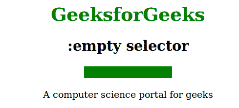

# CSS |:空选择器

> 原文:[https://www.geeksforgeeks.org/css-empty-selector/](https://www.geeksforgeeks.org/css-empty-selector/)

:空选择器用于选择不包含任何子元素(包括文本节点)的元素。

**语法:**

```css
:empty {
    // CSS property
} 

```

**示例:**

```css
<!DOCTYPE html>
<html>
    <head>
        <title>empty selector</title>
        <style> 
            h1 {
                color:green;
            }
            div:empty {
                width: 150px;
                height: 20px;
                background: green;
            }
        </style>
    </head>
    <body>
        <center>
            <h1>GeeksforGeeks</h1>
            <h2>:empty selector</h2>
            <div></div><br>
            <div>A computer science portal for geeks</div>
        </center>
    </body>
</html>                    
```

**输出:**


**支持的浏览器:***支持的浏览器:空*选择器如下:

*   苹果 Safari 3.2
*   谷歌 Chrome 4.0
*   Firefox 3.5
*   歌剧 9.6
*   Internet Explorer 9.0