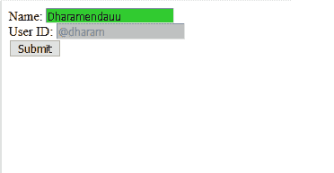

# CSS |:启用选择器

> 原文:[https://www.geeksforgeeks.org/css-enabled-selector/](https://www.geeksforgeeks.org/css-enabled-selector/)

**:启用选择器**用于设置表单中启用元素的背景颜色。

**语法:**

```
:enabled {
  //property
}

```

**示例:**

```
<!DOCTYPE html>
<html>

<head>
    <style>
        input[type=text]:enabled {
            background: limegreen;
        }

        input[type=text]:disabled {
            background: silver;
        }
    </style>
</head>

<body>

    <form action="">
        Name:
        <input type="text" value="Dharamenda">
        <br>
        <!--enabled-->

        User ID:
        <input type="text" disabled="disabled" value="@dharam">
        <br>
        <button type="button">Submit</button>
    </form>

</body>

</html>
```

**输出:**


**支持的浏览器:**

*   谷歌 Chrome 4.0*   Edge 9.0*   Firefox 3.5*   Safari 3.2*   歌剧 9.6