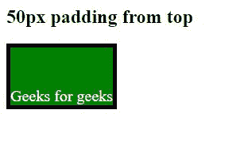
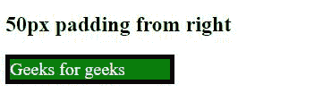
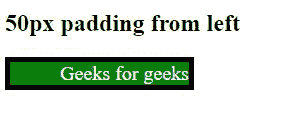
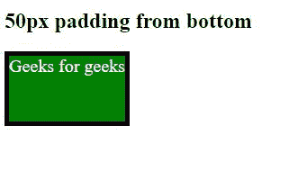

# CSS env()函数

> 原文:[https://www.geeksforgeeks.org/css-env-function/](https://www.geeksforgeeks.org/css-env-function/)

**env()** 函数用于将用户代理定义的环境变量的值插入到你的 CSS 中。它与 CSS 中的 var()几乎相同，只是这些值是用户代理定义的，而不是用户定义的。这些变量是全局范围的。

**语法:**

```css
env( <custom-ident> , <declaration-value> )

```

**注意:**请注意，env()属性值区分大小写。

**属性值:**

*   **SAFE-AREA-INSET-TOP:** It defines the top of the rectangle from the edge of the viewport.

    **语法:**

    ```css
    env(SAFE-AREA-INSET-TOP,Integer_value)

    ```

    **示例:**

    ## 超文本标记语言

    ```css
    <!DOCTYPE html>
    <html lang="en">

    <head>
        <meta charset="UTF-8">
        <meta name="viewport" content=
            "width=device-width, initial-scale=1.0">

        <style>
            p {
                background-color: green;
                width: fit-content;
                color: white;
                font-size: 20px;
                border: env(SAFE-AREA-INSET-TOP, 
                            5px) solid black;
                padding: 10px;
                padding: env(SAFE-AREA-INSET-TOP, 50px) 
                    env(safe-area-inset-right, 50px) 
                    env(safe-area-inset-bottom, 50px) 
                    env(safe-area-inset-left, 50px)
            }
        </style>
    </head>

    <body>
        <h2>50px padding from top</h2>

        <p>Geeks for geeks</p>
    </body>

    </html>
    ```

    **输出:**

    

*   **SAFE-AREA-INSET-RIGHT:** It defines the right of the rectangle from the edge of the viewport.

    **语法:**

    ```css
    env(SAFE-AREA-INSET-RIGHT,Integer_value);
    ```

    **示例:**

    ## 超文本标记语言

    ```css
    <!DOCTYPE html>
    <html lang="en">

    <head>
        <meta charset="UTF-8">
        <meta name="viewport" content=
            "width=device-width, initial-scale=1.0">

        <style>
            p {
                background-color: green;
                width: fit-content;
                color: white;
                font-size: 20px;
                border:
                    env(SAFE-AREA-INSET-TOP, 5px) solid black;
                padding: 10px;
                padding: env(safe-area-inset-top, 50px) 
                        env(SAFE-AREA-INSET-RIGHT, 50px) 
                        env(safe-area-inset-bottom, 50px) 
                        env(safe-area-inset-left, 50px)
            }
        </style>
    </head>

    <body>
        <h2>50px padding from right</h2>

        <p>Geeks for geeks</p>
    </body>

    </html>
    ```

    **输出:**

    

*   **SAFE-AREA-INSET-LEFT:** It defines the left of the rectangle from the edge of the viewport.

    **语法:**

    ```css
    env(SAFE-AREA-INSET-LEFT,Integer_value);

    ```

    **示例:**

    ## 超文本标记语言

    ```css
    <!DOCTYPE html>
    <html lang="en">

    <head>
        <meta charset="UTF-8">
        <meta name="viewport" content=
            "width=device-width, initial-scale=1.0">

        <style>
            p {
                background-color: green;
                width: fit-content;
                color: white;
                font-size: 20px;
                border:
                    env(SAFE-AREA-INSET-TOP, 5px) solid black;
                padding: 10px;
                padding: env(safe-area-inset-top, 50px) 
                        env(safe-area-inset-bottom, 50px) 
                        env(safe-area-inset-right, 50px) 
                        env(SAFE-AREA-INSET-LEFT, 50px)
            }
        </style>
    </head>

    <body>
        <h2>50px padding from left</h2>

        <p>Geeks for geeks</p>
    </body>

    </html>
    ```

    **输出:**

    

*   **SAFE-AREA-INSET-BOTTOM:** It defines the bottom of the rectangle from the edge of the viewport.

    **语法:**

    ```css
    env(SAFE-AREA-INSET-BOTTOM,Integer_value);
    ```

    **示例:**

    ## 超文本标记语言

    ```css
    <!DOCTYPE html>
    <html lang="en">

    <head>
        <meta charset="UTF-8">
        <meta name="viewport" content=
            "width=device-width, initial-scale=1.0">

        <style>
            p {
                background-color: green;
                width: fit-content;
                color: white;
                font-size: 20px;
                border:
                    env(SAFE-AREA-INSET-TOP, 5px) solid black;
                padding: 10px;
                padding: env(safe-area-inset-top, 50px) 
                    env(safe-area-inset-left, 50px) 
                    env(SAFE-AREA-INSET-BOTTOM, 50px) 
                    env(safe-area-inset-right, 50px)
            }
        </style>
    </head>

    <body>
        <h2>50px padding from bottom</h2>

        <p>Geeks for geeks</p>
    </body>

    </html>
    ```

    **输出:**

    

**支持的浏览器:**

*   铬
*   边缘
*   火狐浏览器
*   旅行队
*   歌剧