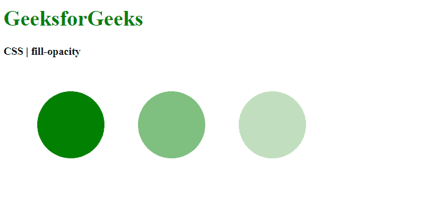
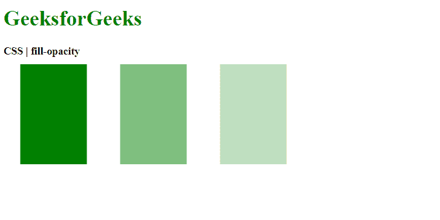

# CSS |填充-不透明度属性

> 原文:[https://www.geeksforgeeks.org/css-fill-opacity-property/](https://www.geeksforgeeks.org/css-fill-opacity-property/)

**填充-不透明度**属性用于设置应用于形状的绘制服务器的不透明度。

**语法:**

```html
fill-opacity: [0-1] | <percentage>
```

**属性值:**

*   **Value between 0 and 1:** It is used to set the opacity of the fill-in decimal values. The value 0 means that the fill is completely transparent and invisible. The value 1 means that the fill is fully opaque and visible. A decimal value between these two values would give a semi-transparent fill.

    **示例:**

    ```html
    <!DOCTYPE html>
    <html>
    <head>
      <title>
        CSS | fill-opacity
      </title>
      <style>
        .opacity1 {
          /* completely 
            visible fill */
          fill-opacity: 1.0;

          fill: green;
        }

        .opacity2 {
          fill-opacity: 0.5;

          fill: green;
        }

        .opacity3 {
          fill-opacity: 0.25;

          fill: green;
        }

        .opacity4 {
          /* completely
            transparent fill */
          fill-opacity: 0;

          fill: green;
        }
      </style>
    </head>
    <body>
      <h1 style="color: green">
        GeeksforGeeks
      </h1>
      <b>
        CSS | fill-opacity
      </b>
      <div class="container">
        <svg height="250px" width="500px"
          xmlns="http://www.w3.org/2000/svg"
          version="1.1">
          <circle class="opacity1" cx="100"
            cy="100" r="50"/>
          <circle class="opacity2" cx="250"
            cy="100" r="50"/>
          <circle class="opacity3" cx="400"
            cy="100" r="50"/>
          <circle class="opacity4" cx="400"
            cy="100" r="50"/>
        </svg>
      </div>
    </body>
    </html>
    ```

    **输出:**
    

*   **percentage:** It is used to set the opacity of the fill in percentage values. A value of 0% means that the fill is completely transparent and invisible. A value of 100% means that the fill is fully opaque and visible. A percentage value between these two values would give a semi-transparent fill.

    **示例:**

    ```html
    <!DOCTYPE html>
    <html>
    <head>
      <title>
        CSS | fill-opacity
      </title>
      <style>
        .opacity1 {
          /* completely visible
            fill */
          fill-opacity: 100%;

          fill: green;
        }

        .opacity2 {
          fill-opacity: 50%;

          fill: green;
        }

        .opacity3 {
          fill-opacity: 25%;

          fill: green;
        }

        .opacity4 {
          /* completely
            transparent fill */
          fill-opacity: 0%;

          fill: green;
        }
      </style>
    </head>

    <body>
      <h1 style="color: green">
        GeeksforGeeks
      </h1>
      <b>
        CSS | fill-opacity
      </b>
      <div class="container">
        <svg height="250px" width="500px"
          xmlns="http://www.w3.org/2000/svg"
          version="1.1">
          <rect class="opacity1" x="25"
             y="10" height="150" width="100"/>
          <rect class="opacity2" x="175"
             y="10" height="150" width="100"/>
          <rect class="opacity3" x="325"
             y="10" height="150" width="100"/>
          <rect class="opacity4" x="325"
             y="10" height="150" width="100"/>
        </svg>
      </div>
    </body>
    </html>
    ```

    **输出:**
    

**支持的浏览器:**由*填充不透明度*属性支持的浏览器如下:

*   铬
*   火狐浏览器
*   旅行队
*   歌剧
*   Internet Explorer 9