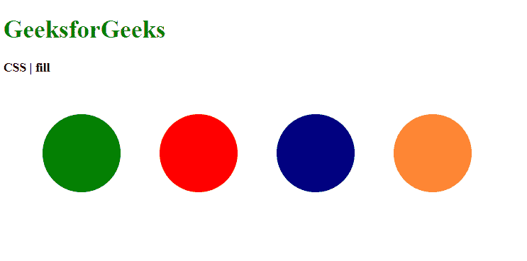
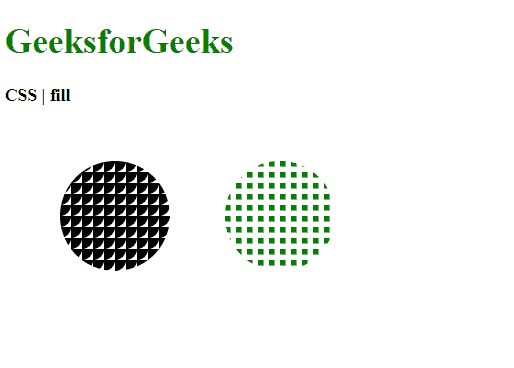

# CSS |填充属性

> 原文:[https://www.geeksforgeeks.org/css-fill-property/](https://www.geeksforgeeks.org/css-fill-property/)

**填充**属性是一个用于设置 SVG 形状颜色的呈现属性。

**语法:**

```html
fill: <paint>
```

**属性值:**

*   **paint:** It is used to set the color of the fill property. This paint be defined using color names, hex, rgb or hsl values. The default value is black. It can also be used with patterns using the url() function.

    **示例 1:** 该示例说明了填充属性的不同颜色值。

    ```html
    <!DOCTYPE html>
    <html>
    <head>
      <title>
        CSS | fill Property
      </title>
      <style>
        .opacity1 {
          /* using color names */
          fill: green;
        }

        .opacity2 {
          /* using hex values */
          fill: #ff0000;
        }

        .opacity3 {
          /* using rgb values */
          fill: rgb(0, 0, 128);
        }

        .opacity4 {
          /* using hsl values */
          fill: hsl(24, 100%, 60%);
        }
      </style>
    </head>
    <body>
      <h1 style="color: green">
        GeeksforGeeks
      </h1>
      <b>CSS | fill</b>
      <div class="container">
        <svg height="250px" width="600px"
          xmlns="http://www.w3.org/2000/svg"
          version="1.1">
          <circle class="opacity1" cx="100"
            cy="100" r="50" />
          <circle class="opacity2" cx="250"
            cy="100" r="50" />
          <circle class="opacity3" cx="400"
            cy="100" r="50" />
          <circle class="opacity4" cx="550"
            cy="100" r="50" />
        </svg>
      </div>
    </body>
    </html>
    ```

    **输出:**
    

    **示例 2:** 本示例使用填充属性的模式。

    ```html
    <!DOCTYPE html>
    <html>
    <head>
      <title>
        CSS | fill property
      </title>
      <style>
        .opacity1 {
          fill: url(#pattern1);
        }

        .opacity2 {
          fill: url(#pattern2);
        }
      </style>
    </head>
    <body>
      <h1 style="color: green">
        GeeksforGeeks
      </h1>
      <b>
        CSS | fill
      </b>
      <div class="container">
        <svg height="250px" width="600px"
          xmlns="http://www.w3.org/2000/svg"
          version="1.1">
          <defs>
            <pattern id="pattern1"
              viewBox="0, 0, 10, 10"
              width="10%" height="10%">
              <circle r="10" />
            </pattern>
            <pattern id="pattern2" 
              viewBox="0, 0, 10, 10"
              width="10%" height="10%">
              <rect height="5" width="5"
                fill="green" />
            </pattern>
          </defs>

          <circle class="opacity1" cx="100"
            cy="100" r="50" />
          <circle class="opacity2" cx="250"
            cy="100" r="50" />
        </svg>
      </div>
    </body>
    </html>
    ```

    **输出:**
    

**支持的浏览器:**填充属性支持的浏览器如下:

*   铬
*   火狐浏览器
*   旅行队
*   歌剧
*   Internet Explorer 9