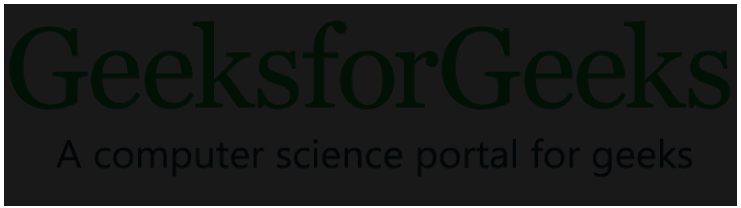

# CSS 滤镜属性

> 原文:[https://www.geeksforgeeks.org/css-filter-property/](https://www.geeksforgeeks.org/css-filter-property/)

**滤镜属性**用于设置元素的视觉效果。此属性主要用于图像内容中，用于调整图像渲染、背景、边框等。

**语法:**

```html
filter: none|blur()|brightness()|contrast()|drop-shadow()|
grayscale()|hue-rotate()|invert()|opacity()|saturate()|sepia()|
url();
```

**注意:**被空格隔开的 HTML 元素可以添加多个过滤器。

**示例:**本示例对网页中的图像元素应用两个过滤器功能。

```html
img {
   filter: brightness(20%) blur(20px);
}
```

筛选器属性同时接受百分比值和十进制值。

**过滤功能:**

*   **无:**为默认值，不应用任何效果。

**示例:**本示例描述了过滤值为“无”的**过滤器**属性。

## 超文本标记语言

```html
<!DOCTYPE html>
<html>

<head>
    <title>CSS filter property</title>
    <style>
    img {
        filter: none;
    }
    </style>
</head>

<body>
    <div>
        
    </div>
</body>

</html>
```

**输出:**


[**【亮度()】**](https://www.geeksforgeeks.org/css-brightness-function/) **:它设置元素的亮度。如果亮度为 0%，则它是完全黑色的，如果亮度为 100%，则它与原始亮度相同。大于 100%的值会产生更亮的元素。**

**示例:**本示例描述了**滤镜**属性，滤镜值为亮度为 100%。

## 超文本标记语言

```html
<!DOCTYPE html>
<html>

<head>
    <title>CSS filter property</title>
    <style>
    img {
        filter: brightness(10%);
    }
    </style>
</head>

<body>
    <div>
        
    </div>
</body>

</html>
```

**输出:**



[**【灰度()**](https://www.geeksforgeeks.org/css-grayscale-function/) **:它把元素颜色转换成黑白。灰度 0%表示原始元素，100%表示完全灰度元素。它不接受负值。**

**示例:**本示例描述了滤镜值为灰度的**滤镜**属性。

## 超文本标记语言

```html
<!DOCTYPE html>
<html>

<head>
    <title>CSS filter property</title>
    <style>
    img {
        filter: grayscale(70%);
    }
    </style>
</head>

<body>
    <div>
        
    </div>
</body>

</html>
```

**输出:**


[**棕褐色()**](https://www.geeksforgeeks.org/css-sepia-function/) **:** 它将图像转换为棕褐色图像，其中 0%代表原始图像，100%代表完全棕褐色。它不接受负值。

**示例:**本示例描述了滤镜值为棕褐色的**滤镜**属性。

## 超文本标记语言

```html
<!DOCTYPE html>
<html>

<head>
    <title>CSS filter property</title>
    <style>
    img {
        filter: sepia(50);
    }
    </style>
</head>

<body>
    <div>
        
    </div>
</body>

</html>
```

**输出:**


[**对比()**](https://www.geeksforgeeks.org/css-contrast-function/) **:有助于调整元素的对比。0%对比度表示完整的黑色元素，100%对比度表示原始元素。**

**示例:**本示例使用滤镜值作为对比度来描述**滤镜**属性，以调整图像的对比度。

## 超文本标记语言

```html
<!DOCTYPE html>
<html>

<head>
    <title>CSS filter property</title>
    <style>
    img {
        filter: contrast(50);
    }
    </style>
</head>

<body>
    <div>
        
    </div>
</body>

</html>
```

**输出:**


[**饱和()**](https://www.geeksforgeeks.org/css-saturate-function/) **:用于设置元素的饱和度。0%饱和表示元素完全不饱和，100%饱和表示原始图像。大于 100%结果的值是超饱和元素。**

**示例:**本示例描述了**滤镜**属性，滤镜值为饱和，用于平衡图像的饱和度。

## 超文本标记语言

```html
<!DOCTYPE html>
<html>

<head>
    <title>CSS filter property</title>
    <style>
    img {
        filter: saturate(50);
    }
    </style>
</head>

<body>
    <div>
        
    </div>
</body>

</html>
```

**输出:**


[**模糊()**](https://www.geeksforgeeks.org/css-blur-function/)【T4:】它将模糊效果应用于元素。如果未指定模糊值，则取 0 作为默认值。

**示例:**本示例使用滤镜值作为模糊来描述**滤镜**属性，以生成模糊图像效果。

## 超文本标记语言

```html
<!DOCTYPE html>
<html>

<head>
    <title>CSS filter property</title>
    <style>
    img {
        filter: blur(5px);
    }
    </style>
</head>

<body>
    <div>
        
    </div>
</body>

</html>
```

**输出:**


[**【不透明度()**](https://www.geeksforgeeks.org/css-opacity-function/) **:设置图像的不透明度效果。0%的不透明度表示元素完全透明，如果不透明度为 100%，则表示原始图像。它不接受负值。**

**示例:**本示例描述了**滤镜**属性，其中滤镜值设置为不透明度 0.5。

## 超文本标记语言

```html
<!DOCTYPE html>
<html>

<head>
    <title>CSS filter property</title>
    <style>
    img {
        filter: opacity(0.5);
    }
    </style>
</head>

<body>
    <div>
        
    </div>
</body>

</html>
```

**输出:**


[**【色相-旋转()】**](https://www.geeksforgeeks.org/css-hue-rotate-function/) **:** 它对图像应用色相旋转。该值定义了图像样本将被调整的颜色圆周围的度数。默认值为 0 度，表示原始图像。

**示例:**本示例描述了**滤镜**属性，其中色调旋转设置为 45 度。

## 超文本标记语言

```html
<!DOCTYPE html>
<html>

<head>
    <title>CSS filter property</title>
    <style>
    img {
        filter: hue-rotate(45deg);
    }
    </style>
</head>

<body>
    <div>
        
    </div>
</body>

</html>
```

**输出:**


[**【逆()】**](https://www.geeksforgeeks.org/css-invert-function/) **:它逆素。默认值为 0%，表示原始图像。100%使图像完全反转。它不接受负值。**

**示例:**本示例描述了**过滤器**属性，过滤器值为反转。

## 超文本标记语言

```html
<!DOCTYPE html>
<html>

<head>
    <title>CSS filter property</title>
    <style>
    img {
        filter: invert(50);
    }
    </style>
</head>

<body>
    <div>
        
    </div>
</body>

</html>
```

**输出:**


[**【暗影】()**](https://www.geeksforgeeks.org/css-drop-shadow-function/) **:** 对元素施加暗影效果。它接受 h 形阴影、v 形阴影、模糊、扩散和颜色作为值。它不仅适用于图像，还可以应用于形状，因为它可以具有与原始形状相同的形状。h 阴影& v 阴影的负值会将阴影移到图像的左侧。

**示例:**本示例描述了将阴影效果应用于元素的**滤镜**属性。

## 超文本标记语言

```html
<!DOCTYPE html>
<html>

<head>
    <title>CSS filter property</title>
    <style>
    img {
        filter: drop-shadow(16px 18px 15px rgba(255, 0, 0, 0.5));
    }
    </style>
</head>

<body>
    <div>
        
    </div>
</body>

</html>
```

**输出:**


**示例:**这里，阴影应用于该图像的水平阴影。

## 超文本标记语言

```html
<!DOCTYPE html>
<html>

<head>
    <title>Page Title</title>
</head>

<body>
    <div></div>
    <style>
    body {
        background: #F2F2B6;
    }

    div {
        width: 0;
        position: relative;
        margin: 85px 50px;
        border-top: 130px solid #FF6D00;
        border-bottom: 0px solid transparent;
        border-left: 78px solid transparent;
        border-right: 74px solid transparent;
        filter: drop-shadow(19px 0 0 #FD4602);
    }
    </style>
</body>

</html>
```

**输出:**


从输出中可以观察到，我们可以使用*投影*获得相同的形状，如果增加 x 偏移，它可以向右移动，如果应用 y 偏移，它会向底部移动。同样，您可以设计任何形状，如果应用“投影”属性，它会为图像生成阴影

[](https://www.geeksforgeeks.org/css-value-initial/)****:**它将过滤器属性设置为默认值。**

****示例:**本示例描述了以过滤器值为初始值的**过滤器**属性。**

## **超文本标记语言**

```html
<!DOCTYPE html>
<html>

<head>
    <title>CSS filter property</title>
    <style>
    img {
        filter: initial();
    }
    </style>
</head>

<body>
    <div>
        
    </div>
</body>

</html>
```

****输出:****

****

****支持的浏览器:***过滤属性*支持的浏览器如下:**

*   **谷歌 Chrome 53.0，18.0 -webkit-**
*   **微软边缘 12.0**
*   **Firefox 35.0**
*   **Safari 9.1，6.0 -webkit-**
*   **Opera 40.0，15.0 -webkit-**