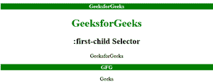
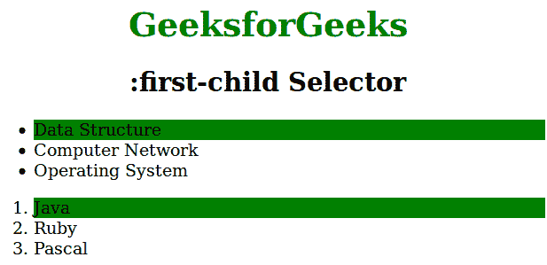

# CSS |:第一子选择器

> 原文:[https://www.geeksforgeeks.org/css-first-child-selector/](https://www.geeksforgeeks.org/css-first-child-selector/)

:第一个子元素选择器用于选择那些作为第一个子元素的元素。对于:第一子选择器必须为 IE8 和更早版本声明。
**语法:**

```html
:first-child {
    // CSS property
} 
```

**例 1:**

## 超文本标记语言

```html
<!DOCTYPE html>
<html>
    <head>
        <title>first child selector</title>
        <style>
            h1 {
                color:green;
            }
            p:first-child {
                background-color: green;
                color:white;
                font-weight:bold;
            }
            body {
                text-align:center;
            }
        </style>
    </head>
    <body>

<p>GeeksforGeeks</p>

        <h1>GeeksforGeeks</h1>
        <h2>:first-child Selector</h2>

<p>GeeksforGeeks</p>

        <div>

<p>GFG</p>

<p>Geeks</p>

        </div>
    </body>
</html>                   
```

**输出:**



**例 2:**

## 超文本标记语言

```html
<!DOCTYPE html>
<html>
    <head>
        <title>first child selector</title>
        <style>
            h1 {
                color:green;
            }
            h1, h2 {
                text-align:center;
            }
            li:first-child {
                background: green;
            }
            body {
                width:70%;
            }
        </style>
    </head>
    <body>
        <h1>GeeksforGeeks</h1>
        <h2>:first-child Selector</h2>
        <ul>
            <li>Data Structure</li>
            <li>Computer Network</li>
            <li>Operating System</li>
        </ul>
        <ol>
            <li>Java</li>
            <li>Ruby</li>
            <li>Pascal</li>
        </ol>
    </body>
</html>                   
```

**输出:**



**支持的浏览器:***:第一子*选择器支持的浏览器如下:

*   苹果 Safari 3.1
*   谷歌 Chrome 4.0
*   Firefox 3.0
*   歌剧 9.6
*   Internet Explorer 7.0