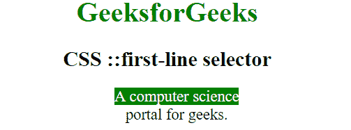

# CSS |::一线选择器

> 原文:[https://www.geeksforgeeks.org/css-first-line-selector/](https://www.geeksforgeeks.org/css-first-line-selector/)

CSS 中的**::第一行**选择器用于对块级元素的第一行应用样式。第一行的长度取决于许多因素，包括元素的宽度、文档的宽度、文本的字体大小等。

**语法:**

```
::first-line {
    //CSS Property
}

```

**示例:**

```
<!DOCTYPE html>
<html>

<head>
    <title>
        CSS ::first-line selector
    </title>
    <style>
        p {
            width: 25%;
        }

        p::first-line {
            color: white;
            background: green;
        }
    </style>
</head>

<body style="text-align: center;">
    <h1 style="color:green;">
            GeeksforGeeks
        </h1>
    <h2>
            CSS ::first-line selector
        </h2>

    <p>
        A computer science portal for geeks.
    </p>

</body>

</html>
```

**输出:**

**支持的浏览器:**第一行选择器支持的浏览器如下:

*   苹果 Safari 1.0
*   谷歌 Chrome 1.0
*   Firefox 1.0
*   Opera 7.0 部分来自 3.5
*   Internet Explorer 9.0 的部分版本