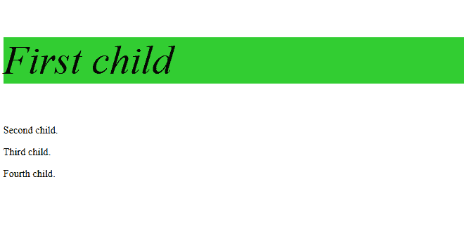

# CSS |:第一类选择器

> 原文:[https://www.geeksforgeeks.org/css-first-of-type-selector/](https://www.geeksforgeeks.org/css-first-of-type-selector/)

**:第一类型选择器**用于定位其父元素的每个元素的第一个子元素。如果我们想在不给类的情况下对元素的第一个子元素进行样式化，我们可以使用它。

**语法:**

```css
:first-of-type {
  //property
}

```

**示例:**

```css
<!DOCTYPE html>
<html>

<head>
    <style>
        p:first-of-type {
            background: limegreen;
            font-size: 4.0em;
            font-style: italic;
        }
    </style>
</head>

<body>

    <p>First child</p>
    <p>Second child.</p>
    <p>Third child.</p>
    <p>Fourth child.</p>

</body>

</html>
```

**输出:**


**支持的浏览器:**

*   谷歌 Chrome 4.0*   Edge 9.0*   Firefox 3.5*   Safari 3.2*   歌剧 9.6