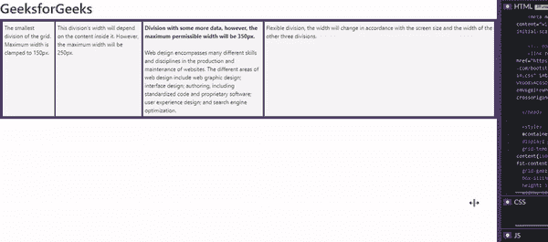
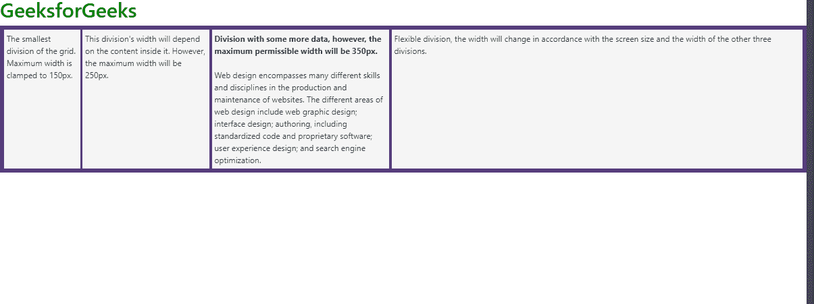
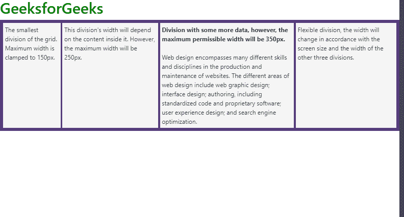
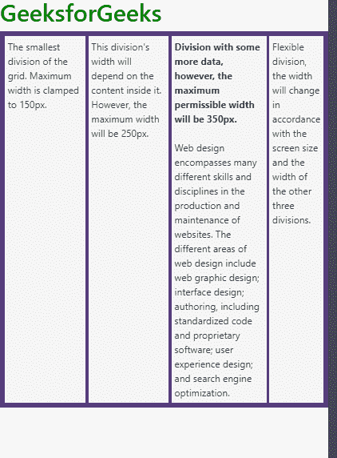
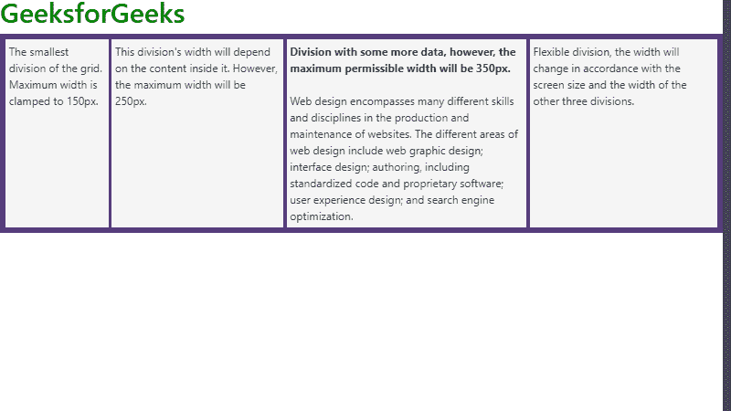
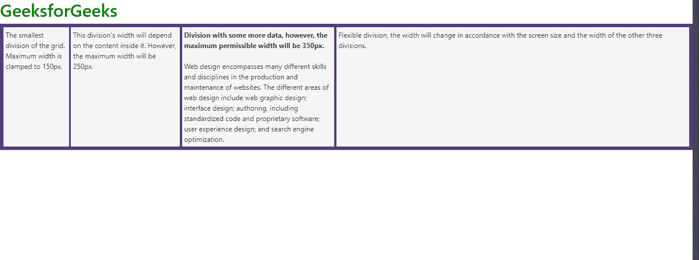

# CSS | fit-content()属性

> 原文:[https://www.geeksforgeeks.org/css-fit-content-property/](https://www.geeksforgeeks.org/css-fit-content-property/)

**CSS 适合内容属性**是 CSS 中的一个内置属性。该属性用于根据公式**最小(最大尺寸，最大(最小尺寸，参数))**调整尺寸。fit-content()属性用于定义函数，以限制除法的最大大小。这个公式在处理 CSS 网格时非常有用。但是，必须记住，fit-content()与 PC 上的 Internet Explorer 不兼容。**这个公式可以使用不同的 CSS 单位。函数的作用是:接受长度和百分比作为参数。**
**语法:**

```html
fit-content: length | percentage
```

**属性值:**

*   **长度:**该属性值包含固定长度。
    T3】单位:绝对长度
    *   适合内容(8 厘米)
    *   适合度(12 毫米)
    *   适合内容(8pc)
    *   适合内容(15px)
    *   适合含量(5pt)
*   **百分比:**包含相对长度的该属性值取决于给定轴中的可用空间。
    **单位:**相对长度
    *   适合度-含量(100%)
    *   适合内容(10 毫米)
    *   适合内容(5rem)
    *   适合含量(2ch)

下面的示例说明了 CSS fit-content 属性:
**示例:**可以看到网页被分成了四个网格列。第一、第二和第三分区的最大允许宽度分别为 150px、250px 和 350px，而第四分区的宽度已设置为 1.5fr。这意味着它将根据器件宽度和其他三个分区占用的宽度进行自我调整。

## 超文本标记语言

```html
<!DOCTYPE html>
<html lang="en">

<head>
    <!-- Required meta tags -->
    <title>CSS | fit-content Property</title>
    <meta charset="utf-8">
    <meta name="viewport"
          content="width=device-width,
                   initial-scale=1,
                   shrink-to-fit=no">

    <!-- Bootstrap CSS -->
    <link rel="stylesheet" href=
"https://stackpath.bootstrapcdn.com/bootstrap/4.4.1/css/bootstrap.min.css"
          integrity=
"sha384-Vkoo8x4CGsO3+Hhxv8T/Q5PaXtkKtu6ug5TOeNV6gBiFeWPGFN9MuhOf23Q9Ifjh"
          crossorigin="anonymous">

</head>

<style>
    #container {
        display: grid;
        grid-template-columns: fit-content(150px)
                               fit-content(250px)
                               fit-content(350px) 1.5fr;
        grid-gap: 5px;
        box-sizing: border-box;
        height: 100%;
        width: 100%;
        background-color: #563d7c;
        padding: 8px;
    }
</style>

<body>
    <h1 style="color:green;">GeeksforGeeks</h1>
    <div id="container">

        <div style="background-color: whitesmoke;
                    padding: 5px">
          The smallest division of the grid.
          Maximum width is clamped to 150px.
        </div>
        <div style="background-color: whitesmoke;
                    padding: 5px">
          This division's width will depend on
          the content inside it. However, the
          maximum width will be 250px.
        </div>
        <div style="background-color: whitesmoke;
                    padding: 5px">
            <strong>
              Division with some more data, however,
              the maximum permissible width will be 350px.
            </strong>
            <br>
            <br>
          Web design encompasses many different skills
          and disciplines in the production and maintenance
          of websites. The different areas of web design
          include web graphic design; interface design;
          authoring, including standardized code and
          proprietary software; user experience design;
          and search engine optimization.
        </div>
        <div style="background-color: whitesmoke;
                    padding: 5px">
          Flexible division, the width will change in
          accordance with the screen size and the width
          of the other three divisions.
        </div>
    </div>

</body>

</html>
```

**输出:**



**说明:**我们来逐步看一下例子。

*   **步骤 01:** 正常布局，正常的网页布局。CSS 网格用于演示目的。CSS 网格有助于创建响应性网页，因为网格划分会根据屏幕宽度进行调整。



*   **步骤 02:** 屏幕宽度开始减小。第四赛区已经开始缩小，但是，第一、第二、第三赛区依然不受影响。



*   **步骤 03:** 最小宽度，第三师缩水最大。第一和第二部门内部的内容已经进行了调整，不会溢出。网格对屏幕宽度的变化反应良好。



*   **步骤 04:** 屏幕宽度开始增加。现在屏幕宽度增加了，所有分区的宽度也相应增加了。然而，对第一、第二和第三划分的宽度设置了上限，因此在限制该阈值限制之后，它们将被固定。然而，第四师将继续扩张。



*   **步骤 05:** 回到正常布局网格已经恢复到正常布局。



从步骤 **02、03、04** 可以观察到，一旦屏幕宽度开始缩小，第四分区最先缩小。一旦宽度开始增加，所有分区都开始扩展，然而，第一个分区在宽度等于 150px 后停止扩展，而第二个和第三个分区扩展，直到它们分别达到 250px 和 350px 的宽度。第四师继续扩大。这是因为它的宽度被设置为 1.5fr，这意味着它自己的宽度将取决于屏幕和其他分区的宽度。

**支持的浏览器:**

*   谷歌 Chrome
*   火狐浏览器
*   歌剧
*   旅行队