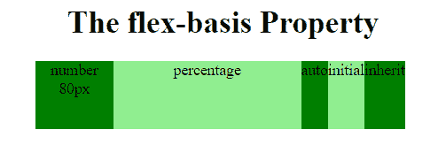
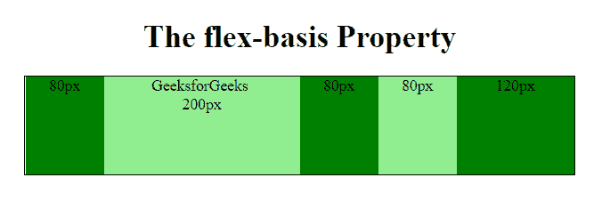

# CSS |基于弹性的属性

> 原文:[https://www.geeksforgeeks.org/css-flex-basis-property/](https://www.geeksforgeeks.org/css-flex-basis-property/)

CSS 中的 flex-based 属性用于指定灵活项的初始大小。如果元素不是柔性项，则不使用 flex 属性。

**语法:**

```html
flex-basis: number|auto|initial|inherit;
```

**默认值:**

*   **自动**

**房产价值:**

*   **数字:**是定义该项目初始长度的长度单位。
*   **自动:**为默认值，如果没有指定长度，长度将根据其内容而定。
*   **初始值:**将属性设置为默认值。
*   **inherit:** 它指定属性应该从其父元素继承其值。

**例 1:**

## 超文本标记语言

```html
<!DOCTYPE html>
<html>

<head>
    <style>
        .Geeks {
            width: 385px;
            height: 70px;
            display: flex;
        }

        .Geeks div {
            flex-grow: 0;
            flex-shrink: 0;
            flex-basis: 80px;

            /* For Safari 6.1 and above browsers */
            -webkit-flex-grow: 0; 
            -webkit-flex-shrink: 0;
            -webkit-flex-basis: 80px;
        }

        .Geeks div:nth-of-type(2) {
            flex-basis: 50%;
        }
        .Geeks div:nth-of-type(3) {
            flex-basis: auto;
        }
        .Geeks div:nth-of-type(4) {
            flex-basis: initial;
        }
        .Geeks div:nth-of-type(5) {
            flex-basis: inherit;
        }
    </style>
</head>

<body>
    <center>

        <h1>
            The flex-basis Property
        </h1>

        <div class = "Geeks">

            <div style = "background-color:green;">
                number 80px
            </div>

            <div style = "background-color:lightgreen;">
                percentage
            </div>

            <div style = "background-color:green;">
                auto
            </div>

            <div style = "background-color:lightgreen;">
                initial
            </div>

            <div style = "background-color:green;">
                inherit
            </div>
        </div> 

    </center>
</body>

</html>                    
```

**输出:**



**例 2:**

## 超文本标记语言

```html
<!DOCTYPE html>
<html>

<head>
    <style>
        .Geeks {
            width: 560px;
            height: 100px;
            border: 1px solid black; 
            display: flex;
        }

        .Geeks div {
            flex-grow: 0;
            flex-shrink: 0;
            flex-basis: 80px;
        }
        .Geeks div:nth-of-type(2) {
            flex-basis: 200px;
        }
        .Geeks div:nth-of-type(5) {
            flex-basis: 120px;
        }
        h3{
            color:Green;
        }
    </style>
</head>

<body>
    <center>

        <h1>
            The flex-basis Property
        </h1>

        <div class = "Geeks">
            <div style="background-color:green">
                80px
            </div>

            <div style="background-color:lightgreen">
                GeeksforGeeks <br>200px
            </div>

            <div style="background-color:green">
                80px
            </div>

            <div style="background-color:lightgreen">
                80px
            </div>

            <div style="background-color:green">
                120px
            </div>
        </div> 
    </center>
</body>

</html>                    
```

**输出:**



**支持的浏览器:**由*灵活基础属性*支持的浏览器如下:

*   谷歌 Chrome 29.0，21.0 -webkit-
*   Internet Explorer 11.0
*   火狐浏览器 28.0， 18.0 -moz-
*   Safari 9.0，6.1 -webkit-
*   Opera 17.0