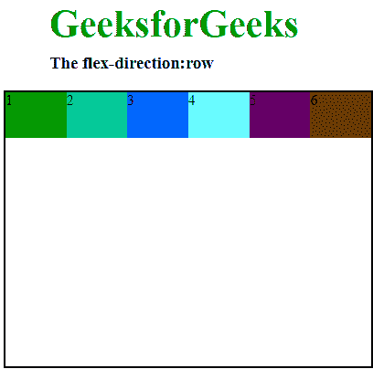
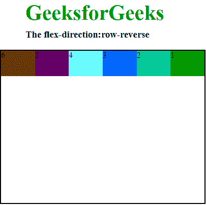
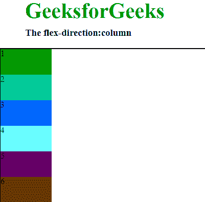
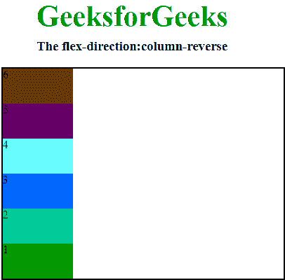

# CSS |弯曲方向属性

> 原文:[https://www.geeksforgeeks.org/css-flex-direction-property/](https://www.geeksforgeeks.org/css-flex-direction-property/)

**柔性方向属性**是柔性盒布局模块的子属性。它确立了柔性物品的主轴。弹性项的主轴是主轴。它不一定总是水平的，它基本上取决于伸缩方向的属性。
**注意:**当元素不是柔性物品时，柔性属性没有用。

**语法:**

```html
flex-direction: row|row-reverse|column|column-reverse;
```

**默认值:行**

**属性值:**

**行:**它将行排列成与文本方向相同。伸缩方向的默认值是行。它用于指定该项具有正常的文本方向。它使项目在行中遵循正常的文本方向。

**语法:**

```html
flex-direction: row; 
```

**示例:**

## 超文本标记语言

```html
<!DOCTYPE html>

<head>
    <title>flex-direction property</title>
    <style>
        #main {
            width: 400px;
            height: 300px;
            border: 2px solid black;
            display: flex;
            flex-direction: row;
        }

        #main div {
            width: 100px;
            height: 50px;
        }

        h1 {
            color: #009900;
            font-size: 42px;
            margin-left: 50px;
        }

        h3 {
            margin-top: -20px;
            margin-left: 50px;
        }
    </style>
</head>

<body>
    <h1>GeeksforGeeks</h1>
    <h3>The flex-direction:row</h3>
    <div id="main">
        <div style="background-color:#009900;">1</div>
        <div style="background-color:#00cc99;">2</div>
        <div style="background-color:#0066ff;">3</div>
        <div style="background-color:#66ffff;">4</div>
        <div style="background-color:#660066;">5</div>
        <div style="background-color:#663300;">6</div>
    </div>
</body>

</html>
```

**输出:**



**行-反转:**该属性用于跟随文本方向的相反方向。正如我们在输出中看到的，它使伸缩项的顺序与文本方向完全相反。

**语法:**

```html
flex-direction: row-reverse;
```

**示例:**

## 超文本标记语言

```html
<!DOCTYPE html>

<head>
    <title>flex-direction property</title>
    <style>
        #main {
            width: 400px;
            height: 300px;
            border: 2px solid black;
            display: flex;
            flex-direction: row-reverse;
        }

        #main div {
            width: 100px;
            height: 50px;
        }

        h1 {
            color: #009900;
            font-size: 42px;
            margin-left: 50px;
        }

        h3 {
            margin-top: -20px;
            margin-left: 50px;
        }
    </style>
</head>

<body>
    <h1>GeeksforGeeks</h1>
    <h3>The flex-direction:row-reverse</h3>
    <div id="main">
        <div style="background-color:#009900;">1</div>
        <div style="background-color:#00cc99;">2</div>
        <div style="background-color:#0066ff;">3</div>
        <div style="background-color:#66ffff;">4</div>
        <div style="background-color:#660066;">5</div>
        <div style="background-color:#663300;">6</div>
    </div>
</body>

</html>
```

**输出:**



**列:**它将行排列为与文本方向相同但从上到下的列。它用于指定项目具有正常的上下方向。它使项目遵循正常的从上到下的方向，正如我们在输出中看到的。

**语法:**

```html
flex-direction:column; 
```

**例:**

## 超文本标记语言

```html
<!DOCTYPE html>

<head>
    <title>flex-direction property</title>
    <style>
        #main {
            width: 400px;
            height: 300px;
            border: 2px solid black;
            display: flex;
            flex-direction: column;
        }

        #main div {
            width: 100px;
            height: 50px;
        }

        h1 {
            color: #009900;
            font-size: 42px;
            margin-left: 50px;
        }

        h3 {
            margin-top: -20px;
            margin-left: 50px;
        }
    </style>
</head>

<body>
    <h1>GeeksforGeeks</h1>
    <h3>The flex-direction:column</h3>
    <div id="main">
        <div style="background-color:#009900;">1</div>
        <div style="background-color:#00cc99;">2</div>
        <div style="background-color:#0066ff;">3</div>
        <div style="background-color:#66ffff;">4</div>
        <div style="background-color:#660066;">5</div>
        <div style="background-color:#663300;">6</div>
    </div>
</body>

</html>
```

**输出:**



**列-反转:**它将行排列为与行-从下到上反转相同的列。它用于指定项目具有正常的底部到顶部方向。它使项目遵循正常的从下到上的方向，正如我们在输出中看到的。

**语法:**

```html
flex-direction:column-reverse; 
```

**例:**

## 超文本标记语言

```html
<!DOCTYPE html>

<head>
    <title>flex-direction property</title>
    <style>
        #main {
            width: 400px;
            height: 300px;
            border: 2px solid black;
            display: flex;
            flex-direction: column-reverse;
        }

        #main div {
            width: 100px;
            height: 50px;
        }

        h1 {
            color: #009900;
            font-size: 42px;
            margin-left: 50px;
        }

        h3 {
            margin-top: -20px;
            margin-left: 50px;
        }
    </style>
</head>

<body>
    <h1>GeeksforGeeks</h1>
    <h3>The flex-direction:column-reverse</h3>
    <div id="main">
        <div style="background-color:#009900;">1</div>
        <div style="background-color:#00cc99;">2</div>
        <div style="background-color:#0066ff;">3</div>
        <div style="background-color:#66ffff;">4</div>
        <div style="background-color:#660066;">5</div>
        <div style="background-color:#663300;">6</div>
    </div>
</body>

</html>

<!DOCTYPE html>

<head>
    <title>flex-direction property</title>
    <style>
        #main {
            width: 400px;
            height: 300px;
            border: 2px solid black;
            display: flex;
            flex-direction: column-reverse;
        }
```

**输出:**



**支持的浏览器:**

*   谷歌 Chrome 29.0
*   Internet Explorer 11.0
*   Mozilla Firefox 28.0
*   Opera 17.0
*   Safari 9.0