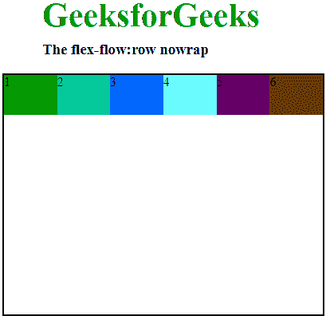
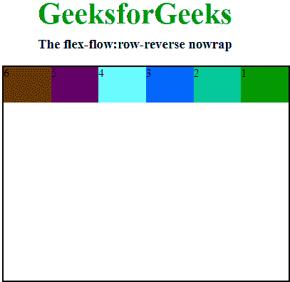
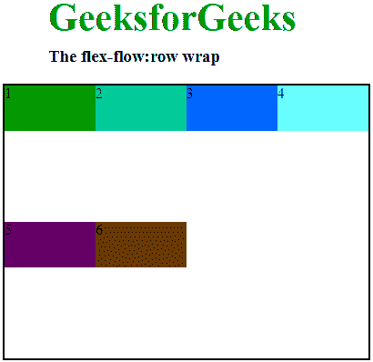
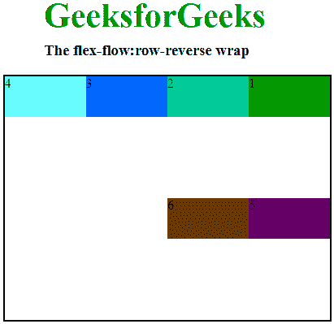
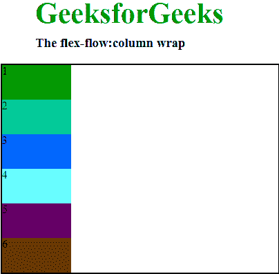
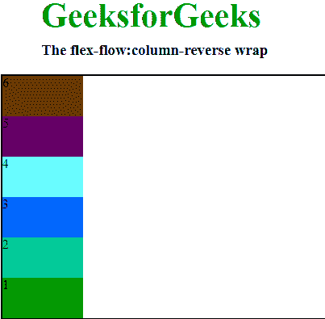
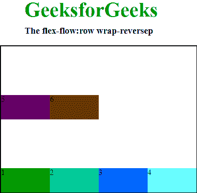
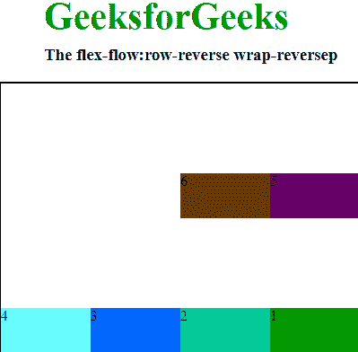
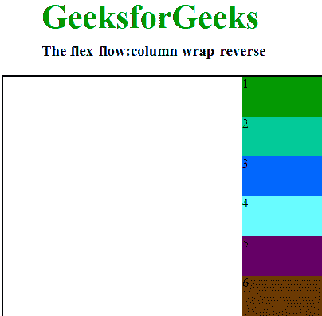
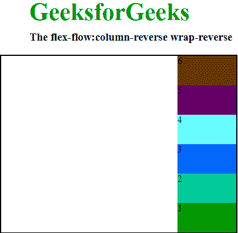

# CSS |柔流属性

> 原文:[https://www.geeksforgeeks.org/css-flex-flow-property/](https://www.geeksforgeeks.org/css-flex-flow-property/)

柔性流属性是柔性盒布局模块的子属性，也是柔性卷绕和柔性方向的简写属性。
**注意:**当元素不是柔性项时，柔性属性没有用。

### 语法:

```html
flex-flow: flex-direction flex-wrap;

```

### 柔性流特性的值:

*   **row nowrap:** It arrange the row same as text direction and the default value of wrap-flex is nowrap. It is used to specify that the item has no wrap. It makes item wrap in single lines.

    **语法:**

    ```html
    flex-flow: row nowrap; 
    ```

    **示例:**

    ```html
    <!DOCTYPE html>

    <head>
        <title>flex-flow property</title>
        <style>
            #main {
                width: 400px;
                height: 300px;
                border: 2px solid black;
                display: flex;
                flex-flow: row nowrap;
            }

            #main div {
                width: 100px;
                height: 50px;
            }

            h1 {
                color: #009900;
                font-size: 42px;
                margin-left: 50px;
            }

            h3 {
                margin-top: -20px;
                margin-left: 50px;
            }
        </style>
    </head>

    <body>
        <h1>GeeksforGeeks</h1>
        <h3>The flex-flow:row nowrap</h3>
        <div id="main">
            <div style="background-color:#009900;">1</div>
            <div style="background-color:#00cc99;">2</div>
            <div style="background-color:#0066ff;">3</div>
            <div style="background-color:#66ffff;">4</div>
            <div style="background-color:#660066;">5</div>
            <div style="background-color:#663300;">6</div>
        </div>
    </body>

    </html>
    ```

    **输出:**
    

*   **行-反转 nowrap:** 它将行排列在文本方向的相反方向，wrap-flex 的默认值是 nowrap。它用于指定项目没有包装。它使项目换行。
    **语法:**

```html
flex-flow: row-reverse nowrap; 
```

**示例:**

```html
<!DOCTYPE html>

<head>
    <title>flex-flow property</title>
    <style>
        #main {
            width: 400px;
            height: 300px;
            border: 2px solid black;
            display: flex;
            flex-flow: row-reverse nowrap;
        }

        #main div {
            width: 100px;
            height: 50px;
        }

        h1 {
            color: #009900;
            font-size: 42px;
            margin-left: 50px;
        }

        h3 {
            margin-top: -20px;
            margin-left: 50px;
        }
    </style>
</head>

<body>
    <h1>GeeksforGeeks</h1>
    <h3>The flex-flow:row-reverse nowrap</h3>
    <div id="main">
        <div style="background-color:#009900;">1</div>
        <div style="background-color:#00cc99;">2</div>
        <div style="background-color:#0066ff;">3</div>
        <div style="background-color:#66ffff;">4</div>
        <div style="background-color:#660066;">5</div>
        <div style="background-color:#663300;">6</div>
    </div>
</body>

</html>
```

**输出:**


*   **column nowrap:** same as row but top to bottom and the default value of wrap-flex is nowrap. It is used to specify that the item has no wrap. It makes item wrap in single lines.
    **Syntax:**

    ```html
    flex-flow: column nowrap; 
    ```

    **示例:**

    ```html
    <!DOCTYPE html>

    <head>
        <title>flex-flow property</title>
        <style>
            #main {
                width: 400px;
                height: 300px;
                border: 2px solid black;
                display: flex;
                flex-flow: column nowrap;
            }

            #main div {
                width: 100px;
                height: 50px;
            }

            h1 {
                color: #009900;
                font-size: 42px;
                margin-left: 50px;
            }

            h3 {
                margin-top: -20px;
                margin-left: 50px;
            }
        </style>
    </head>

    <body>
        <h1>GeeksforGeeks</h1>
        <h3>The flex-flow:column nowrap</h3>
        <div id="main">
            <div style="background-color:#009900;">1</div>
            <div style="background-color:#00cc99;">2</div>
            <div style="background-color:#0066ff;">3</div>
            <div style="background-color:#66ffff;">4</div>
            <div style="background-color:#660066;">5</div>
            <div style="background-color:#663300;">6</div>
        </div>
    </body>

    </html>
    ```

    **输出:**
    

    *   **column-reverse nowrap:** Same as row-reverse top to bottom and the default value of wrap-flex is nowrap. It is used to specify that the item has no wrap. It makes item wrap in single lines.
    **Syntax:**

    ```html
    flex-flow: column-reverse nowrap; 
    ```

    **示例:**

    ```html
    <!DOCTYPE html>

    <head>
        <title>flex-flow property</title>
        <style>
            #main {
                width: 400px;
                height: 300px;
                border: 2px solid black;
                display: flex;
                flex-flow: column-reverse nowrap;
            }

            #main div {
                width: 100px;
                height: 50px;
            }

            h1 {
                color: #009900;
                font-size: 42px;
                margin-left: 50px;
            }

            h3 {
                margin-top: -20px;
                margin-left: 50px;
            }
        </style>
    </head>

    <body>
        <h1>GeeksforGeeks</h1>
        <h3>The flex-flow:column-reverse nowrap</h3>
        <div id="main">
            <div style="background-color:#009900;">1</div>
            <div style="background-color:#00cc99;">2</div>
            <div style="background-color:#0066ff;">3</div>
            <div style="background-color:#66ffff;">4</div>
            <div style="background-color:#660066;">5</div>
            <div style="background-color:#663300;">6</div>
        </div>
    </body>

    </html>
    ```

    **输出:**
    

    *   **row wrap:** It arrange the row same as text direction and wrap property is used to break the flex item into multiples lines. It makes flex items wrap to multiple lines according to flex item width
    **Syntax:**

    ```html
    flex-flow: row wrap; 
    ```

    **示例:**

    ```html
    <!DOCTYPE html>

    <head>
        <title>flex-flow property</title>
        <style>
            #main {
                width: 400px;
                height: 300px;
                border: 2px solid black;
                display: flex;
                flex-flow: row wrap;
            }

            #main div {
                width: 100px;
                height: 50px;
            }

            h1 {
                color: #009900;
                font-size: 42px;
                margin-left: 50px;
            }

            h3 {
                margin-top: -20px;
                margin-left: 50px;
            }
        </style>
    </head>

    <body>
        <h1>GeeksforGeeks</h1>
        <h3>The flex-flow:row wrap</h3>
        <div id="main">
            <div style="background-color:#009900;">1</div>
            <div style="background-color:#00cc99;">2</div>
            <div style="background-color:#0066ff;">3</div>
            <div style="background-color:#66ffff;">4</div>
            <div style="background-color:#660066;">5</div>
            <div style="background-color:#663300;">6</div>
        </div>
    </body>

    </html>
    ```

    **输出:**
    

    *   **行-反向换行:**它将行排列在文本方向的相反方向，换行属性用于在伸缩项换行到新行时反转它们的流向。
    **语法:**

```html
flex-flow: row-reverse wrap; 
```

**示例:**

```html
<!DOCTYPE html>

<head>
    <title>flex-flow property</title>
    <style>
        #main {
            width: 400px;
            height: 300px;
            border: 2px solid black;
            display: flex;
            flex-flow: row-reverse wrap;
        }

        #main div {
            width: 100px;
            height: 50px;
        }

        h1 {
            color: #009900;
            font-size: 42px;
            margin-left: 50px;
        }

        h3 {
            margin-top: -20px;
            margin-left: 50px;
        }
    </style>
</head>

<body>
    <h1>GeeksforGeeks</h1>
    <h3>The flex-flow:row-reverse wrap</h3>
    <div id="main">
        <div style="background-color:#009900;">1</div>
        <div style="background-color:#00cc99;">2</div>
        <div style="background-color:#0066ff;">3</div>
        <div style="background-color:#66ffff;">4</div>
        <div style="background-color:#660066;">5</div>
        <div style="background-color:#663300;">6</div>
    </div>
</body>

</html>
```

**输出:**


*   **column wrap:** It arrange the row same as row but top to bottom and wrap property is used to reverse the flow of the flex items when they wrap to new lines.
    **Syntax:**

    ```html
    flex-flow:column wrap; 
    ```

    **示例:**

    ```html
    <!DOCTYPE html>

    <head>
        <title>flex-flow property</title>
        <style>
            #main {
                width: 400px;
                height: 300px;
                border: 2px solid black;
                display: flex;
                flex-flow: column wrap;
            }

            #main div {
                width: 100px;
                height: 50px;
            }

            h1 {
                color: #009900;
                font-size: 42px;
                margin-left: 50px;
            }

            h3 {
                margin-top: -20px;
                margin-left: 50px;
            }
        </style>
    </head>

    <body>
        <h1>GeeksforGeeks</h1>
        <h3>The flex-flow:column wrap</h3>
        <div id="main">
            <div style="background-color:#009900;">1</div>
            <div style="background-color:#00cc99;">2</div>
            <div style="background-color:#0066ff;">3</div>
            <div style="background-color:#66ffff;">4</div>
            <div style="background-color:#660066;">5</div>
            <div style="background-color:#663300;">6</div>
        </div>
    </body>

    </html>
    ```

    **输出:**
    

    *   **column-reverse wrap:** It arrange the row same as row-reverse top to bottom. and wrap property is used to reverse the flow of the flex items when they wrap to new lines.
    **Syntax:**

    ```html
    flex-flow:column-reverse wrap; 
    ```

    **示例:**

    ```html
    <!DOCTYPE html>

    <head>
        <title>flex-flow property</title>
        <style>
            #main {
                width: 400px;
                height: 300px;
                border: 2px solid black;
                display: flex;
                flex-flow: column-reverse wrap;
            }

            #main div {
                width: 100px;
                height: 50px;
            }

            h1 {
                color: #009900;
                font-size: 42px;
                margin-left: 50px;
            }

            h3 {
                margin-top: -20px;
                margin-left: 50px;
            }
        </style>
    </head>

    <body>
        <h1>GeeksforGeeks</h1>
        <h3>The flex-flow:column-reverse wrap</h3>
        <div id="main">
            <div style="background-color:#009900;">1</div>
            <div style="background-color:#00cc99;">2</div>
            <div style="background-color:#0066ff;">3</div>
            <div style="background-color:#66ffff;">4</div>
            <div style="background-color:#660066;">5</div>
            <div style="background-color:#663300;">6</div>
        </div>
    </body>

    </html>
    ```

    **输出:**
    

    *   **row wrap-reverse:** It arrange the row same as text direction and wrap-reverse property This property is used to reverse the flow of the flex items when they wrap to new lines.
    **Syntax:**

    ```html
    flex-flow:row wrap-reverse; 
    ```

    **示例:**

    ```html
    <!DOCTYPE html>

    <head>
        <title>flex-flow property</title>
        <style>
            #main {
                width: 400px;
                height: 300px;
                border: 2px solid black;
                display: flex;
                flex-flow: row wrap-reverse;
            }

            #main div {
                width: 100px;
                height: 50px;
            }

            h1 {
                color: #009900;
                font-size: 42px;
                margin-left: 50px;
            }

            h3 {
                margin-top: -20px;
                margin-left: 50px;
            }
        </style>
    </head>

    <body>
        <h1>GeeksforGeeks</h1>
        <h3>The flex-flow:row wrap-reversep</h3>
        <div id="main">
            <div style="background-color:#009900;">1</div>
            <div style="background-color:#00cc99;">2</div>
            <div style="background-color:#0066ff;">3</div>
            <div style="background-color:#66ffff;">4</div>
            <div style="background-color:#660066;">5</div>
            <div style="background-color:#663300;">6</div>
        </div>
    </body>

    </html>
    ```

    **输出:**
    

    *   **row-reverse wrap-reverse:** It arrange the row opposite text direction and wrap-reverse property This property is used to reverse the flow of the flex items when they wrap to new lines.
    **Syntax:**

    ```html
    flex-flow:row-reverse wrap-reverse; 
    ```

    **示例:**

    ```html
    <!DOCTYPE html>

    <head>
        <title>flex-flow property</title>
        <style>
            #main {
                width: 400px;
                height: 300px;
                border: 2px solid black;
                display: flex;
                flex-flow: row-reverse wrap-reverse;
            }

            #main div {
                width: 100px;
                height: 50px;
            }

            h1 {
                color: #009900;
                font-size: 42px;
                margin-left: 50px;
            }

            h3 {
                margin-top: -20px;
                margin-left: 50px;
            }
        </style>
    </head>

    <body>
        <h1>GeeksforGeeks</h1>
        <h3>The flex-flow:row-reverse wrap-reversep</h3>
        <div id="main">
            <div style="background-color:#009900;">1</div>
            <div style="background-color:#00cc99;">2</div>
            <div style="background-color:#0066ff;">3</div>
            <div style="background-color:#66ffff;">4</div>
            <div style="background-color:#660066;">5</div>
            <div style="background-color:#663300;">6</div>
        </div>
    </body>

    </html>
    ```

    **输出:**
    

    *   **column wrap-reverse:** It arrange the row same as row but top to bottom.and wrap-reverse property This property is used to reverse the flow of the flex items when they wrap to new lines.
    **Syntax:**

    ```html
    flex-flow:column wrap-reverse; 
    ```

    **示例:**

    ```html
    <!DOCTYPE html>

    <head>
        <title>flex-flow property</title>
        <style>
            #main {
                width: 400px;
                height: 300px;
                border: 2px solid black;
                display: flex;
                flex-flow: column wrap-reverse;
            }

            #main div {
                width: 100px;
                height: 50px;
            }

            h1 {
                color: #009900;
                font-size: 42px;
                margin-left: 50px;
            }

            h3 {
                margin-top: -20px;
                margin-left: 50px;
            }
        </style>
    </head>

    <body>
        <h1>GeeksforGeeks</h1>
        <h3>The flex-flow:column wrap-reverse</h3>
        <div id="main">
            <div style="background-color:#009900;">1</div>
            <div style="background-color:#00cc99;">2</div>
            <div style="background-color:#0066ff;">3</div>
            <div style="background-color:#66ffff;">4</div>
            <div style="background-color:#660066;">5</div>
            <div style="background-color:#663300;">6</div>
        </div>
    </body>

    </html>
    ```

    **输出:**
    

    *   **column-reverse wrap-reverse:** It arrange the row same as row-reverse top to bottom and wrap-reverse property This property is used to reverse the flow of the flex items when they wrap to new lines.
    **Syntax:**

    ```html
    flex-flow:column-reverse wrap-reverse; 
    ```

    **示例:**

    ```html
    <!DOCTYPE html>

    <head>
        <title>flex-flow property</title>
        <style>
            #main {
                width: 400px;
                height: 300px;
                border: 2px solid black;
                display: flex;
                flex-flow: column-reverse wrap-reverse;
            }

            #main div {
                width: 100px;
                height: 50px;
            }

            h1 {
                color: #009900;
                font-size: 42px;
                margin-left: 50px;
            }

            h3 {
                margin-top: -20px;
                margin-left: 50px;
            }
        </style>
    </head>

    <body>
        <h1>GeeksforGeeks</h1>
        <h3>The flex-flow:column-reverse wrap-reverse</h3>
        <div id="main">
            <div style="background-color:#009900;">1</div>
            <div style="background-color:#00cc99;">2</div>
            <div style="background-color:#0066ff;">3</div>
            <div style="background-color:#66ffff;">4</div>
            <div style="background-color:#660066;">5</div>
            <div style="background-color:#663300;">6</div>
        </div>
    </body>

    </html>
    ```

    **输出:**
    

### 支持的浏览器:

*   谷歌 Chrome 29.0
*   Internet Explorer 11.0
*   Mozila Firefox 28.0
*   Safari 9.0
*   Opera 17.0