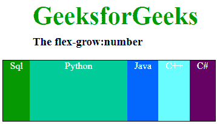

# CSS |伸缩生长属性

> 原文:[https://www.geeksforgeeks.org/css-flex-grow-property/](https://www.geeksforgeeks.org/css-flex-grow-property/)

**flex-grow** 属性指定与容器中的其他项目相比，该项目将增长多少。换句话说，它是一个项目相对于同一个容器中的其他项目增长的能力。

**注意:**如果容器中的项目不是柔性项目，则 flex-grow 属性不会影响该项目。

**语法:**

```css
flex-grow: number| initial| inherit;
```

**默认值:**

*   **0**

**属性值:**

*   **数字:**定义该物品与其他灵活物品相比将如何增长的数字。
*   **初始值:**设置默认值。
*   **继承:**它从它的父元素继承属性。

**示例:**这里我们将看到在一个容器中有 5 个 div，我们将在第 2 个 div 上应用 **flex-grow:** ，与其他 4 个 div 相比，该 div 将增长。我们可以在同一个容器中的任何文档上应用 flex-grow，div 相对于其他 div 的宽度会增长，flex-grow 属性将帮助该 div 相对于该容器中的其他项目增长。

## 超文本标记语言

```css
<!DOCTYPE html>
<html>

<head>
    <title>
        CSS | flex-grow Property
    </title>
    <style>
        #main {
            width: 350px;
            height: 100px;
            border: 1px solid black;
            display: -webkit-flex;
            display: flex;
            color: white;
            text-align: center;
        }

        h1 {
            color: #009900;
            font-size: 42px;
            margin-left: 50px;
        }

        h3 {
            margin-top: -20px;
            margin-left: 50px;
        }

        #main div:nth-of-type(1) {
            flex-grow: 1;
        }

        #main div:nth-of-type(2) {
            flex-grow: 5;
        }

        #main div:nth-of-type(3) {
            flex-grow: 1;
        }

        #main div:nth-of-type(4) {
            flex-grow: 1;
        }

        #main div:nth-of-type(5) {
            flex-grow: 1;
        }
    </style>
</head>

<body>
    <h1>GeeksforGeeks</h1>
    <h3>The flex-grow:number</h3>

    <!-- Making 5 divs in main -->
    <div id="main">
        <div style="background-color:#009900;">
          Sql</div>
        <div style="background-color:#00cc99;">
          Python</div>
        <div style="background-color:#0066ff;">
          Java</div>
        <div style="background-color:#66ffff;;">
          C++</div>
        <div style="background-color:#660066;">
          C#</div>
    </div>
</body>

</html>       
```

**输出:**



**支持的浏览器:**CSS | flex-grow Property 支持的浏览器如下:

*   谷歌 Chrome 29.0
*   Internet Explorer 11.0
*   Mozilla Firefox 28.0
*   Opera 17.0
*   Safari 9.0