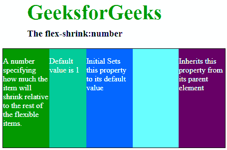

# CSS |伸缩属性

> 原文:[https://www.geeksforgeeks.org/css-flex-shrink-property/](https://www.geeksforgeeks.org/css-flex-shrink-property/)

**伸缩**属性指定与容器中的其他项目相比，该项目将缩小多少。它定义了与放置在同一容器内的其他元素相比，一个元素收缩的能力。

**注意:**如果容器中的物品不是柔性物品，则**伸缩**属性不会影响该物品。

**语法:**

```html
flex-shrink: number| initial| inherit;
```

**默认值:**

*   **1**

**属性值:**

*   **数字:**定义该物品与其他柔性物品相比将如何收缩的数字。
*   **初始值:**设置默认值。
*   **inherit:** 它从其父元素继承属性。

**示例:**这里我们将看到在单个容器中有 5 个 div，我们将在第 2 个 div 上应用 flex-shrink，与其他 4 个 div 相比，该 div 将会收缩。我们可以在同一个容器中的任何文档上应用 flex-shrink，并且该 div 相对于其他 div 的宽度会缩小，flex-shrink 相对于该容器中的其他项目会缩小该 div。

## 超文本标记语言

```html
<!DOCTYPE html>
<html>

<head>
    <title>
        CSS | flex-shrink Property
    </title>
    <style>
        #main {
            width: 450px;
            height: 200px;
            border: 1px solid black;
            display: -webkit-flex;
            display: flex;
            color: white;
        }

        h1 {
            color: #009900;
            font-size: 42px;
            margin-left: 50px;
        }

        h3 {
            margin-top: -20px;
            margin-left: 50px;
        }

        #main div {
            flex-grow: 1;
            flex-shrink: 1;
            flex-basis: 100px;
        }

        <!-- shrinking the 2nd div compare to others -->
        #main div:nth-of-type(2) {
            flex-shrink: 4;
        }
    </style>
</head>

<body>
    <h1>GeeksforGeeks</h1>

    <h3>The flex-shrink:number</h3>

    <!-- Making 5 divs in main -->
    <div id="main">
        <div style="background-color:#009900;">

<p>
                A number specifying how much the item
              will shrink relative to the rest of the
              flexible items.
            </p>

        </div>

        <div style="background-color:#00cc99;">

<p> Default value is 1</p>

        </div>

        <div style="background-color:#0066ff;">

<p>
              Initial Sets this property to
              its default value
            </p>

        </div>

        <div style="background-color:#66ffff;;"></div>

        <div style="background-color:#660066;">

<p>
              Inherits this property from
              its parent element
            </p>

        </div>
    </div>
</body>

</html>            
```

**输出:**



**支持的浏览器:**CSS |伸缩属性支持的浏览器如下:

*   谷歌 Chrome 29.0
*   Internet Explorer 11.0
*   Mozilla Firefox 28.0
*   Opera 17.0
*   Safari 9.0