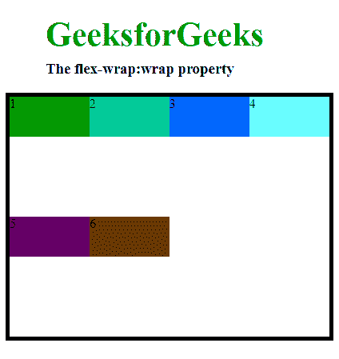
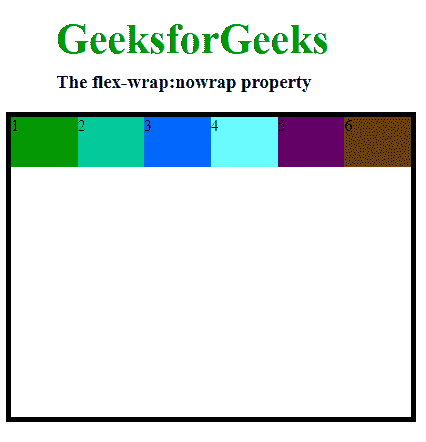
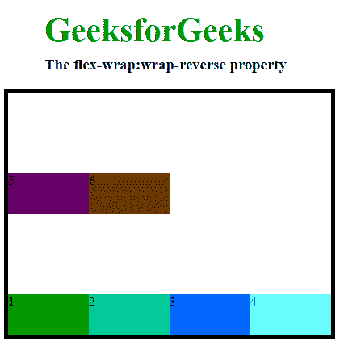
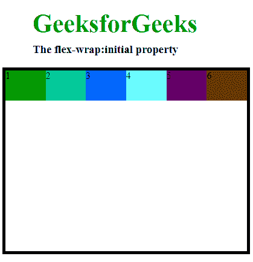

# CSS |折曲属性

> 原文:[https://www.geeksforgeeks.org/css-flex-wrap-property/](https://www.geeksforgeeks.org/css-flex-wrap-property/)

**CSS flex-wrap** 属性用于指定是将 flex 项强制放入一行还是放入多行。flex-wrap 属性允许启用线条堆叠的控制方向。它用于指定单行或多行格式，以在 flex 容器内伸缩项目。

**语法:**

```html
flex-wrap: nowrap|wrap|wrap-reverse|initial;
```

**默认值:**

*   **【nowrap】t1㎡**

**房产价值:**

*   **换行:**该属性用于将伸缩项拆分成多行。它使弹性项根据弹性项宽度换行到多行。
    **语法:**

```html
flex-wrap: wrap;
```

*   **例:**

## 超文本标记语言

```html
<!DOCTYPE html>
<html>
<head>
    <title>flex-wrap property</title>
    <style>
        #main {
            width: 400px;
            height: 300px;
            border: 5px solid black;
            display: flex;
            flex-wrap: wrap;
        }

        #main div {
            width: 100px;
            height: 50px;
        }
        h1 {
            color:#009900;
            font-size:42px;
            margin-left:50px;
        }
        h3 {
            margin-top:-20px;
            margin-left:50px;
        }
    </style>
</head>
<body>
    <h1>GeeksforGeeks</h1>
    <h3>The flex-wrap:wrap property</h3>
    <div id="main">
        <div style="background-color:#009900;">1</div>
        <div style="background-color:#00cc99;">2</div>
        <div style="background-color:#0066ff;">3</div>
        <div style="background-color:#66ffff;">4</div>
        <div style="background-color:#660066;">5</div>
        <div style="background-color:#663300;">6</div>
    </div>
</body>
</html>                    
```

*   **输出:**



*   **nowrap:**wrap-flex 的默认值是 nowrap。它用于指定项目没有包装。它使项目换行。
    **语法:**

```html
flex-wrap: nowrap;
```

*   **例:**

## 超文本标记语言

```html
<!DOCTYPE html>
<html>
<head>
    <title>flex-wrap property</title>
    <style>
        #main {
            width: 400px;
            height: 300px;
            border: 5px solid black;
            display: flex;
            flex-wrap: nowrap;
        }

        #main div {
            width: 100px;
            height: 50px;
        }
        h1 {
            color:#009900;
            font-size:42px;
            margin-left:50px;
        }
        h3 {
            margin-top:-20px;
            margin-left:50px;
        }
    </style>
</head>
<body>
    <h1>GeeksforGeeks</h1>
    <h3>The flex-wrap:nowrap property</h3>
    <div id="main">
        <div style="background-color:#009900;">1</div>
        <div style="background-color:#00cc99;">2</div>
        <div style="background-color:#0066ff;">3</div>
        <div style="background-color:#66ffff;">4</div>
        <div style="background-color:#660066;">5</div>
        <div style="background-color:#663300;">6</div>
    </div>
</body>
</html>                    
```

*   **输出:**



*   **换行-反转:**该属性用于在柔性项换行到新行时反转柔性项的流向。
    **语法:**

```html
flex-wrap: wrap-reverse;
```

*   **例:**

## 超文本标记语言

```html
<!DOCTYPE html>
<html>
<head>
    <title>flex-wrap property</title>
    <style>
        #main {
            width: 400px;
            height: 300px;
            border: 5px solid black;
            display: flex;
            flex-wrap: wrap-reverse;
        }

        #main div {
            width: 100px;
            height: 50px;
        }
        h1 {
            color:#009900;
            font-size:42px;
            margin-left:50px;
        }
        h3 {
            margin-top:-20px;
            margin-left:50px;
        }
    </style>
</head>
<body>
    <h1>GeeksforGeeks</h1>
    <h3>The flex-wrap:wrap-reverse property</h3>
    <div id="main">
        <div style="background-color:#009900;">1</div>
        <div style="background-color:#00cc99;">2</div>
        <div style="background-color:#0066ff;">3</div>
        <div style="background-color:#66ffff;">4</div>
        <div style="background-color:#660066;">5</div>
        <div style="background-color:#663300;">6</div>
    </div>
</body>
</html>                    
```

*   **输出:**



*   **初始值:**该属性用于设置为默认值。
    **语法:**

```html
flex-wrap: initial;
```

*   **例:**

## 超文本标记语言

```html
<!DOCTYPE html>
<html>
<head>
    <title>flex-wrap property</title>
    <style>
        #main {
            width: 400px;
            height: 300px;
            border: 5px solid black;
            display: flex;
            flex-wrap: initial;
        }

        #main div {
            width: 100px;
            height: 50px;
        }
        h1 {
            color:#009900;
            font-size:42px;
            margin-left:50px;
        }
        h3 {
            margin-top:-20px;
            margin-left:50px;
        }
    </style>
</head>
<body>
    <h1>GeeksforGeeks</h1>
    <h3>The flex-wrap:initial property</h3>
    <div id="main">
        <div style="background-color:#009900;">1</div>
        <div style="background-color:#00cc99;">2</div>
        <div style="background-color:#0066ff;">3</div>
        <div style="background-color:#66ffff;">4</div>
        <div style="background-color:#660066;">5</div>
        <div style="background-color:#663300;">6</div>
    </div>
</body>
</html>                    
```

*   **输出:**



**支持的浏览器:**CSS flex-wrap 属性支持的浏览器如下:

*   谷歌 Chrome 29.0，21.0 -webkit-
*   Internet Explorer 11.0
*   火狐 28.0， 18.0 -moz-
*   Opera 17.0
*   Safari 9.0，6.0 -webkit-