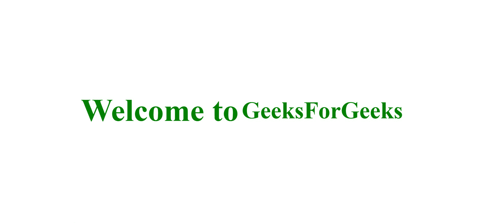

# CSS Flexbox 及其属性

> 原文:[https://www . geesforgeks . org/CSS-flex box-及其属性/](https://www.geeksforgeeks.org/css-flexbox-and-its-properties/)

在我们深入学习 CSS Flexbox 之前，让我们了解一下**预 Flexbox**

**预 Flexbox:** 总结 CSS 中可能与学习 Flexbox 相关的一些属性。

*   我们有不同的位置属性，例如“绝对”和“相对”，这取决于我们想要如何在页面中放置元素。
*   浮动，网格，明确的修复，以帮助定位。
*   列的固定高度(创建弹性框的主要元素之一)。

**到底什么是弹性箱？**

*   Flexbox 是一个 CSS 显示类型的设计，帮助我们非常容易地制作 CSS 布局。
*   控制元素相对于其父元素以及彼此的位置、大小和间距。
*   它们非常适合响应式设计。
*   它有自己的一套属性。
*   它定义了控制布局的格式上下文。
*   这是一种亲子关系。

**注意:**并非所有浏览器都支持 flexbox 属性，因此请确保您使用的浏览器支持该属性。

**Flexbox 的基础:**
将 Flexbox 的显示类型应用于父容器，这将使其中的所有子元素调整为 flex 类型，这些将被称为“flex 项目”。这意味着它们变得更加灵活，也就是说，我们可以控制它们可以收缩多少，可以增长多少，以及这些元素之间的间距。

**显示:flex 属性:**


*   flex 容器可以更改子元素的宽度、高度和顺序。
*   项目可以增大或缩小以填满可用空间或防止溢出。
*   可用空间分布在其他项目中。


**挠性箱轴线:**

*   主轴:

A)从左到右

```css
 flex-direction: row
```

B)从右向左

```css
 flex-direction: row-reverse
```

C)从上到下

```css
        flex-direction: column
```

D)从底部到顶部

```css
        flex-direction: column
```

*   横轴(垂直于主轴)

**弹性箱属性:**

父属性:

*   **显示**定义一个伸缩容器——伸缩格式上下文。
*   **弯曲方向**定义容器内的主轴。
*   **允许柔性物品缠绕在多条线上。**
*   ****柔流*柔向+柔绕*的简写。****
*   ******对齐-内容**允许项目沿主轴对齐。****
*   ******对齐-内容**允许项目在一条直线上沿横轴对齐。****
*   ******对齐-物品**在横轴上对齐多行物品。****

******父属性:******

*   ******顺序**允许在不改变源顺序的情况下改变物品的顺序。****
*   ******允许一个项目填满可用的空闲空间。******
*   ********【伸缩】**如果没有足够的可用空间，允许物品收缩。******
*   ******在空间分配之前定义项目的大小。******
*   ********是*伸缩增长+伸缩收缩+伸缩基础*** **的简写。********
*   ********flex-self** 能够在 flex 容器内对齐单个项目。******

******示例:******

```css
**<!DOCTYPE html>
<html lang="en">

<head>
    <meta charset="UTF-8">
    <meta name="viewport" content=
        "width=device-width, initial-scale=1.0"> 

    <style>
        body {
            display: flex;
            align-items: center;
            justify-content: center;
            color: green;
            font-size: 50;
        }
        h2 {
            margin: 10px;
        }
    </style>  
</head>

<body>
    <h2>GeeksforGeeks</h2>
</body>

</html>**
```

******在应用弯曲属性之前:******

********

******应用挠曲特性后:******

********

****是的，只有 CSS 中的这么多代码才能在使用 flex-box 时产生如此巨大的影响。****

******弹性箱的优势:******

*   ****导航栏和菜单****
*   ****网格布局****
*   ****条形图****
*   ****等高柱****