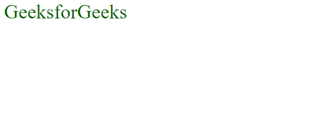

# CSS 浮动

> 原文:[https://www.geeksforgeeks.org/css-float/](https://www.geeksforgeeks.org/css-float/)

**浮动** CSS 属性用于将元素放置在其容器的左侧、右侧，同时允许文本和内联元素环绕它。float 属性定义页面中的内容流。如果元素从内容的正常流中移除，剩余的元素将成为流的一部分。绝对定位的元素忽略此属性。它可以写在 CSS 文件中，也可以直接用元素的样式指定。

**语法:**

```css
float: none|left|right|initial|inherit;
```

**属性值:**

*   **无**:这是默认值&元素不浮动。
*   **左侧**:元素漂浮在容器左侧。
*   **右侧**:元素漂浮在容器右侧。
*   [**初始**](https://www.geeksforgeeks.org/css-value-initial/) 元素将被设置为其默认值。
*   [**继承**](https://www.geeksforgeeks.org/css-value-inherit/) :元素继承其父属性的浮动属性。

我们将使用上述属性值，并通过示例了解它们的用法。

**左侧:**元素将位于其包含块的左侧。

## 超文本标记语言

```css
<!DOCTYPE html>
<html>

<head>
    <title>Float</title>
</head>

<body>
    <div class="GFG" style="font-size:40px; 
color:#006400; float:left;"> GeeksforGeeks </div>
</body>

</html>
```

**输出**:



**右侧:**元素将位于其包含块的右侧。

## 超文本标记语言

```css
<!DOCTYPE html>
<html>

<head>
    <title>Float</title>
</head>

<body>
    <div class="GFG" style="font-size:40px; 
color:#006400; float:right;"> GeeksforGeeks </div>
</body>

</html>
```

**输出**:


**无:**元素保持声明的原样，即不会影响元素&这是默认值。

## 超文本标记语言

```css
<!DOCTYPE html>
<html>

<head>
    <title>Float</title>
</head>

<body>
    <div class="GFG" style="font-size:40px; 
color:#006400; float:none;"> GeeksforGeeks </div>
</body>

</html>
```

**输出:**


[**继承**](https://www.geeksforgeeks.org/css-value-inherit/) **:** 用于从元素的父元素属性值继承元素的属性。

## 超文本标记语言

```css
<!DOCTYPE html>
<html>

<head>
    <title>Float</title>
</head>

<body>
    <div style="float:right">
        <div class="GFG" style="font-size:40px; 
    color:#006400; float:inherit;"> GeeksforGeeks </div>
    </div>
</body>

</html>
```

**输出**:


**支持的浏览器:**

*   谷歌 Chrome 1.0
*   微软边缘 12.0
*   Firefox 1.0
*   Internet Explorer 4.0
*   Safari 1.0
*   Opera 7.0